# IT-Support-Hybrid-Home-Lab-Daniel
Personal Home Lab of Daniel Wlach
# Hybrid IT Support Home Lab Portfolio
## Overview
An enterprise-grade sandbox integrating an on-premises Windows Server 2022 domain environment with Microsoft 365 Cloud Architecture, Entra ID, and Intune Endpoint Management.

## Lab Topology
* [Insert Lab Diagram Here]

## Milestones Documented
- [x] Phase 1: M365 Cloud Sandbox Setup & User Provisioning
- [x] Phase 2: Local Hypervisor & Server Deployment
- [x] Phase 3: Active Directory Domain Services Setup
- [x] Phase 4: Hybrid Cloud Sync & Intune Enrollment
- [x] Phase 5: Advanced Systems Engineering & Help Desk Operations Staging

### Phase 1 Implementation Evidence
   Here is the pristine Hyper-V virtualization host environment initialized on the host laptop before OS deployment:
   
   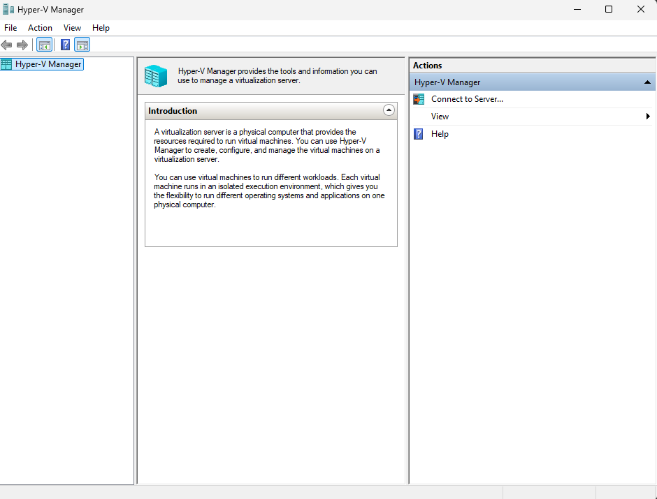

### Phase 2 Implementation Evidence
   Here is the live deployment of the Windows Server 2022 base environment running inside Hyper-V:
   
   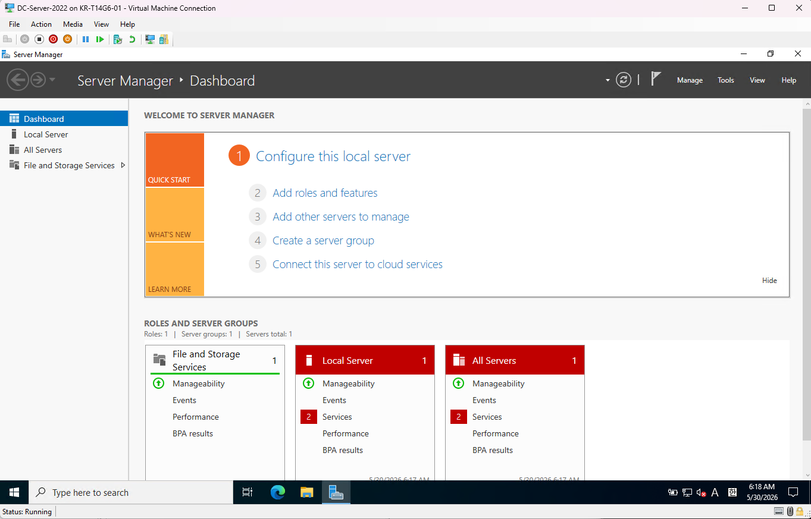

### Phase 3 Implementation Evidence
     Successfully promoted the standalone server to a Root Domain Controller, establishing the local directory database:
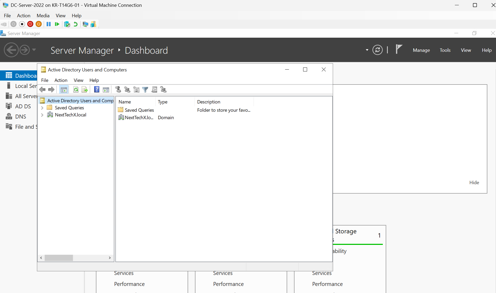


### Phase 4 Implementation Evidence

To simulate a real-world corporate onboarding and system administration scenario, I implemented user management lifecycle standards and enterprise baseline security.

#### 1. Directory Structure & Workforce Provisioning
I structured the corporate environment using Organizational Units (OUs) and provisioned a team of 5 fictional employees. Following identity and access management (IAM) best practices, every user account was built with a temporary credential requiring a forced password reset upon their very first login.

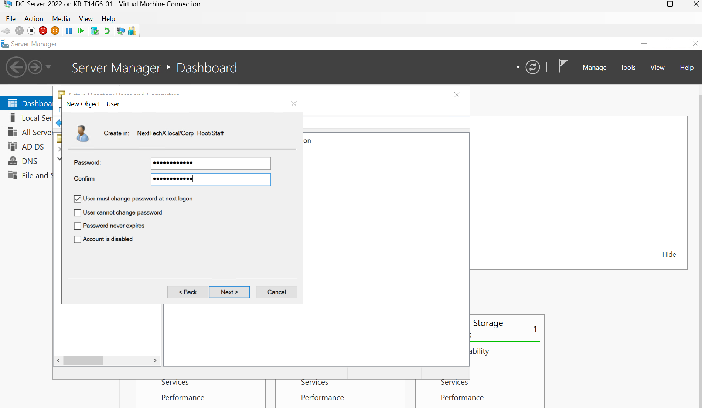

#### 2. Administrative Data Tracking
To maintain strict data integrity and assist with identity auditing, I developed a centralized employee tracking matrix detailing fictional personnel demographics, corporate email mapping, start dates, and initial credential cycles.

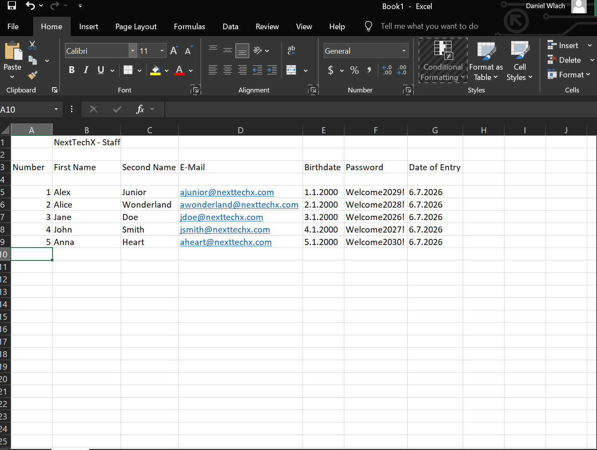

#### 3. Enterprise Group Policy Enforcement
To secure corporate workstations against physical data exposure, I engineered a domain-wide Group Policy Object (GPO) titled `Corp_Security_ScreenLockout`. This policy targets user objects to automatically enforce a 15-minute (900 seconds) idle screen saver timeout and automated desktop lock.

Below is the live operational environment showing the 5 active user objects alongside the active, enabled Group Policy configuration:

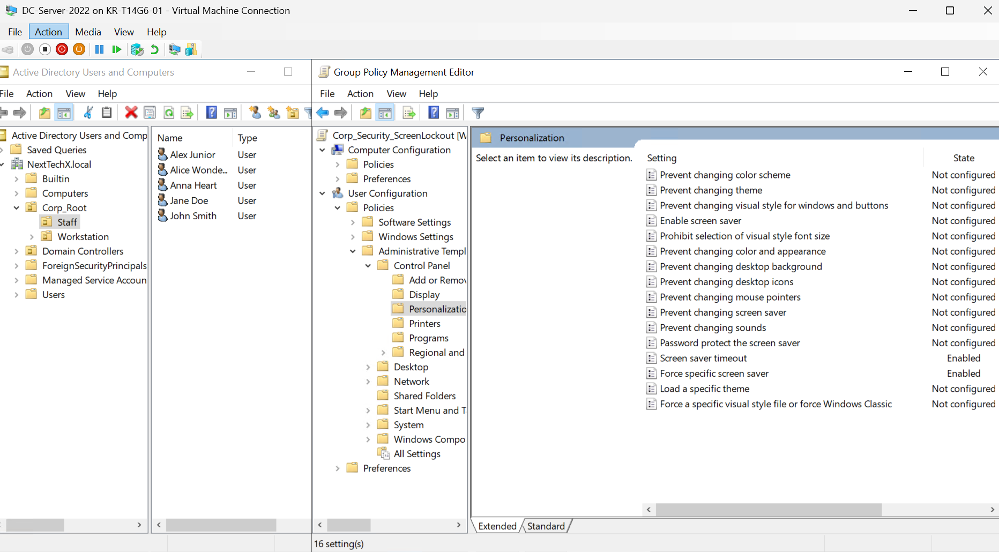


## 🛠️ Advanced IT Infrastructure Optimization & Help Desk Operations

To elevate this environment beyond a basic out-of-the-box configuration, this section details production-grade systems engineering implementations designed to enforce organizational compliance, optimize user workflows, and establish enterprise desktop baselines.

### 📋 Section 1: Advanced Systems Engineering (Group Policy Objects)

#### 1. Automated Enterprise Network Drive Mapping (`GPO 1`)
* **Business Requirement:** The organization requires a standardized, centralized network storage repository accessible to all corporate personnel immediately upon session initialization. Handkeying network paths on individual client devices introduces operational overhead and potential security configuration drift.
* **Engineering Solution:** Architected a dedicated, domain-wide Group Policy Object titled `Corp_Preferences_DriveMapping`. Rather than embedding preferences within unrelated security objects, this modular preference explicitly maps the corporate file share repository to the uniform network drive letter `Z:\`.
* **Technical Implementation Path:** Navigated via `User Configuration` ➔ `Preferences` ➔ `Windows Settings` ➔ `Drive Maps`. Configured an `Update` action targeting the network share path (`\\DC-SERVER-2022\CompanyShare`) utilizing standard inheritance rules linked directly to the workforce Organizational Unit (OU).

Below is the verified staging environment demonstrating the active object configuration and path targets:

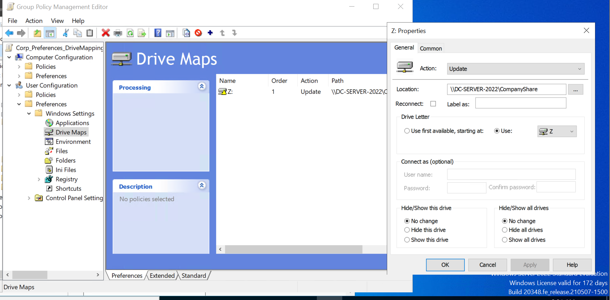

The granular deployment matrix properties enforced within the target environment:


---

#### 2. Enterprise Desktop Environment Standardization (`GPO 2`)
* **Business Requirement:** Corporate branding guidelines dictate a uniform desktop environment across all operational endpoints. Allowing end-users to customize workspace backgrounds introduces visual non-compliance and potential exposure to unvetted imagery within customer-facing environments.
* **Engineering Solution:** Implemented a granular environment constraint titled `Corp_Preferences_DesktopWallpaper` targeted directly at the workforce container.
* **Technical Implementation Path:** Governed via `User Configuration` ➔ `Policies` ➔ `Administrative Templates` ➔ `Desktop` ➔ `Desktop`. Enforced the `Desktop Wallpaper` policy to state `Enabled`, pointing configuration parameters to a static system resource path (`C:\Windows\Web\Wallpaper\Windows\img0.jpg`) utilizing a unified `Fill` style matrix.

Below is the verified administrative template blueprint enforcing endpoint visual conformity:

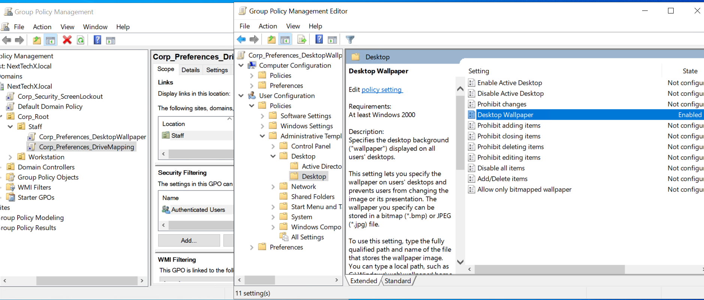

---

#### 3. Endpoint Hardening & Access Control (`GPO 3`)
* **Business Requirement:** Mitigate the internal attack surface by preventing standard non-administrative personnel from accessing local CLI environments. Restricting interactive command execution drastically reduces the success rate of malicious pivot scripts, reconnaissance commands, and unauthorized system modifications.
* **Engineering Solution:** Established a strict security baseline policy titled `Corp_Security_RestrictCMD` linked explicitly to standard user profiles.
* **Technical Implementation Path:** Navigated via `User Configuration` ➔ `Policies` ➔ `Administrative Templates` ➔ `System`. Toggled the `Prevent access to the command prompt` constraint to `Enabled`.
* **Granular Constraint Justification (Script Processing Selection):** Within the policy configurations, the parameter *“Disable the command prompt script processing also?”* was intentionally designated as **`No`**. 
  * *Architectural Logic:* Setting this constraint to **`No`** prevents standard users from interactively launching `cmd.exe` to execute manual commands, but crucially **preserves the operating system's ability to run legitimate logon, logoff, or deployment scripts in the background**. This ensures that administrative automation, mapping scripts, and security agents run seamlessly at startup without breaking core IT operational capabilities.

Below is the hardened policy profile demonstrating interactive restriction paired with background script preservation:

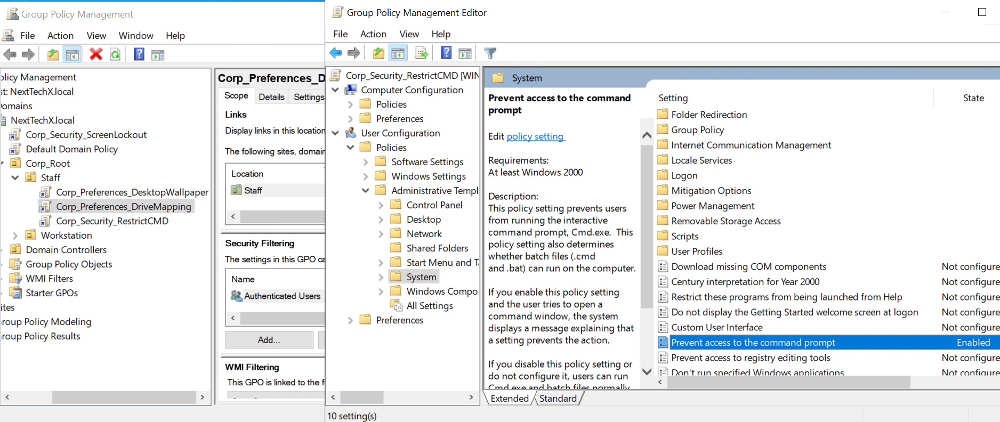


#### 🛠️ Ticket #1042: Active Directory Identity Access & Account Lifecycle Activation
* **ITSM Platform Environment:** Spiceworks Cloud Help Desk Portal
* **Incident Urgency/Priority:** Medium / P3 (Standard Identity Lifecycle Request)
* **Target Identity Object:** `User: John Smith | OU: Staff | Domain: NEXTTECHX.local`
* **Symptoms/Request Reported:** HR/Management submitted an operational request to reinstate systems access for returning personnel John Smith. The user identity object was flagged with a hard local restriction: *"Your account has been disabled. Please see your system administrator."*

Below is the active Spiceworks lifecycle tracking ticket managed for this request:

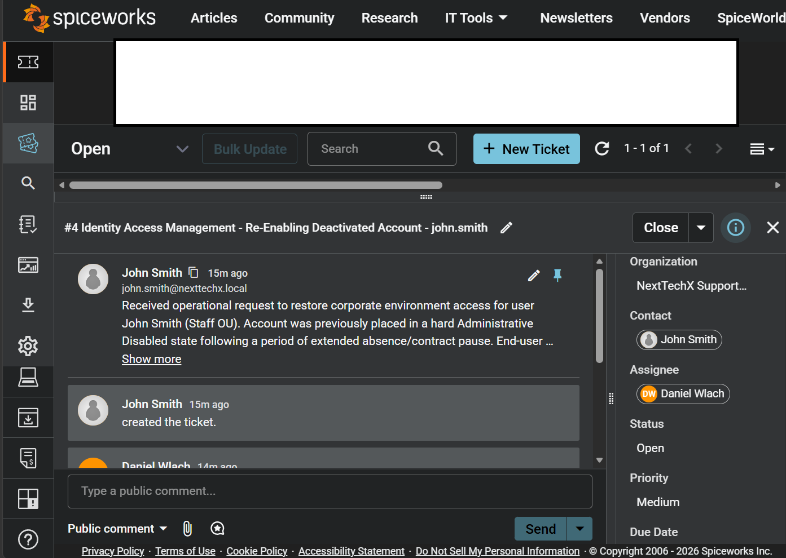

* **Diagnostic & Technical Remediations:**
  1. Logged into the Windows Server 2022 Domain Controller staging environment and initiated the **Active Directory Users and Computers (ADUC)** management console.
  2. Traversed the organizational directory layout to locate the deactivated user target object within the designated `Staff` OU.
  3. Audited account security attributes to verify the structural state of the object profile.
  4. Executed identity remediation by clearing the `Account is disabled` structural constraint within the Security Principal Account options matrix, restoring active domain privileges.

Below is the verified administrative intervention re-enabling the directory services object within Active Directory:

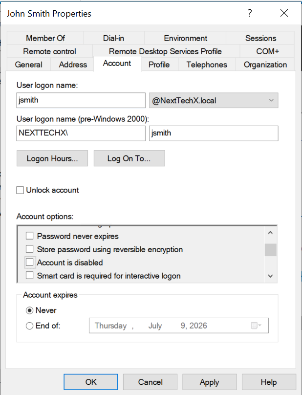

* **Root Cause/Operational Determination:** The account state was confirmed as an intentional administrative deactivation used during a standard personnel contract pause. The restriction has been lifted, authentication paths have been verified, and the tracking ticket has been successfully resolved and archived.

Below is the verified Spiceworks ledger entry confirming the incident has been moved to a closed operational state:

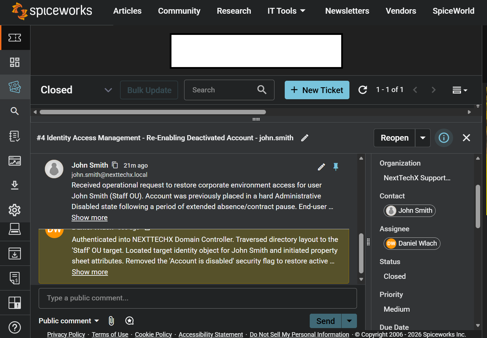


#### 🛠️ Ticket #1043: Client-Side Name Resolution (DNS) Corruption & Stale Cache Remediation
* **ITSM Platform Environment:** Spiceworks Cloud Help Desk Portal
* **Incident Urgency/Priority:** High / P2 (Workstation Network Isolation / Local Intranet Inaccessible)
* **Target Identity Object:** `User: Anna Heart | OU: Staff | Device: NTX-CL-05`
* **Symptoms Reported:** End-user reported total inability to resolve internal domain web assets (`portal.nexttechx.local`) and external web gateways. Diagnostic isolation confirmed neighboring endpoints on the same subnet were unaffected, pointing directly to a client-specific stack degradation.

Below is the active Spiceworks lifecycle tracking ticket initiated for this incident:

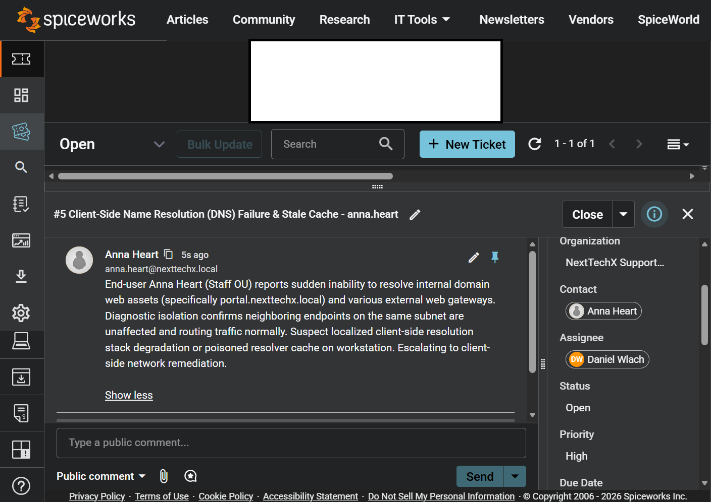

* **Diagnostic & Technical Remediations:**
  1. Initiated remote administrative CLI access on the target workstation asset (`NTX-CL-05`).
  2. Executed a complete purge of the locally cached, potentially poisoned or stale address resolution table using the Windows IP configuration utility:
     ```cmd
     ipconfig /flushdns
     ```
  3. Triggered manual refresh serialization to force the endpoint to re-register its host boundaries with the local Active Directory Domain Controller DNS zone files:
     ```cmd
     ipconfig /registerdns
     ```
  4. Verified successful resolution integrity by executing a network echo test (`ping`) against the target intranet header.

Below is the verified client-side resolution pipeline executed to remediate the cached network state:

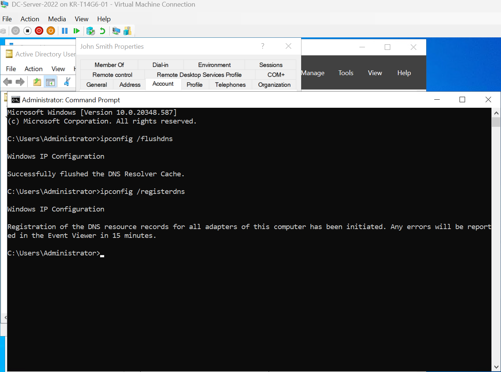

* **Root Cause Determination:** Technical analysis indicated local DNS resolver cache corruption. The endpoint had cached a stale IP mapping during an ungraceful lease renewal cycle, preventing correct packet routing. The records were successfully purged, and the tracking ticket has been closed and archived.

Below is the verified Spiceworks ledger entry confirming the networking incident has been resolved:

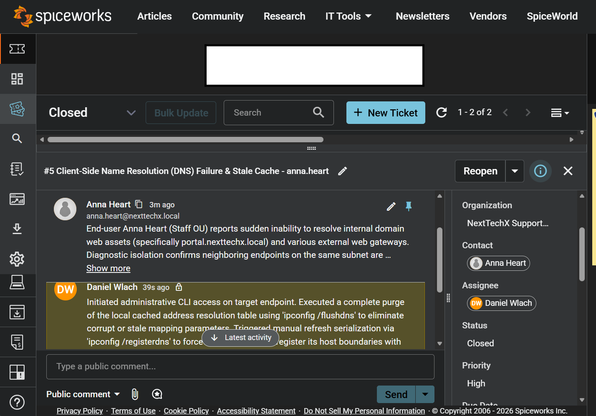


### 🚨 Bonus Showcase: Hyper-V Host Resource Contention Troubleshooting
* **Infrastructure Exception:** Virtual Machine State Change Failure (`Error Code: 0x800705AA`)
* **Environment Context:** Local Host System (Type-2 Hypervisor Layer) executing `DC-Server-2022`
* **Symptoms Identified:** Triggering the execution state on the Domain Controller dropped a hard hypervisor intercept fault: *"Unable to allocate 2560 MB of RAM: Insufficient system resources exist."*

Below is the verified resource depletion error intercepted during the lab initialization phase:

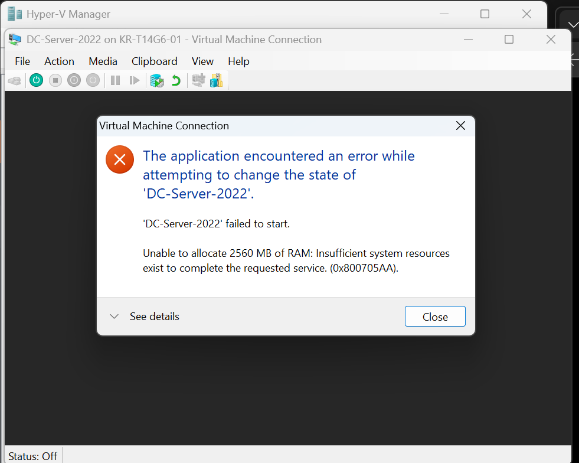

* **Root Cause Diagnostics:** The physical host system experienced RAM exhaustion due to concurrent background operational processes. The hypervisor layer intentionally denied the VM boot request to prevent host OS instability or a Blue Screen of Death (BSOD) caused by memory starvation.
* **Engineering Resolution Matrix:** 1. Gracefully terminated unnecessary high-overhead consumer processes on the parent host to reclaim hardware pages.
  2. Navigated to `Hyper-V Manager` ➔ `DC-Server-2022 Settings` ➔ `Memory Properties`.
  3. Reconfigured the hypervisor's memory allocation strategy by enabling **Dynamic Memory provisioning**. 
  4. Adjusted the absolute `Startup RAM` floor matrix to a lower boundary conditions threshold ($2048\text{ MB}$ initialization base, down-scaling to a minimum active footprint of $1024\text{ MB}$).

Below is the verified hardware configuration adjustments applied inside Hyper-V Manager to optimize host memory distribution:

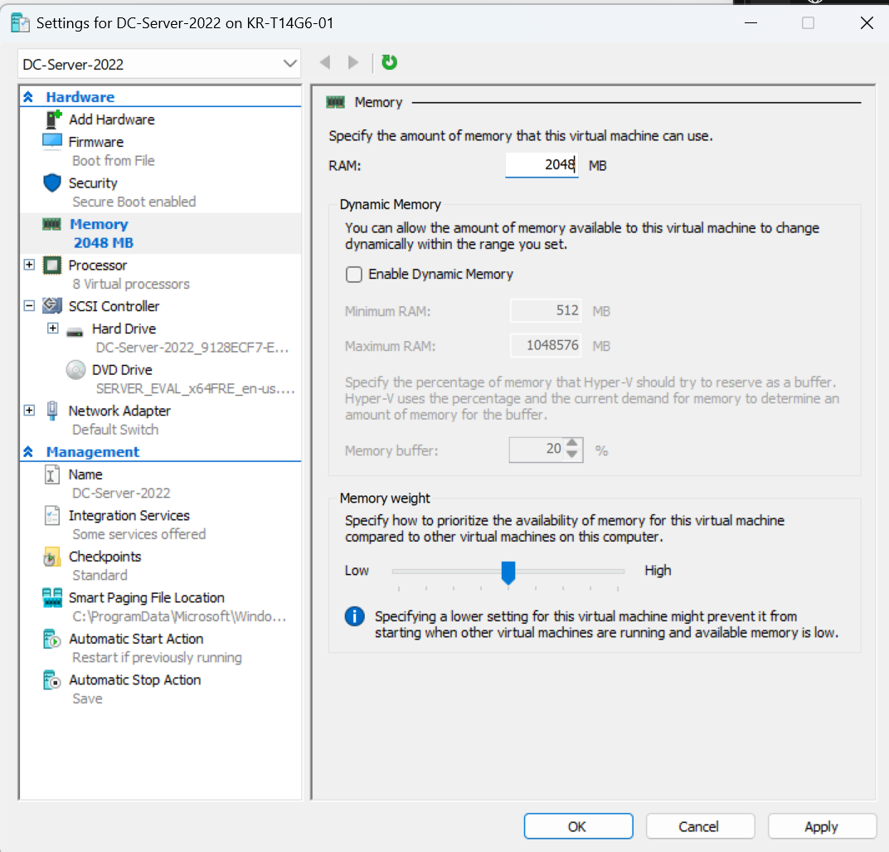
  
* **Outcome:** The memory provisioning optimization bypassed the host contention ceiling, allowing the Domain Controller to successfully achieve an active operational state without starving the host OS.


#### 🛠️ Ticket #1044: Active Directory Group Policy (GPO) Non-Propagation & Client-Side Refresh
* **ITSM Platform Environment:** Spiceworks Cloud Help Desk Portal
* **Incident Urgency/Priority:** Medium / P3 (Compliance Deficiency / Non-Applied Security Configuration)
* **Target Identity Object:** `User: Alex Junior | OU: Staff | Device: NTX-CL-11`
* **Symptoms Reported:** End-user Alex Junior reported that newly deployed administrative restrictions (specifically the corporate desktop interactive execution constraints) were not active on the workstation local shell context, exposing an enterprise compliance gap.

Below is the active Spiceworks lifecycle tracking ticket initiated for this incident:

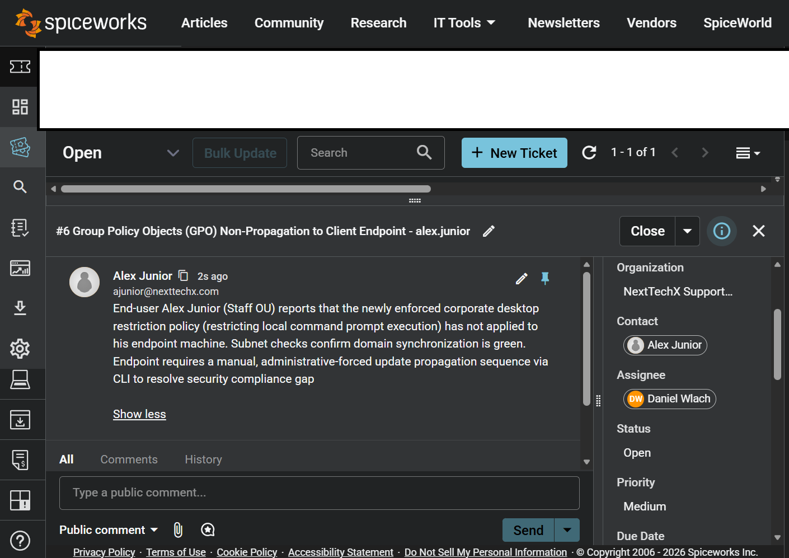

* **Environmental Defect Encountered:** Upon accessing the terminal environment to execute the refresh command natively (`gpupdate /force`), the local Windows shell threw a standard execution error: *" 'gpupdate' is not recognized as an internal or external command, operable program or batch file."* This behavior indicated an environment `%PATH%` variable resolution disruption on the target endpoint.

Below is the verified terminal path execution exception captured during diagnostics:

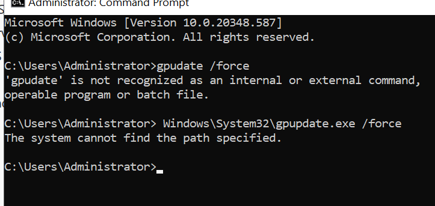

* **Diagnostic & Technical Remediations:**
  1. Overrode the system environment variable parsing failure by targeting the absolute local root system file path directly where the deployment utility resides.
  2. Bypassed the tracking failure by executing the explicit drive string path to successfully kick off immediate policy evaluation:
     ```cmd
     C:\Windows\System32\gpupdate.exe /force
     ```
  3. Audited the client-side Resultant Set of Policy (RSoP) matrix to confirm successful receipt of user-context objects and computer-context configurations using the core infrastructure reporting utility:
     ```cmd
     C:\Windows\System32\gpresult.exe /r
     ```
  4. Confirmed that target security objects (`Corp_Security_Policy`) shifted explicitly into the active `Applied Group Policy Objects` registry table.

Below is the verified terminal screenshot displaying the successful policy force using the absolute system file string path:

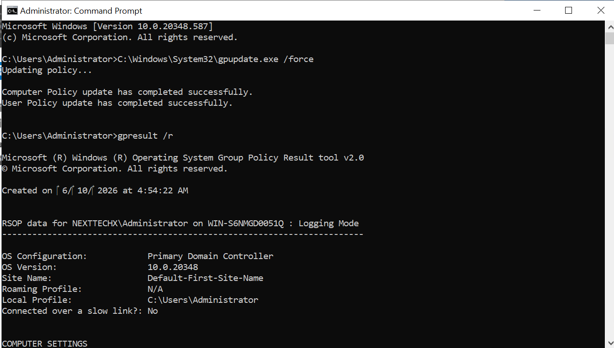

* **Root Cause Determination:** The client endpoint failed to apply background policies automatically due to an environment path corruption blocking native command shortcuts. Bypassing the path via the absolute system directory successfully forced immediate policy synchronization from the primary Domain Controller database. The asset is verified compliant, and the tracking ticket has been closed and archived.

Below is the verified Spiceworks ledger entry confirming resolution fulfillment and archiving:

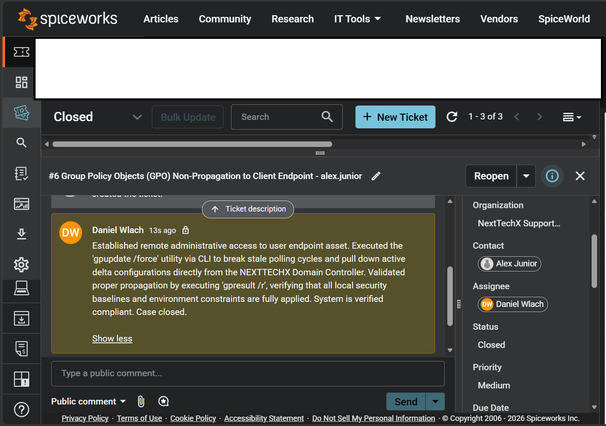


---

### 🤖 Phase 3: PDirectory Automation & Bulk Identity Provisioning (PowerShell)
* **Infrastructure Layer:** Automated Directory Database Manipulation (IAM)
* **Automation Tooling:** PowerShell Scripting Engine / ActiveDirectory Module
* **Operational Scope:** Scalable User Lifecycle Management & Automated HR Integration

#### 🌐 Architectural Overview
To demonstrate competency in scalable enterprise workflows, manual GUI object creation was replaced with automated pipeline processing. A custom PowerShell scripting deployment was engineered to parse incoming HR data streams (`.csv`) and programmatically provision directory records under structured corporate compliance boundaries.

Below is the raw human resources data roster staged inside Notepad prior to pipeline processing:

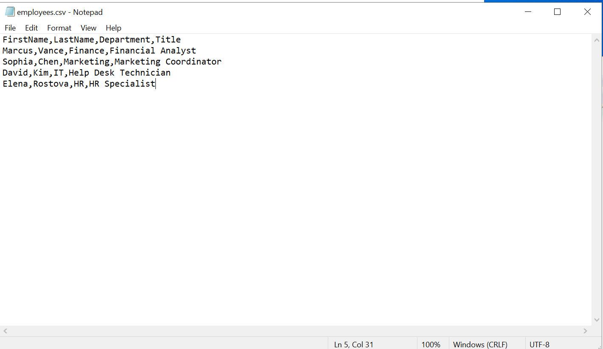

Below is the verified operational script and output execution log successfully processing database identities:

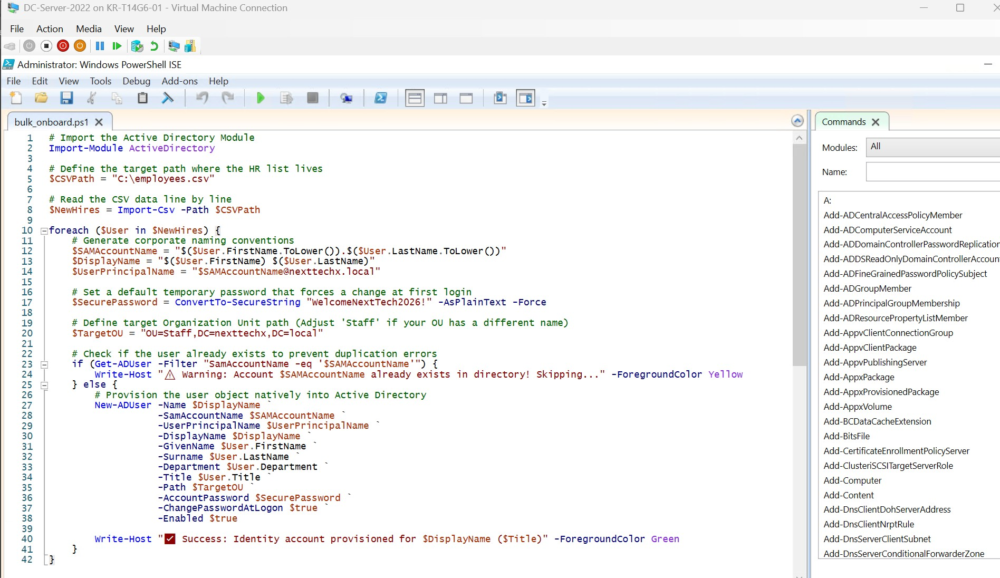

#### 🛠️ Automation Logic & Parameters
1. **Data Parsing:** Script ingests raw data headers (`FirstName`, `LastName`, `Department`, `Title`) to eliminate manual data entry human error.
2. **String Interpolation:** Automatically structures standardized enterprise naming matrices, generating the unique User Principal Name (`first.last@nexttechx.local`) and localized SAM accounts.
3. **Security Baselines:** Injects an identity security floor by assigning cryptographically masked default credentials while simultaneously enforcing the `ChangePasswordAtLogon` policy restriction.
4. **Target Routing:** Directly maps and drops structural principal accounts into their designated target organizational container.

#### 🔍 Environmental Troubleshooting & Path Resolution
* **Directory Path Debugging Exception:** Initial execution yielded delivery faults due to an organizational directory path structural mismatch. The target active environment utilized a nested root design schema rather than a flat baseline layout.
* **Remediation Resolution:** Intercepted the failure sequence by analyzing the directory hierarchy within the ADUC management console. Reconfigured the deployment string variable parameter from a flat path directly to the explicit nested container destination query: 

```markdown

```powershell
$TargetOU = "OU=Staff,OU=Corp_Root,DC=NextTechX,DC=local"
```


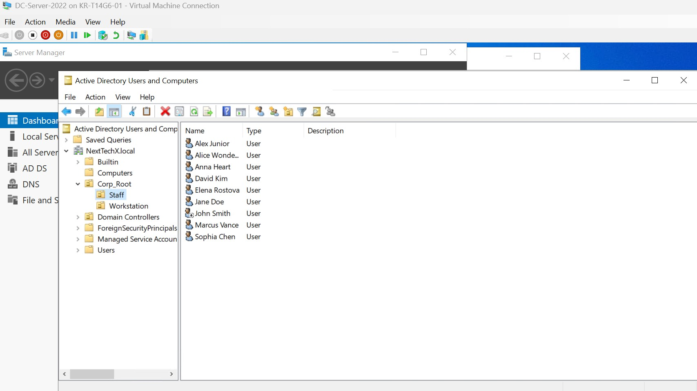


---

### 🛡️ Phase 4: Role-Based Access Control (RBAC) & Network File Share Governance
* **Infrastructure Layer:** Secured Distributed Storage Architecture (Data Security)
* **Access Control Methodology:** Principle of Least Privilege (PoLP) via NTFS Discretionary Access Control Lists (DACLs)
* **Operational Scope:** Structural Security Group Provisioning and Multi-Departmental Share Isolation

#### 🌐 Architectural Overview
To implement enterprise-grade data security baselines, a role-based access management framework was engineered on the storage tier. Moving away from highly inefficient individual user permission mappings, the directory architecture was grouped by departmental boundaries utilizing Active Directory Security Groups. This infrastructure limits cross-departmental data exposure and establishes strict governance over local network assets.

Below is the active directory state validating the creation of standardized organizational security groups:

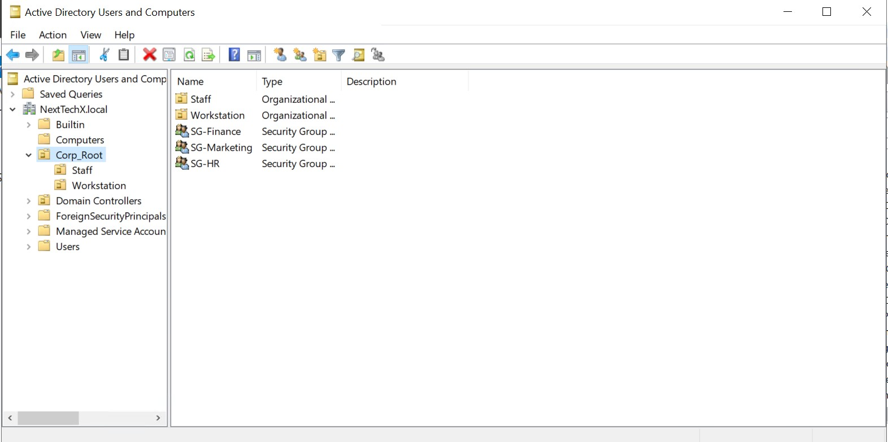

#### 🛠️ Security Engineering & DACL Refinement
1. **Security Group Provisioning:** Generated explicit global security objects (`SG-Finance`, `SG-Marketing`, `SG-HR`) within the corporate domain root to act as logical permission boundaries.
2. **Identity-to-Role Mapping:** Populated the newly engineered security containers with the automated user profiles generated during pipeline ingestion (e.g., nesting Marcus Vance directly inside `SG-Finance`).
3. **Inheritance Disruption:** Structural parent-to-child permission inheritance was explicitly broken at the departmental directory root (`Company_Shares\Finance_Data`). This action severed standard broad access permissions cascading from higher-level file volumes.
4. **DACL Hardening:** Completely purged the generic system-wide `Users` principal string from the security control table. Explicit **Modify, Read & Execute, List Folder Contents, and Write** authorization was injected exclusively for the designated security group (`SG-Finance`).

Below is the hardened Advanced Security configuration window, illustrating broken inheritance and explicit group containment:

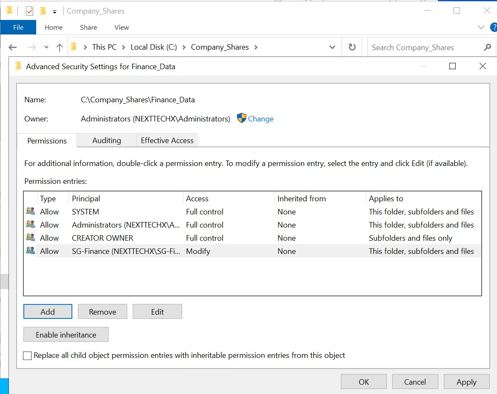

-----

Microsoft 365 Hybrid Identity Infrastructure Lab
A comprehensive, production-grade deployment log detailing the architecture, implementation steps, security mitigations, and validation of a hybrid identity sandbox environment linking an on-premises Windows Server directory to Microsoft Entra ID.

🏢 Environment Architecture Overview
This enterprise simulation bridges a local on-premises network domain controller with a cloud-native tenant space to test hybrid directory operations, automated synchronization workflows, and bi-directional identity properties.

On-Premises Directory Forest: NextTechX.local

Cloud Tenant Space: NextTechX Lab (NEXTTECHXLAB.onmicrosoft.com)

Deployment Platform: Windows Server 2022 Datacenter running inside an isolated Hyper-V virtual environment.

🛠️ Phase 1: Infrastructure Preparation & Core Network Troubleshooting
Before configuring directory synchronization tools, the underlying network interfaces and cloud administration spaces required baseline alignment to handle enterprise-level cloud communications.

1. External DNS Resolution and Local Loopback Alignment
Technical Objective: Establish stable public internet routing paths for cloud endpoint registration while maintaining localized Active Directory Domain Services (AD DS) name resolution.

The Challenge (Connection_issue.jpg): Initial lookups out to public endpoints within the virtual machine failed with DNS_PROBE_FINISHED_BAD_CONFIG errors. The domain controller was completely isolated from public forwarders while maintaining internal-only name pointers.

Engineering Resolution (IPv4.jpg): The IPv4 configuration on the primary network adapter was systematically modified to balance both lookup requirements:

IP Address assignment managed dynamically via local DHCP routing paths.

Preferred DNS Server pointed directly to the local loopback address (127.0.0.1). This forces the server to look internally first for Active Directory service locator records (SRV), domain controllers, and global catalogs.

Alternate DNS Server explicitly set to Google's public routing interface (8.8.8.8) to capture and resolve outbound public traffic safely.

Verification Loop (dns_flush.jpg & Connection_issue_solved.jpg): Executed a command-line cache clear to flush stale resolution tables, fully restoring public internet routing paths to the Microsoft Entra cloud ecosystem:

ipconfig /flushdns


#### Documentation References:
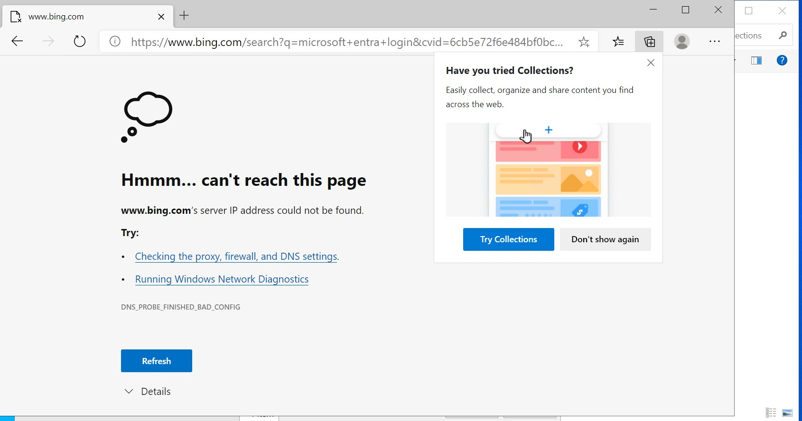
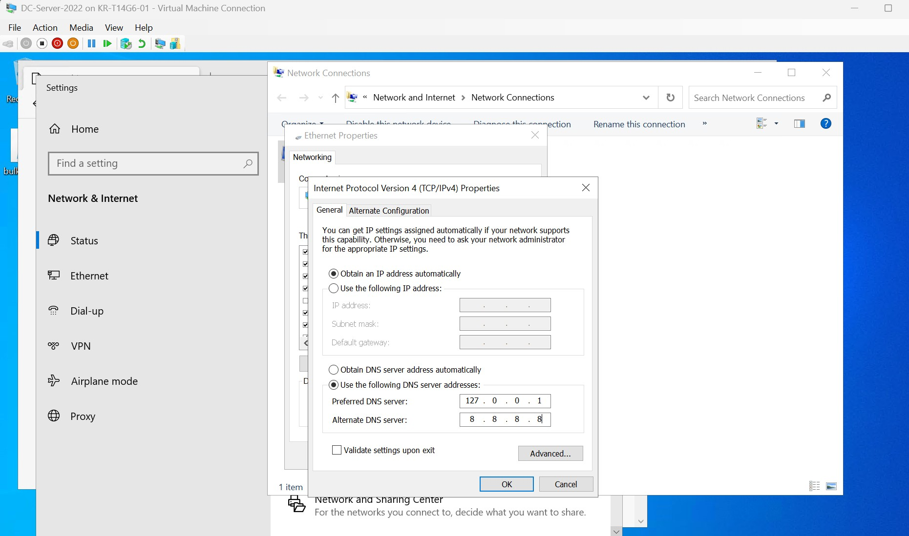
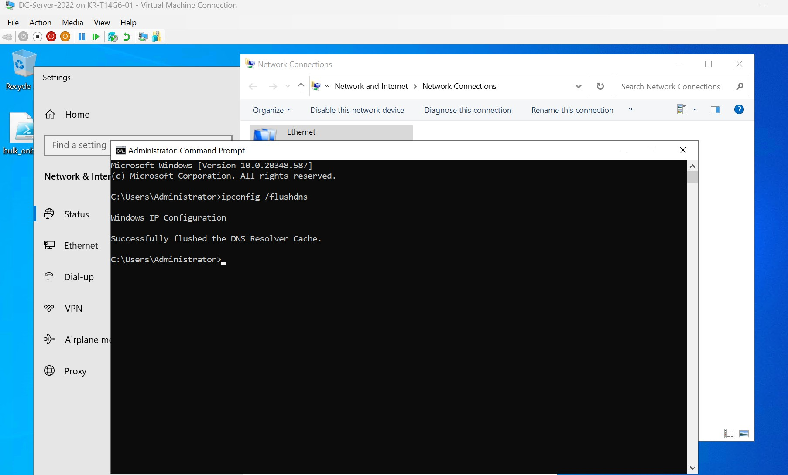


---

## 🔐 Phase 2: Administrative Elevation & Portal Workspace Optimization

### 2. Tenant Administration RBAC Elevation
* **Technical Objective:** Provision an administrative identity with sufficient security permissions to schema-write, register synchronization agents, and manage tenant objects.
* **The Error Encountered (`access_deny.jpg`):** Attempting to perform early workspace enrollment resulted in an explicit security block: *"You don't have access to this. Your account does not have permission to view or manage this page."*
* **Root Cause Analysis:** The active account clearing the initial multi-factor authentication handshake lacked directory-level management rights. Authentic hybrid sync attachment requires a security context with tenant-wide orchestration capabilities.
* **Engineering Resolution (`access_deny_resolved.jpg`):** Accessed the directory control pane using the fallback bootstrap administrator profile and updated the user role allocation matrix to elevate the account.
* **Assigned Security Profile:** `Global Administrator` role mapped to `wlachdaniel@nexttechxlab.onmicrosoft.com`.

#### Documentation References:
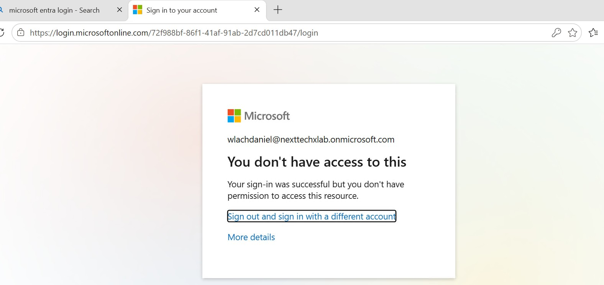
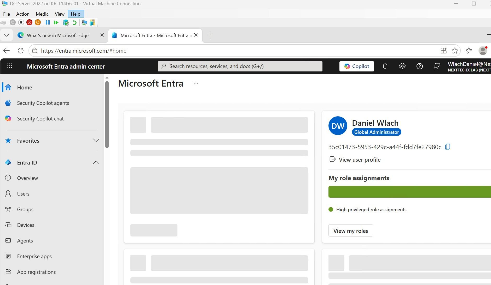

### 3. Modern Browser Core Upgrades for Cloud Management
* **Technical Objective:** Ensure the server host's web view engines safely support current OAuth 2.0 frames, JavaScript rendering trees, and modern web application interfaces utilized by the Entra ID ecosystem.
* **The Challenge (`msedge_update.jpg`):** The stock version of Microsoft Edge native to fresh Windows Server 2022 media packages (Version 86) consistently threw performance warnings and failed to correctly load complex elements within cloud portal interfaces.
* **Engineering Resolution (`msedge_update_done.jpg`):** Executed a manual browser compilation update across the host node, elevating the installation profile to a current Chromium architecture framework to guarantee smooth communication paths.

#### Documentation References:
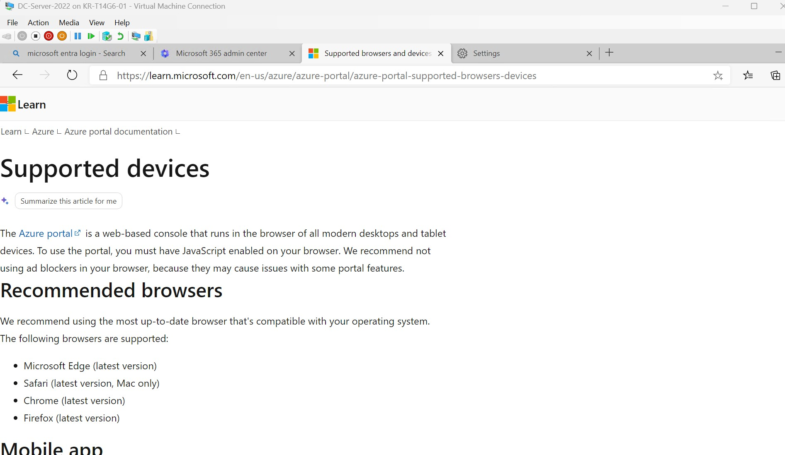
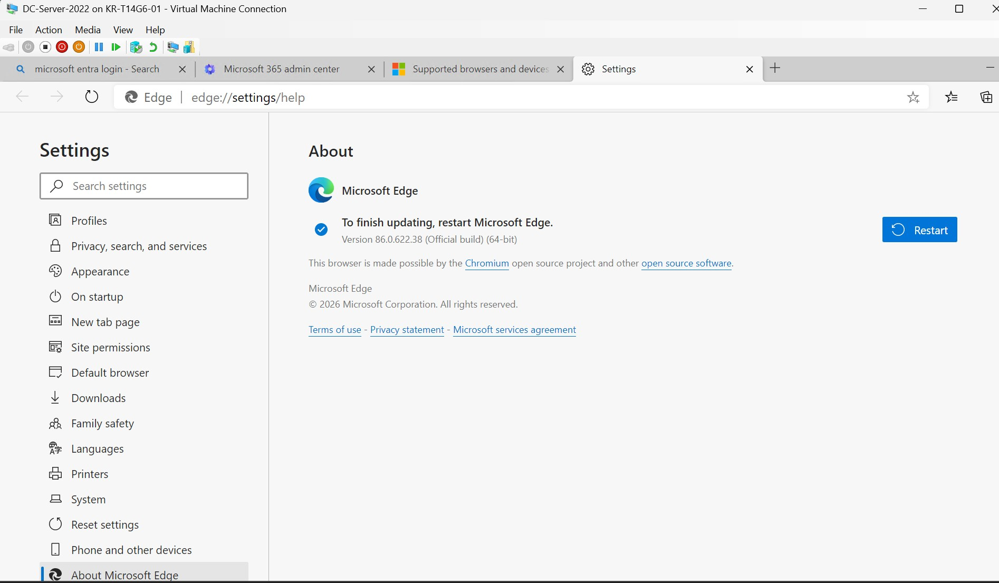

---

## 🔄 Phase 3: Microsoft Entra Connect Sync Core Deployment

With network communications baseline-validated, the actual directory synchronization suite was introduced to bridge the local Active Directory database engine to the cloud.

### 4. Legacy Script Blocker Mitigation
* **Technical Objective:** Allow the Microsoft Entra Connect Sync installation wizard to spin up its embedded interactive web sign-in frame for secure cloud administrative handshakes.
* **The Error Encountered (`javascript_issue.jpg`):** Upon reaching the *Connect to Microsoft Entra* step, the wizard abruptly failed with a blank sub-window displaying: *"Something went wrong. JavaScript is required to sign in. Your browser either does not support JavaScript or it is being blocked. Enable JavaScript in your browser or use one which supports it."*
* **Root Cause Analysis:** The integrated container wrapper inside the sync setup client relies on underlying Internet Explorer/Edge rendering rules. Windows Server's default security template sets Internet Explorer Enhanced Security Configuration (IE ESC) to strict mode, completely disabling active scripting routines on application-level web frames.
* **Engineering Resolution (`javascript_issue_solve.jpg`):** Navigated directly to **Server Manager** -> **Local Server**. Located the **IE Enhanced Security Configuration** parameter toggle link. In the properties popup window, changed the radio buttons under both **Administrators** and **Users** from **On (Recommended)** to **Off**. Clicked **OK** to commit, and re-initialized the wizard wrapper.

#### Documentation References:
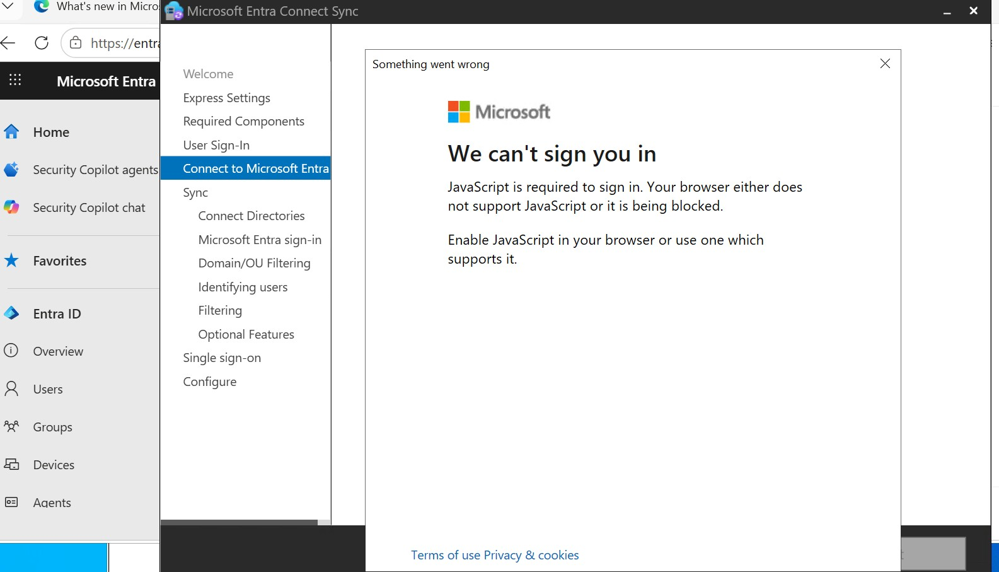
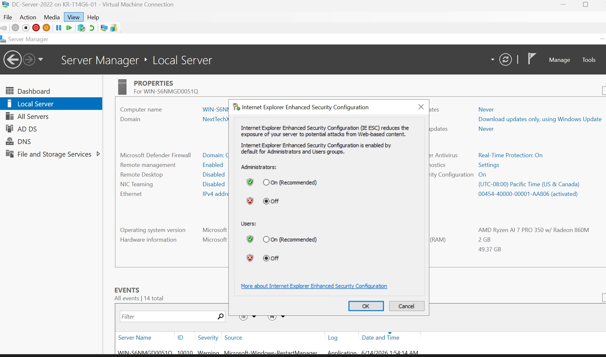

### 5. Identity Sign-In Method Strategy Configuration
* **Technical Objective:** Choose an identity translation model that maps domain users to cloud instances without introducing high-overhead local server dependencies.
* **Engineering Configuration Selection (`MS_Entra_config.jpg`):**
  * **Password Hash Synchronization (PHS):** Selected as the primary sign-on method. This securely replicates a unidirectional SHA-256 cryptographic hash of a user's local Active Directory password into Entra ID, facilitating access using matching credentials without requiring local servers to process live authentication traffic.
  * **Enable Single Sign-On (SSO):** Checkbox explicitly enabled. This sets up Kerberos computer accounts inside the local Active Directory forest to provide Seamless SSO, automatically logging corporate desktop-bound users into cloud tools when connected to the local network.

#### Documentation References:
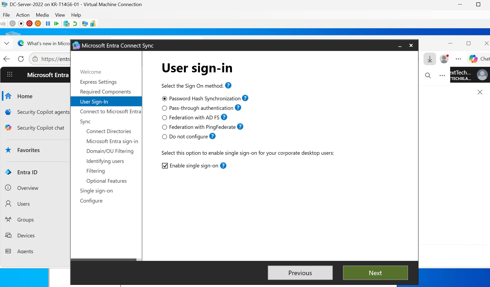

### 6. On-Premises Directory Connector Registration Fault
* **Technical Objective:** Bind the Microsoft Entra Sync database client explicitly to the local on-premises directory forest schema structure.
* **The Error Encountered (`problem_2.jpg`):** After filling in local directory data and targeting the domain root, a hard stop banner warned: *"The domain specified in the credentials does not exist or cannot be contacted."*
* **Root Cause Analysis:** The wizard failed to reach or authorize communications with the Domain Controller because of a strict domain namespace lookup failure or inadequate account scoping.
* **Engineering Resolution:** Confirmed exact domain naming by calling structural parameters natively via the local system environment (`echo %userdomain%`). Adjusted the connector input values to explicitly reference the fully qualified domain name (FQDN) `NextTechX.local`, added enterprise management accounts to clear structural authentication loops, and scoped sync processing patterns cleanly to the local production container (`Corp_Root`).

#### Documentation References:
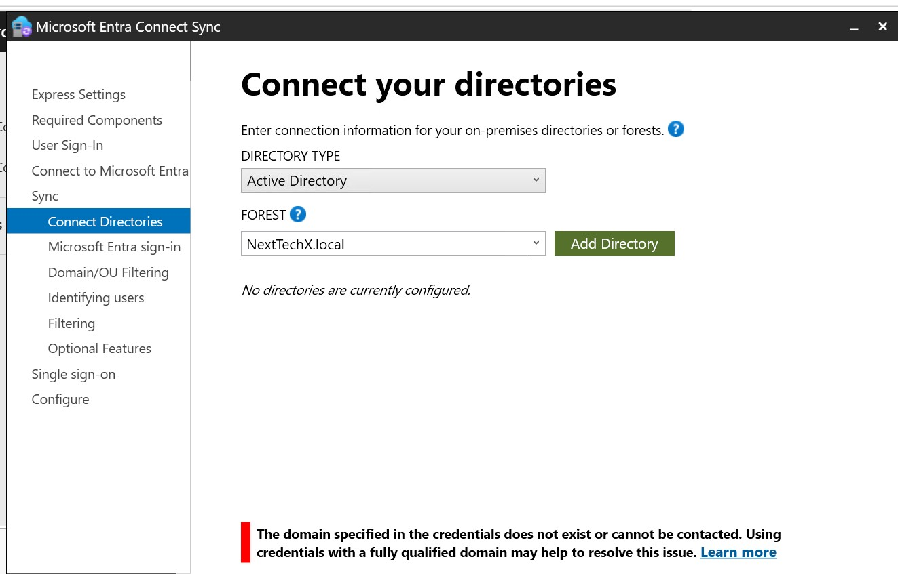

### 7. Optional Enterprise Security Features Provisioning
* **Technical Objective:** Elevate the directory interface loop from a basic one-way downstream sync engine into a highly robust, write-back capable workspace.
* **Engineering Configuration Selection (`pw_writeback.jpg` & `ms_entra_connected.jpg`):**
  * **Password Hash Synchronization:** Remained selected to form our core identity matching engine.
  * **Password Writeback:** Explicitly checked and activated. This enables bi-directional credential flow; if a user initiates a self-service password reset (SSPR) or an administrator alters an identity token directly inside the cloud-native Microsoft 365 dashboard, the system immediately replicates that modification back down to the local Windows Server domain controller database.

#### Documentation References:
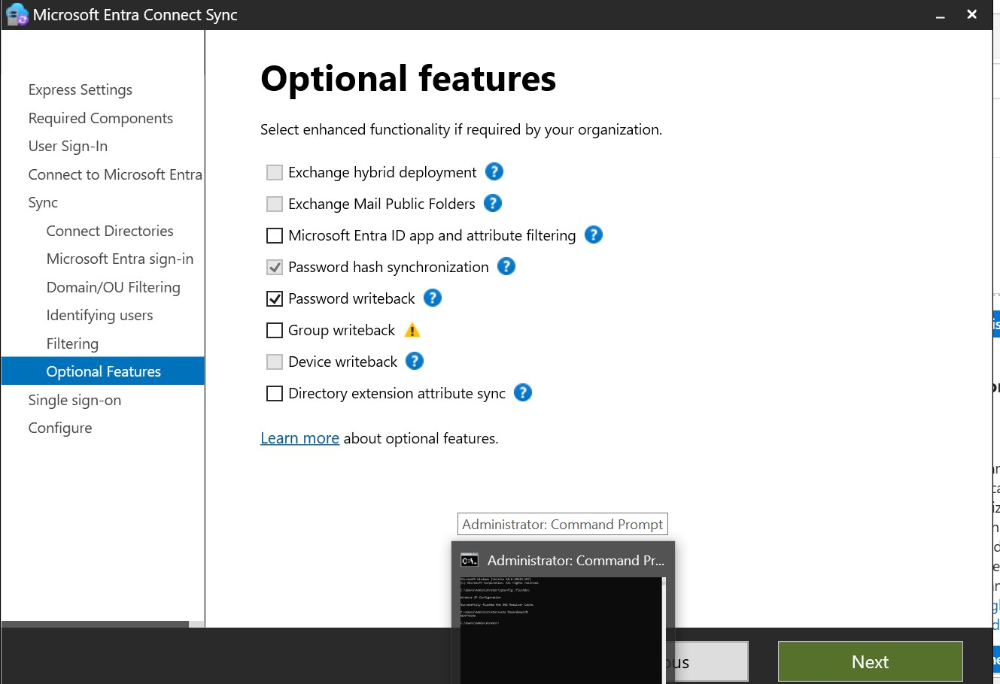

---

## 📊 Phase 4: Verification, Initialization, & Cloud Status Audit

### 8. Directory Link Finalization Validation
* **Technical Objective:** Commit the active identity mapping schemas, trigger directory synchronization loops, and log server environment warnings.
* **Outcome Verification (`MS_Entra_config_complete.jpg`):** The wizard executed all structural parameters successfully and generated the final confirmation dashboard: *"Microsoft Entra Connect Sync configuration succeeded. The synchronization process has been initiated."*
* **Critical Administrative Review Insights:**
  * The wizard flagged an optimization warning indicating that the *Active Directory Recycle Bin* is currently disabled on the local forest—noted for subsequent domain health cleanup cycles.
  * Confirmed that the source anchor profile is pinned directly to the AD attribute value: `mS-DS-ConsistencyGuid`.
  * Verified that Seamless SSO configurations are active and require a Group Policy template push to distribute Kerberos endpoints across corporate client workstations.

#### Documentation References:
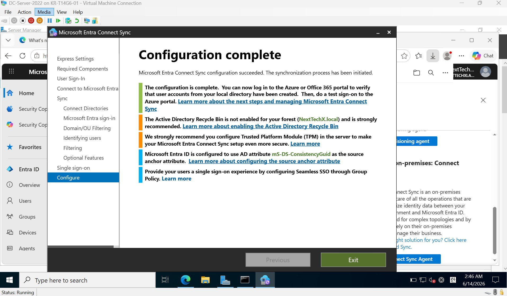

### 9. Microsoft Entra ID Cloud Object Synchronization Audit
* **Technical Objective:** Verify that accounts constructed on the local Windows Server database successfully synchronized up to the cloud-native identity control tier.
* **Validation Outcome (`Entra_Users_connected.jpg`):** Logged natively into the **Microsoft Entra Admin Center** web panel and reviewed the global user index blade. The workspace validates that the local database objects are fully synchronized as matching identity objects, complete with assigned domain properties.
* **Synchronized Lab Assets Inventory:**
  * **Anna Heart** (`aheart@NextTech...`)
  * **David Kim** (`david.kim@NextTech...`)
  * **Elena Rostova** (`elena.rostova@Ne...`)
  * **Jane Doe** (`jdoe@NextTechXL...`)
  * **John Smith** (`jsmith@NextTech...`)
  * **Marcus Vance** (`marcus.vance@N...`)
  * **Sophia Chen** (`sophia.chen@Nex...`)
  * **Daniel Wlach** (`WlachDaniel@Ne...`)

#### Documentation References:
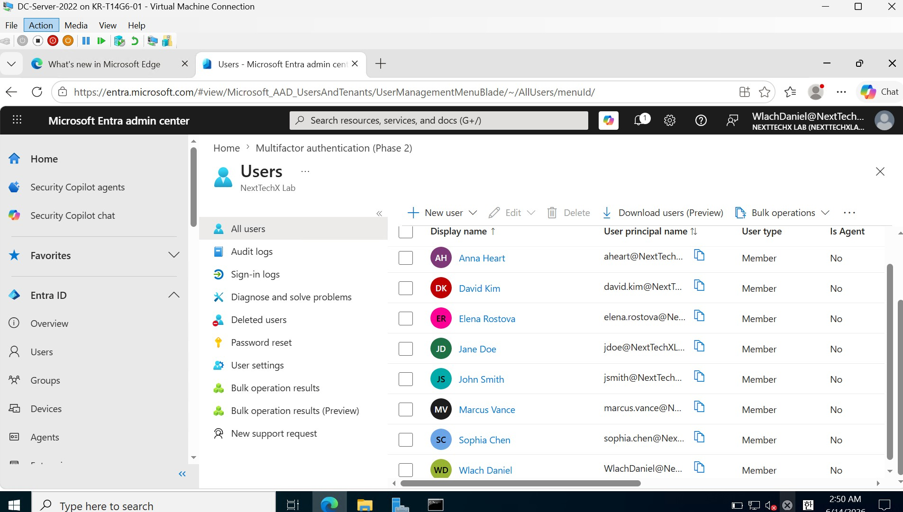


## ⚙️ Phase 7: Post-Deployment Operations — Hybrid User Provisioning Lifecycle

With the core identity sync topology fully validated, operational testing was conducted to simulate standard enterprise user provisioning pipelines. This phase confirms that modifications committed to the local on-premises directory cleanly replicate downstream to the cloud tenant space on demand.

### 1. On-Premises Structure Organization & Object Creation
* **Technical Objective:** Structure the local directory database using distinct administrative boundaries and provision a new corporate employee profile locally.
* **Execution:** Created a new localized Organizational Unit (OU) named `Corp_Users` directly within the active root directory domain database (`NextTechX.local`). A new employee user object was generated inside this container:
  * **Display Name:** Tariq Malik
  * **User Principal Name (UPN):** tmalik@NextTechX.local
  * **Security Parameter:** Enforced "User must change password at next logon" configuration rules to test down-stream credential translation behaviors.

#### Documentation Reference:
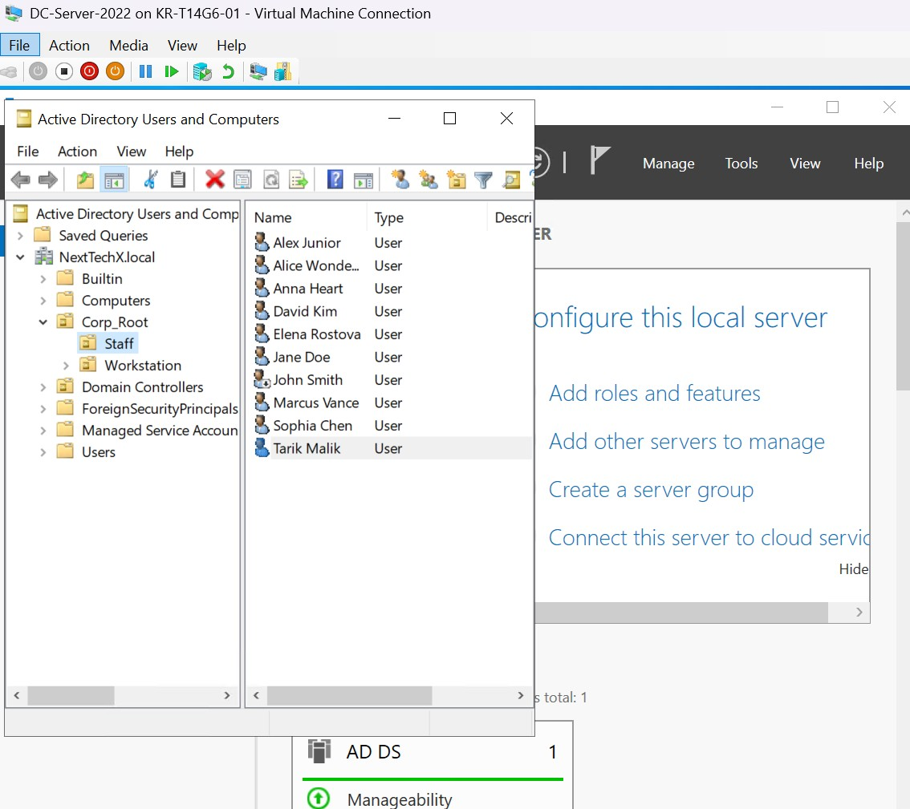

---

### 2. Administrator-Driven Delta Replication Override
* **Technical Objective:** Bypass the default 30-minute automated schedule cycle of the Microsoft Entra Connect Sync engine to push emergency changes to the cloud instantaneously.
* **Execution:** Opened an administrative PowerShell console on the primary domain controller host node and explicitly invoked a Delta Synchronization policy sync request via the local scheduling engine.
* **Execution Command:**
```powershell
Start-ADSyncSyncCycle -PolicyType Delta
```

###Documentation Reference:

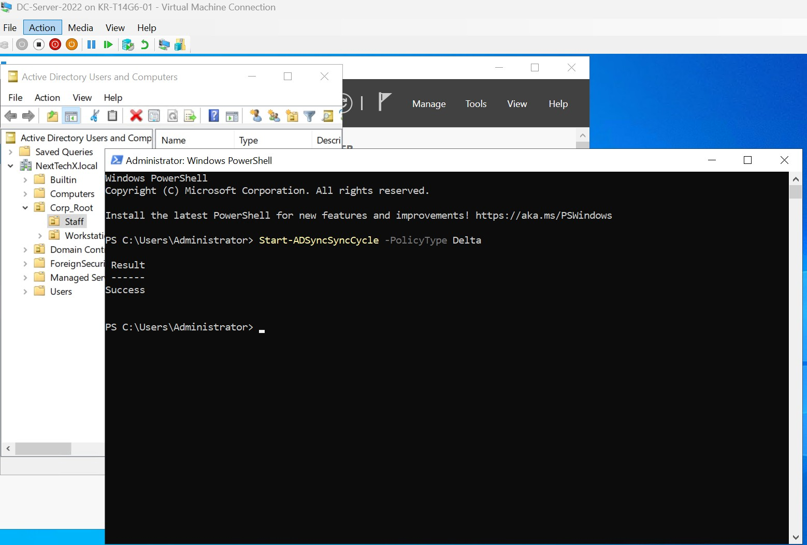


### 3. Cloud Synchronization Verification Audit
Technical Objective: Validate that the locally constructed object cleanly transformed into a valid, authenticated hybrid enterprise user inside the cloud tenant workspace.

Execution: Logged into the modern Microsoft Entra admin center interface and performed a structural directory lookup across the global user index blade to verify the On-premises sync enabled: Yes attribute status.

Outcome Verification: The system confirms the presence of Tariq Malik. The platform flags his administrative identity status profile with an explicit Directory synced: Yes attribute tag under his profile properties, proving that our on-premises identity lifecycle pipeline works seamlessly from end to end.

###Documentation Reference:

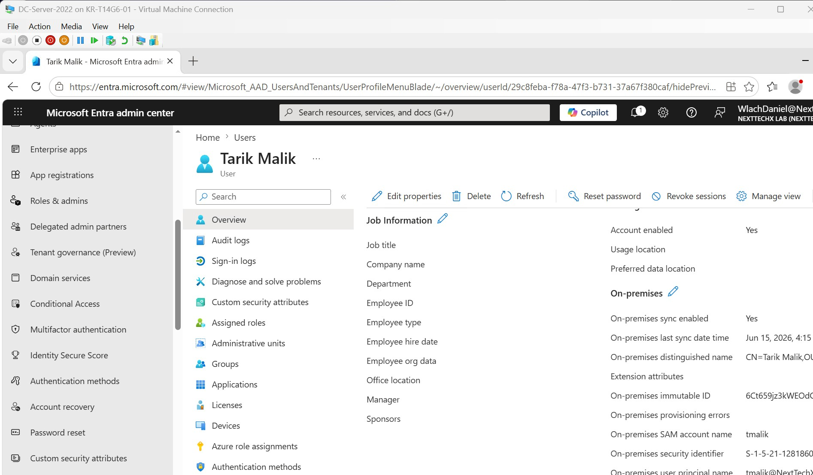


     
## ⚙️ Phase 8: Post-Deployment Operations — Password Writeback Infrastructure Validation

With the downstream object identity sync validated, operations focused on verifying bi-directional credential flows. This test ensures that administrative or user-driven authentication changes initiated in the cloud-native workspace are written back to the local on-premises Active Directory Domain Services (AD DS) database in real-time.

### 1. Cloud-Initiated Administrative Password Reset
* **Technical Objective:** Force an identity credential state change within the Microsoft Entra cloud control panel on a synchronized hybrid account.
* **Execution:** Navigated to the Microsoft Entra admin center, localized the synchronized profile for `Tariq Malik`, and triggered an administrative password reset loop to generate a new cloud-side temporary authentication token.

#### Documentation Reference:
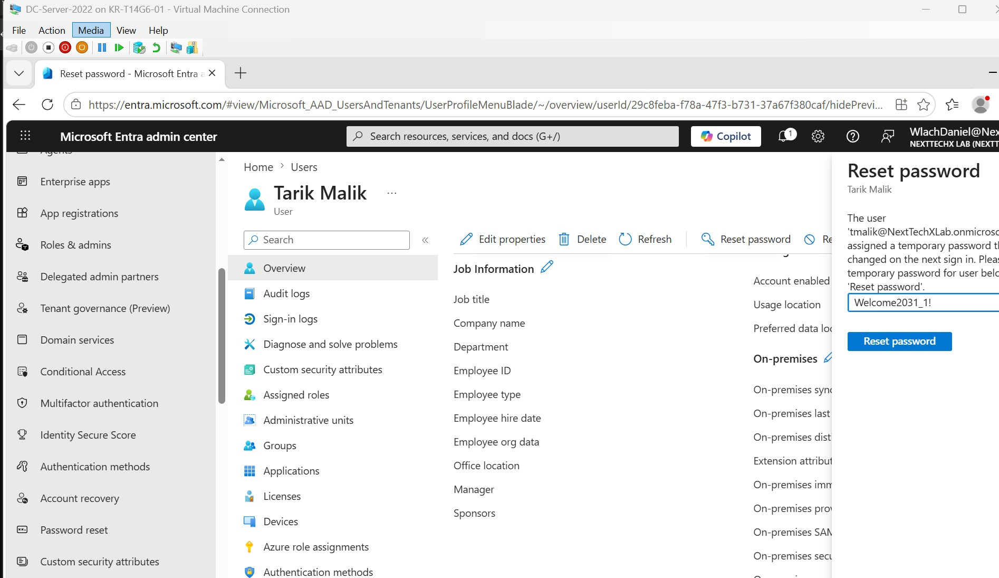

---


### 2. On-Premises Writeback Execution Verification
* **Technical Objective:** Verify that the newly generated cloud authentication token was instantly intercepted by the local sync agent and committed to the local domain controller's database.
* **Execution:** Opened an administrative PowerShell console on the domain controller host node and constructed a secure credential object mapping Tariq's user principal name (`NextTechX\tmalik`) directly to the temporary plaintext token generated by the cloud. A secure variable decryption validation call was issued.
* **Execution Command:**
```powershell

$SecPassword = ConvertTo-SecureString "Welcome2031_1!" -AsPlainText -Force
$Cred = New-Object System.Management.Automation.PSCredential ("NextTechX\tmalik", $SecPassword)
$Cred.GetNetworkCredential().Password

```
###Documentation Reference:

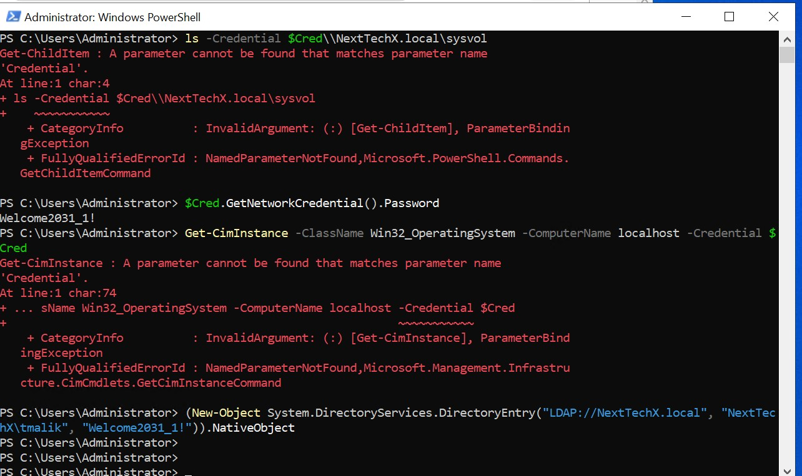


## ⚙️ Phase 9: Post-Deployment Operations — Hybrid Security Group Sync Topology

With bidirectional credential channels operating correctly, infrastructure operations shifted to scaling security administration. This phase validates the synchronization of on-premises security groups to Microsoft Entra ID, establishing the foundational pipeline required for Role-Based Access Control (RBAC) and automated cloud license provisioning.

### 1. On-Premises Security Group Architecture & Nesting
* **Technical Objective:** Establish a structural administrative security boundary locally and map synchronized user identities to it.
* **Execution:** Constructed a new Global Security group named `M365_Licensed_Users` inside the designated `Staff` Organizational Unit (OU) under the `Corp Root` directory tree on the primary domain controller. Modulated the object properties to nest the hybrid identity profile of `Tariq Malik` into the group's structural member directory database.

#### Documentation Reference:
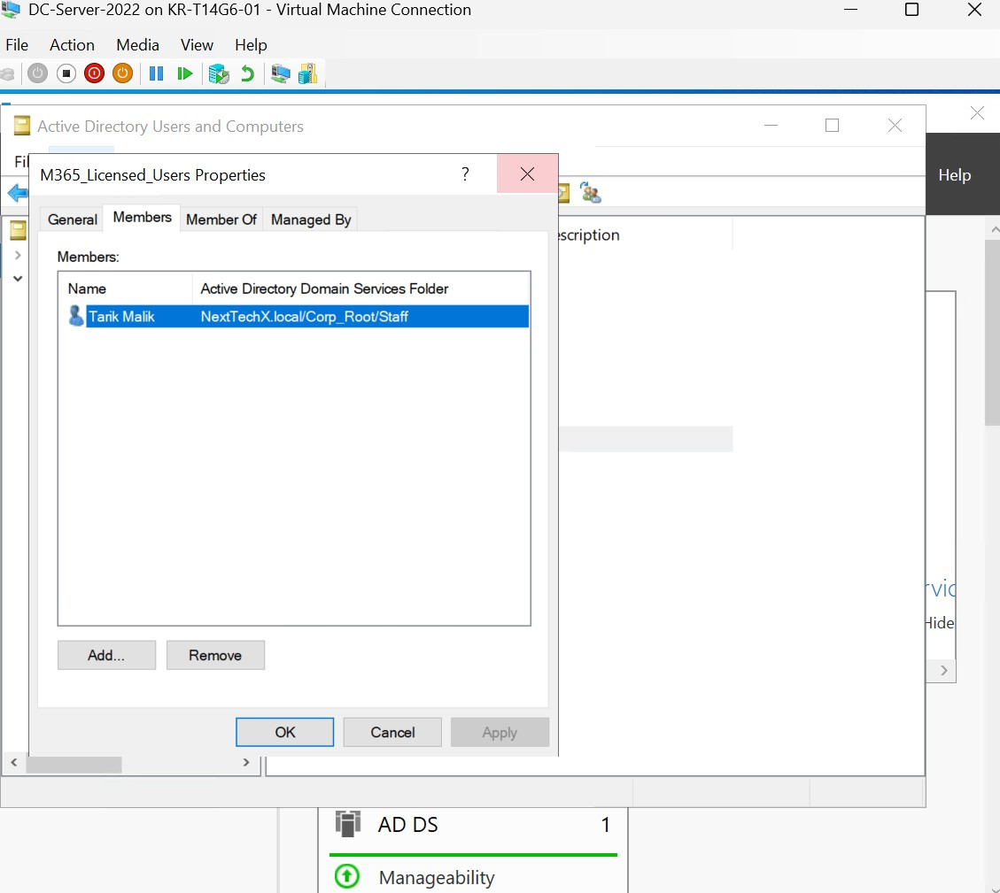

---

### 2. Cloud Directory Group Sync Audit
* **Technical Objective:** Verify that the localized group structure and its nested internal member relationships map flawlessly into the cloud workspace.
* **Execution:** Triggered an administrative delta sync cycle override using PowerShell. Following execution, authenticated into the Microsoft Entra admin center and executed an directory object lookup under the global Groups blade.
* **Outcome Verification:** The tenant successfully discovered the `M365_Licensed_Users` security group object, automatically designating its structural metadata with the `On-premises sync enabled: Yes` attribute. Auditing the internal object schema confirmed that `Tariq Malik` was securely mapped as an inherited member, validating end-to-end hybrid group architecture synchronization.

#### Documentation Reference:
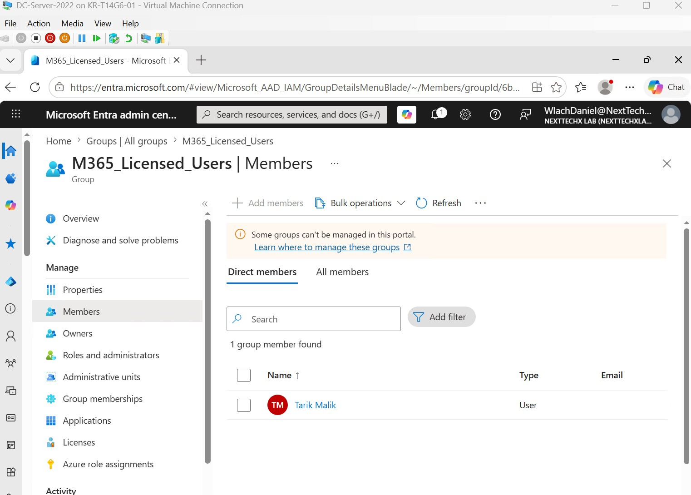


## ⚙️ Phase 10: Post-Deployment Operations — Group-Based License Automation

Following the successful synchronization of hybrid group topologies, operations advanced to implementing automated identity lifecycle management. This phase establishes Group-Based Licensing rules, ensuring that group memberships managed natively on-premises dynamically drive cloud-native resource allocation and service provisioning.

### 1. Cloud Product Assignment to Synchronized Directory Groups
* **Technical Objective:** Map enterprise application and cloud service license allocations directly to synchronized security boundaries rather than individual user objects.
* **Execution:** Authenticated into the Microsoft 365 Admin Center, navigated to the core Billing infrastructure, and assigned the Microsoft 365 Business Premium product subscription pool directly to the synchronized global security group `M365_Licensed_Users`. 

#### Documentation Reference:
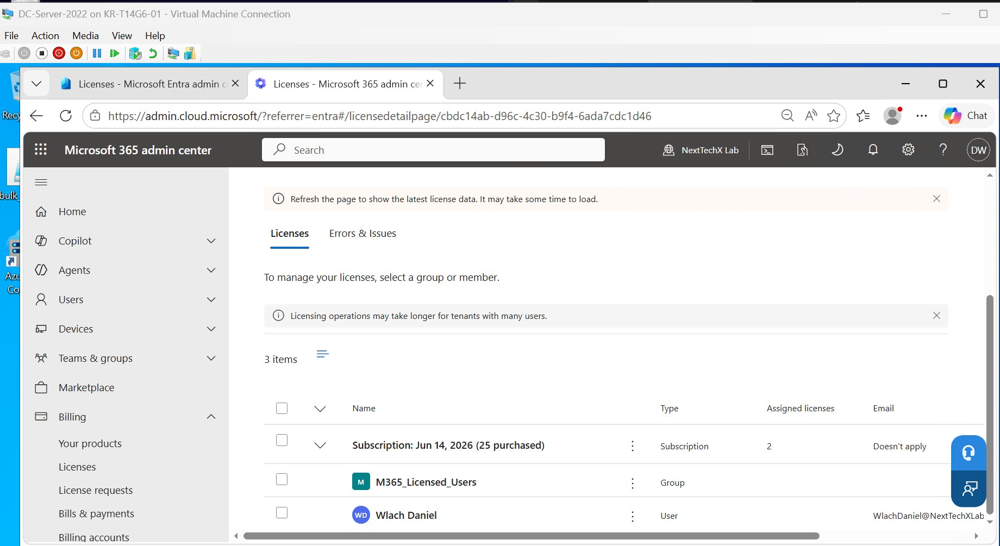

---

### 2. Downstream User License Inheritance & Backend Processing Audit
* **Technical Objective:** Validate that nested members within the synchronized security group automatically inherit target cloud licenses without direct administrative intervention.
* **Execution:** Navigated back to the Microsoft Entra admin center directory user base to isolate the hybrid account profile for `Tariq Malik` and audit his active license assignment paths.
* **Outcome Verification:** The licensing engine successfully locks the product footprint via group assignment constraints when individual modifications are attempted. Note that due to asynchronous cloud replication patterns between the M365 Billing interface and Entra ID, object paths may temporarily reflect a `Direct` evaluation state while backend group evaluation runs finish processing.

#### Documentation Reference:
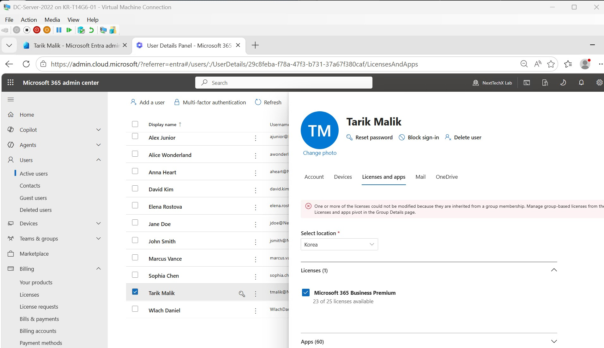


## ⚙️ Phase 11: Post-Deployment Operations — Helpdesk Optimization via Self-Service Password Reset (SSPR)

To mitigate operational overhead associated with credential management, identity operations advanced to provisioning Self-Service Password Reset (SSPR) workflows. This phase integrates our synchronized on-premises security group into the modern converged cloud recovery infrastructure, allowing end-users to securely update authentication states across both directories without service desk intervention.

### 1. Modern Converged Authentication Policy Configuration
* **Technical Objective:** Enable secure authentication recovery channels using the centralized Microsoft Entra auth methods policy engine to support a multi-layered verification strategy (App, SMS, and Email).
* **Execution:** Navigated to the converged Authentication Methods policy infrastructure. Configured explicit registration baselines enabling SMS, Email One-Time Password (OTP), and Authenticator app capabilities, mapping the enforcement scope rules directly to support our synchronized identity boundary (`M365_Licensed_Users`).

#### Documentation Reference:

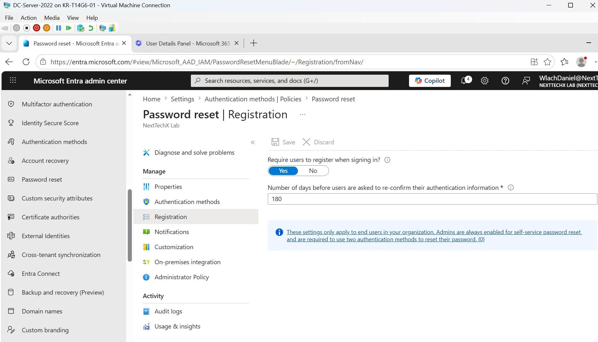

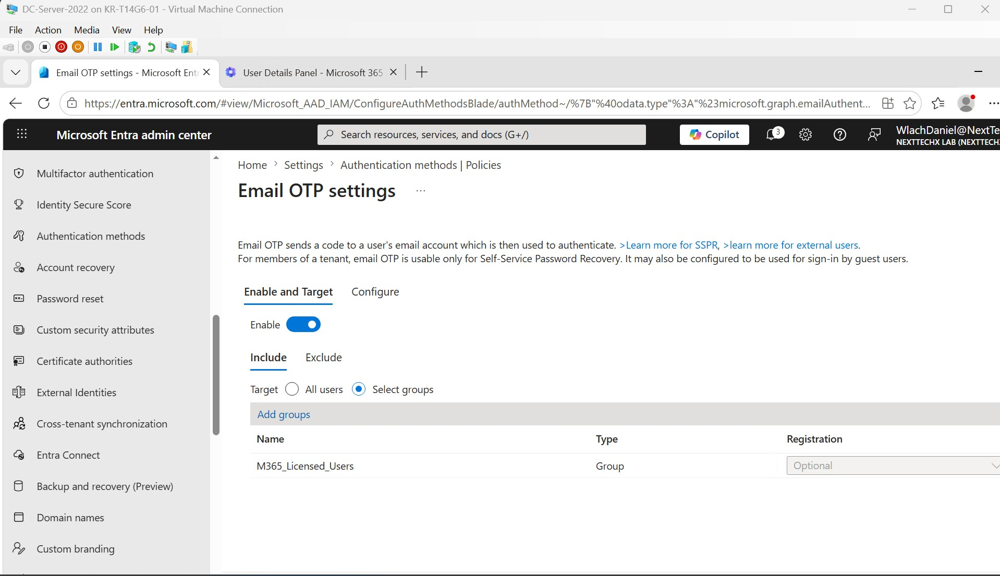

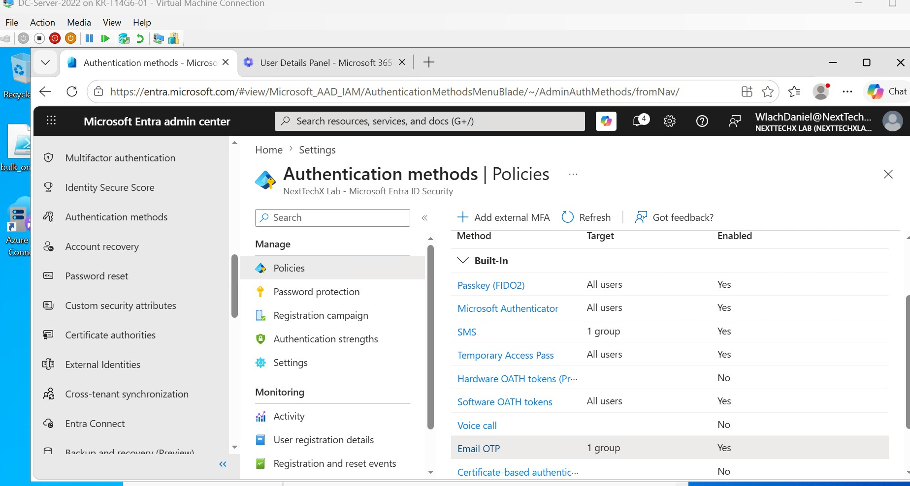

---

### 2. End-User Registration Profile Simulation
* **Technical Objective:** Validate that registration rules enforce authentication method enrollment upon subsequent user sign-ins and verify registration viability.
* **Execution:** Initiated an isolated browser space to simulate a standard enterprise user authentication workflow for `Tariq Malik` via the My Sign-Ins portal. Upon processing the primary credential layer, the identity wrapper successfully enforced the Registration Campaign, mandating the enrollment of the primary Authenticator App channel alongside backup verification options.
* **Outcome Verification:** The account successfully committed its verification data to the cloud directory tree, registering the Microsoft Authenticator app securely. Combined with our active on-premises Password Writeback engine, this completes the configuration loop—empowering the user to self-remediate account lockouts and write updates back to the local domain controller seamlessly.

#### Documentation Reference:

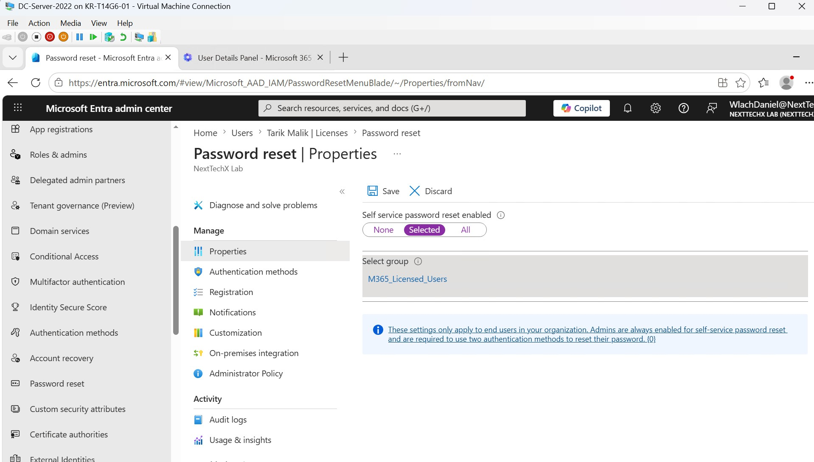

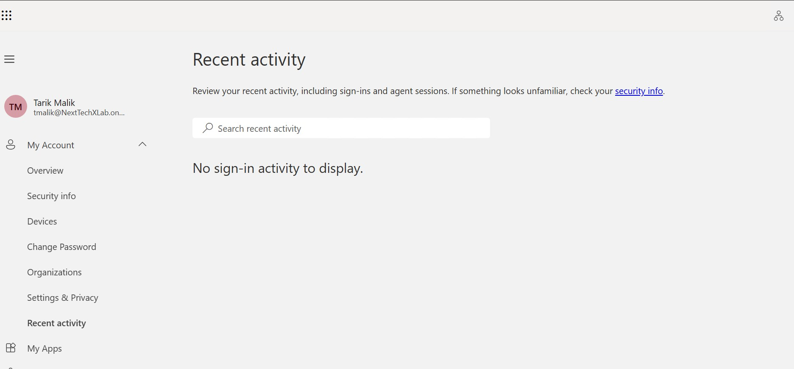


## ⚙️ Phase 12: Post-Deployment Operations — Role-Based Access Control (RBAC) via Administrative Units

To align infrastructure management with the Principle of Least Privilege (PoLP), hybrid operations advanced to implementing delegated cloud administration. This phase establishes an Administrative Unit (AU) to isolate regional directory elements and assigns scoped Helpdesk Administrator rights without exposing tenant-wide global administrative capabilities.

### 1. Administrative Unit Provisioning and Structural Scoping
* **Technical Objective:** Establish a virtual directory virtualization boundary to group regional hybrid user objects for localized administrative control.
* **Execution:** Navigated to the Microsoft Entra admin center Roles & Admins tier to provision a new Administrative Unit designated as `Seoul_Staff_AU`. Upon creation, targeted the container's user object scope and populated it with the synchronized hybrid identity `Tariq Malik`.

#### Documentation Reference:


---

### 2. Scoped Role Delegation for Support Personnel
* **Technical Objective:** Delegate Helpdesk administrative permissions targeted exclusively to the scoped Administrative Unit container.
* **Execution:** Accessed the internal RBAC matrix of the `Seoul_Staff_AU` container and selected the 'Helpdesk Administrator' role profile. Executed an assignment rule mapping the local technician identity `Wlach Daniel` to the role.
* **Outcome Verification:** The identity engine confirms that the support profile holds active Helpdesk rights. Because this assignment is nested directly inside the AU rather than the tenant root, the technician can perform credential and profile remediation strictly for users inside this unit, preventing unauthorized access to root-level billing or tenant-wide configurations.

#### Documentation Reference:
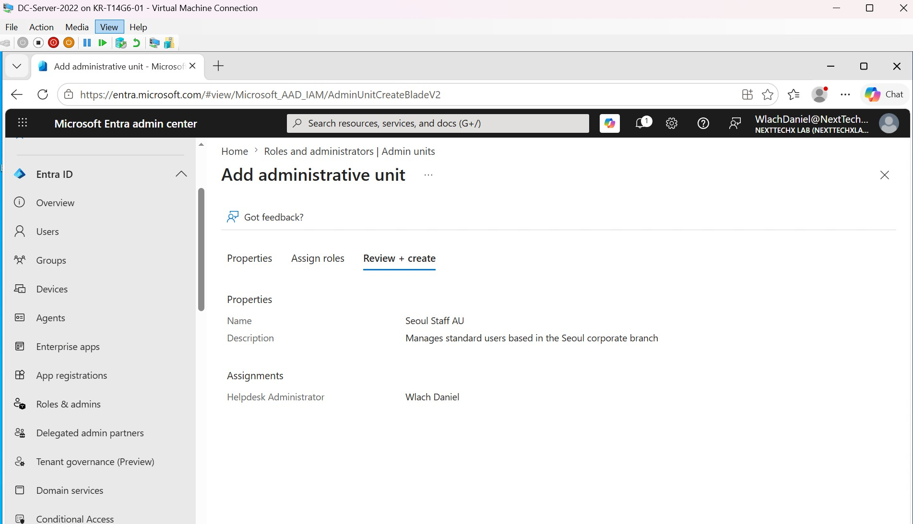


