# IT-Support-Hybrid-Home-Lab-Daniel
Personal Home Lab of Daniel Wlach
# Hybrid IT Support Home Lab Portfolio
## Overview
An enterprise-grade sandbox integrating an on-premises Windows Server 2022 domain environment with Microsoft 365 Cloud Architecture, Entra ID, and Intune Endpoint Management.


## Milestones Documented
- [x] Phase 1: M365 Cloud Sandbox Setup & User Provisioning
- [x] Phase 2: Local Hypervisor & Server Deployment
- [x] Phase 3: Active Directory Domain Services Setup
- [x] Phase 4: Hybrid Cloud Sync & Intune Enrollment
- [x] Phase 5: Advanced Systems Engineering & Help Desk Operations Staging
- [x] Phase 6: Core Cloud Identity Security & Conditional Access Policy Enforcement
- [x] Phase 7: Entra ID Sign-In Log Triage & Authentication Troubleshooting
- [x] Phase 8: Hybrid User Provisioning Lifecycle & Directory Synchronization Management
- [x] Phase 9: Manual Delta Sync Overrides & Entra Connect Engine Optimization
- [x] Phase 10: Role-Based Access Control (RBAC) Delegation via Administrative Units
- [x] Phase 11: Enterprise Corporate Branding & Helpdesk Disclosure Configuration
- [x] Phase 12: Self-Service Password Reset (SSPR) Architecture & Security Registration Policies
- [x] Phase 13: Core Communication Infrastructure: Shared Mailboxes & Distribution Groups Setup
- [x] Phase 14: Directory Cleanup, User Audit Trails, & Duplicate Account Remediation
- [x] Phase 15: Corporate Hierarchy Re-Engineering: Departmental Scopes & Cloud Security Group Topologies
- [x] Phase 16: Enterprise Group-Based Licensing Architecture Implementation
- [x] Phase 17: Tenant-Wide Security Baselines & Password Lifecycle Governance
- [x] Phase 18: Cloud Device Registration & Automated Intune MDM Staging
- [x] Phase 19: Role-Based Access Control (RBAC) & Delegated Helpdesk Administration
- [x] Phase 20: Hybrid Network Troubleshooting & Local DNS Cache Remediation
- [x] Phase 21: Endpoint Diagnostics & Custom BSOD Crash Dump Analysis
- [x] Phase 22: Enterprise Messaging Operations & User Lifecycle Triage
- [x] Phase 23: User Offboarding & Basic Security Triage
- [x] Phase 24: Mailbox Delegation & Access Management
- [x] Phase 25: Automated Mail-Flow Coverages (Out-of-Office Policy)
- [x] Phase 26: Logical Operators in Identity Governance (Legal & Compliance)
- [x] Phase 27: Self-Service Identity Lifecycle Management (SSPR)
- [x] Phase 28: Diagnostic Identity Auditing & Sign-In Log Analysis
- [x] Phase 29: Environment Auditing & Tenant Security Health Baseline
- [x] Phase 30: Mail-Enabled External Contacts & Global Address List (GAL) Integration
- [x] Phase 31: Role-Based Access Control (RBAC) & Identity Lifecycle Promotion
- [x] Phase 32: Enterprise Governance & Tenant Brand Customization
- [x] Phase 33: Mobile Email Apps & Device Checking
- [x] Phase 34: Shared Folder Permissions & Account Lifecycle Triage
- [x] Phase 35: System Storage Triage & Enterprise User Profile Remediation
- [x] Phase 36: Desktop Application Remediation & Process Management
- [x] Phase 37: Workstation Optimization & Taskbar Widget Management

### Phase 1 Implementation Evidence
   Here is the pristine Hyper-V virtualization host environment initialized on the host laptop before OS deployment:
   
   

### Phase 2 Implementation Evidence
   Here is the live deployment of the Windows Server 2022 base environment running inside Hyper-V:
   
   

### Phase 3 Implementation Evidence
     Successfully promoted the standalone server to a Root Domain Controller, establishing the local directory database:


### Phase 4 Implementation Evidence

To simulate a real-world corporate onboarding and system administration scenario, I implemented user management lifecycle standards and enterprise baseline security.

#### 1. Directory Structure & Workforce Provisioning
I structured the corporate environment using Organizational Units (OUs) and provisioned a team of 5 fictional employees. Following identity and access management (IAM) best practices, every user account was built with a temporary credential requiring a forced password reset upon their very first login.


#### 2. Administrative Data Tracking
To maintain strict data integrity and assist with identity auditing, I developed a centralized employee tracking matrix detailing fictional personnel demographics, corporate email mapping, start dates, and initial credential cycles.


#### 3. Enterprise Group Policy Enforcement
To secure corporate workstations against physical data exposure, I engineered a domain-wide Group Policy Object (GPO) titled `Corp_Security_ScreenLockout`. This policy targets user objects to automatically enforce a 15-minute (900 seconds) idle screen saver timeout and automated desktop lock.

Below is the live operational environment showing the 5 active user objects alongside the active, enabled Group Policy configuration:


## 🛠️ Advanced IT Infrastructure Optimization & Help Desk Operations

To elevate this environment beyond a basic out-of-the-box configuration, this section details production-grade systems engineering implementations designed to enforce organizational compliance, optimize user workflows, and establish enterprise desktop baselines.

### 📋 Section 1: Advanced Systems Engineering (Group Policy Objects)

#### 1. Automated Enterprise Network Drive Mapping (`GPO 1`)
* **Business Requirement:** The organization requires a standardized, centralized network storage repository accessible to all corporate personnel immediately upon session initialization. Handkeying network paths on individual client devices introduces operational overhead and potential security configuration drift.
* **Engineering Solution:** Architected a dedicated, domain-wide Group Policy Object titled `Corp_Preferences_DriveMapping`. Rather than embedding preferences within unrelated security objects, this modular preference explicitly maps the corporate file share repository to the uniform network drive letter `Z:\`.
* **Technical Implementation Path:** Navigated via `User Configuration` ➔ `Preferences` ➔ `Windows Settings` ➔ `Drive Maps`. Configured an `Update` action targeting the network share path (`\\DC-SERVER-2022\CompanyShare`) utilizing standard inheritance rules linked directly to the workforce Organizational Unit (OU).

Below is the verified staging environment demonstrating the active object configuration and path targets:


The granular deployment matrix properties enforced within the target environment:


---

#### 2. Enterprise Desktop Environment Standardization (`GPO 2`)
* **Business Requirement:** Corporate branding guidelines dictate a uniform desktop environment across all operational endpoints. Allowing end-users to customize workspace backgrounds introduces visual non-compliance and potential exposure to unvetted imagery within customer-facing environments.
* **Engineering Solution:** Implemented a granular environment constraint titled `Corp_Preferences_DesktopWallpaper` targeted directly at the workforce container.
* **Technical Implementation Path:** Governed via `User Configuration` ➔ `Policies` ➔ `Administrative Templates` ➔ `Desktop` ➔ `Desktop`. Enforced the `Desktop Wallpaper` policy to state `Enabled`, pointing configuration parameters to a static system resource path (`C:\Windows\Web\Wallpaper\Windows\img0.jpg`) utilizing a unified `Fill` style matrix.

Below is the verified administrative template blueprint enforcing endpoint visual conformity:


---

#### 3. Endpoint Hardening & Access Control (`GPO 3`)
* **Business Requirement:** Mitigate the internal attack surface by preventing standard non-administrative personnel from accessing local CLI environments. Restricting interactive command execution drastically reduces the success rate of malicious pivot scripts, reconnaissance commands, and unauthorized system modifications.
* **Engineering Solution:** Established a strict security baseline policy titled `Corp_Security_RestrictCMD` linked explicitly to standard user profiles.
* **Technical Implementation Path:** Navigated via `User Configuration` ➔ `Policies` ➔ `Administrative Templates` ➔ `System`. Toggled the `Prevent access to the command prompt` constraint to `Enabled`.
* **Granular Constraint Justification (Script Processing Selection):** Within the policy configurations, the parameter *“Disable the command prompt script processing also?”* was intentionally designated as **`No`**. 
  * *Architectural Logic:* Setting this constraint to **`No`** prevents standard users from interactively launching `cmd.exe` to execute manual commands, but crucially **preserves the operating system's ability to run legitimate logon, logoff, or deployment scripts in the background**. This ensures that administrative automation, mapping scripts, and security agents run seamlessly at startup without breaking core IT operational capabilities.

Below is the hardened policy profile demonstrating interactive restriction paired with background script preservation:


#### 🛠️ Ticket #1042: Active Directory Identity Access & Account Lifecycle Activation
* **ITSM Platform Environment:** Spiceworks Cloud Help Desk Portal
* **Incident Urgency/Priority:** Medium / P3 (Standard Identity Lifecycle Request)
* **Target Identity Object:** `User: John Smith | OU: Staff | Domain: NEXTTECHX.local`
* **Symptoms/Request Reported:** HR/Management submitted an operational request to reinstate systems access for returning personnel John Smith. The user identity object was flagged with a hard local restriction: *"Your account has been disabled. Please see your system administrator."*

Below is the active Spiceworks lifecycle tracking ticket managed for this request:


* **Diagnostic & Technical Remediations:**
  1. Logged into the Windows Server 2022 Domain Controller staging environment and initiated the **Active Directory Users and Computers (ADUC)** management console.
  2. Traversed the organizational directory layout to locate the deactivated user target object within the designated `Staff` OU.
  3. Audited account security attributes to verify the structural state of the object profile.
  4. Executed identity remediation by clearing the `Account is disabled` structural constraint within the Security Principal Account options matrix, restoring active domain privileges.

Below is the verified administrative intervention re-enabling the directory services object within Active Directory:


* **Root Cause/Operational Determination:** The account state was confirmed as an intentional administrative deactivation used during a standard personnel contract pause. The restriction has been lifted, authentication paths have been verified, and the tracking ticket has been successfully resolved and archived.

Below is the verified Spiceworks ledger entry confirming the incident has been moved to a closed operational state:


#### 🛠️ Ticket #1043: Client-Side Name Resolution (DNS) Corruption & Stale Cache Remediation
* **ITSM Platform Environment:** Spiceworks Cloud Help Desk Portal
* **Incident Urgency/Priority:** High / P2 (Workstation Network Isolation / Local Intranet Inaccessible)
* **Target Identity Object:** `User: Anna Heart | OU: Staff | Device: NTX-CL-05`
* **Symptoms Reported:** End-user reported total inability to resolve internal domain web assets (`portal.nexttechx.local`) and external web gateways. Diagnostic isolation confirmed neighboring endpoints on the same subnet were unaffected, pointing directly to a client-specific stack degradation.

Below is the active Spiceworks lifecycle tracking ticket initiated for this incident:


* **Diagnostic & Technical Remediations:**
  1. Initiated remote administrative CLI access on the target workstation asset (`NTX-CL-05`).
  2. Executed a complete purge of the locally cached, potentially poisoned or stale address resolution table using the Windows IP configuration utility:
     ```cmd
     ipconfig /flushdns
     ```
  3. Triggered manual refresh serialization to force the endpoint to re-register its host boundaries with the local Active Directory Domain Controller DNS zone files:
     ```cmd
     ipconfig /registerdns
     ```
  4. Verified successful resolution integrity by executing a network echo test (`ping`) against the target intranet header.

Below is the verified client-side resolution pipeline executed to remediate the cached network state:


* **Root Cause Determination:** Technical analysis indicated local DNS resolver cache corruption. The endpoint had cached a stale IP mapping during an ungraceful lease renewal cycle, preventing correct packet routing. The records were successfully purged, and the tracking ticket has been closed and archived.

Below is the verified Spiceworks ledger entry confirming the networking incident has been resolved:


### 🚨 Bonus Showcase: Hyper-V Host Resource Contention Troubleshooting
* **Infrastructure Exception:** Virtual Machine State Change Failure (`Error Code: 0x800705AA`)
* **Environment Context:** Local Host System (Type-2 Hypervisor Layer) executing `DC-Server-2022`
* **Symptoms Identified:** Triggering the execution state on the Domain Controller dropped a hard hypervisor intercept fault: *"Unable to allocate 2560 MB of RAM: Insufficient system resources exist."*

Below is the verified resource depletion error intercepted during the lab initialization phase:


* **Root Cause Diagnostics:** The physical host system experienced RAM exhaustion due to concurrent background operational processes. The hypervisor layer intentionally denied the VM boot request to prevent host OS instability or a Blue Screen of Death (BSOD) caused by memory starvation.
* **Engineering Resolution Matrix:** 1. Gracefully terminated unnecessary high-overhead consumer processes on the parent host to reclaim hardware pages.
  2. Navigated to `Hyper-V Manager` ➔ `DC-Server-2022 Settings` ➔ `Memory Properties`.
  3. Reconfigured the hypervisor's memory allocation strategy by enabling **Dynamic Memory provisioning**. 
  4. Adjusted the absolute `Startup RAM` floor matrix to a lower boundary conditions threshold ($2048\text{ MB}$ initialization base, down-scaling to a minimum active footprint of $1024\text{ MB}$).

Below is the verified hardware configuration adjustments applied inside Hyper-V Manager to optimize host memory distribution:


  
* **Outcome:** The memory provisioning optimization bypassed the host contention ceiling, allowing the Domain Controller to successfully achieve an active operational state without starving the host OS.


#### 🛠️ Ticket #1044: Active Directory Group Policy (GPO) Non-Propagation & Client-Side Refresh
* **ITSM Platform Environment:** Spiceworks Cloud Help Desk Portal
* **Incident Urgency/Priority:** Medium / P3 (Compliance Deficiency / Non-Applied Security Configuration)
* **Target Identity Object:** `User: Alex Junior | OU: Staff | Device: NTX-CL-11`
* **Symptoms Reported:** End-user Alex Junior reported that newly deployed administrative restrictions (specifically the corporate desktop interactive execution constraints) were not active on the workstation local shell context, exposing an enterprise compliance gap.

Below is the active Spiceworks lifecycle tracking ticket initiated for this incident:


* **Environmental Defect Encountered:** Upon accessing the terminal environment to execute the refresh command natively (`gpupdate /force`), the local Windows shell threw a standard execution error: *" 'gpupdate' is not recognized as an internal or external command, operable program or batch file."* This behavior indicated an environment `%PATH%` variable resolution disruption on the target endpoint.

Below is the verified terminal path execution exception captured during diagnostics:


* **Diagnostic & Technical Remediations:**
  1. Overrode the system environment variable parsing failure by targeting the absolute local root system file path directly where the deployment utility resides.
  2. Bypassed the tracking failure by executing the explicit drive string path to successfully kick off immediate policy evaluation:
     ```cmd
     C:\Windows\System32\gpupdate.exe /force
     ```
  3. Audited the client-side Resultant Set of Policy (RSoP) matrix to confirm successful receipt of user-context objects and computer-context configurations using the core infrastructure reporting utility:
     ```cmd
     C:\Windows\System32\gpresult.exe /r
     ```
  4. Confirmed that target security objects (`Corp_Security_Policy`) shifted explicitly into the active `Applied Group Policy Objects` registry table.

Below is the verified terminal screenshot displaying the successful policy force using the absolute system file string path:


* **Root Cause Determination:** The client endpoint failed to apply background policies automatically due to an environment path corruption blocking native command shortcuts. Bypassing the path via the absolute system directory successfully forced immediate policy synchronization from the primary Domain Controller database. The asset is verified compliant, and the tracking ticket has been closed and archived.

Below is the verified Spiceworks ledger entry confirming resolution fulfillment and archiving:


---

### 🤖 Phase 3: PDirectory Automation & Bulk Identity Provisioning (PowerShell)
* **Infrastructure Layer:** Automated Directory Database Manipulation (IAM)
* **Automation Tooling:** PowerShell Scripting Engine / ActiveDirectory Module
* **Operational Scope:** Scalable User Lifecycle Management & Automated HR Integration

#### 🌐 Architectural Overview
To demonstrate competency in scalable enterprise workflows, manual GUI object creation was replaced with automated pipeline processing. A custom PowerShell scripting deployment was engineered to parse incoming HR data streams (`.csv`) and programmatically provision directory records under structured corporate compliance boundaries.

Below is the raw human resources data roster staged inside Notepad prior to pipeline processing:


Below is the verified operational script and output execution log successfully processing database identities:


#### 🛠️ Automation Logic & Parameters
1. **Data Parsing:** Script ingests raw data headers (`FirstName`, `LastName`, `Department`, `Title`) to eliminate manual data entry human error.
2. **String Interpolation:** Automatically structures standardized enterprise naming matrices, generating the unique User Principal Name (`first.last@nexttechx.local`) and localized SAM accounts.
3. **Security Baselines:** Injects an identity security floor by assigning cryptographically masked default credentials while simultaneously enforcing the `ChangePasswordAtLogon` policy restriction.
4. **Target Routing:** Directly maps and drops structural principal accounts into their designated target organizational container.

#### 🔍 Environmental Troubleshooting & Path Resolution
* **Directory Path Debugging Exception:** Initial execution yielded delivery faults due to an organizational directory path structural mismatch. The target active environment utilized a nested root design schema rather than a flat baseline layout.
* **Remediation Resolution:** Intercepted the failure sequence by analyzing the directory hierarchy within the ADUC management console. Reconfigured the deployment string variable parameter from a flat path directly to the explicit nested container destination query: 

```markdown

```powershell
$TargetOU = "OU=Staff,OU=Corp_Root,DC=NextTechX,DC=local"
```


---

### 🛡️ Phase 4: Role-Based Access Control (RBAC) & Network File Share Governance
* **Infrastructure Layer:** Secured Distributed Storage Architecture (Data Security)
* **Access Control Methodology:** Principle of Least Privilege (PoLP) via NTFS Discretionary Access Control Lists (DACLs)
* **Operational Scope:** Structural Security Group Provisioning and Multi-Departmental Share Isolation

#### 🌐 Architectural Overview
To implement enterprise-grade data security baselines, a role-based access management framework was engineered on the storage tier. Moving away from highly inefficient individual user permission mappings, the directory architecture was grouped by departmental boundaries utilizing Active Directory Security Groups. This infrastructure limits cross-departmental data exposure and establishes strict governance over local network assets.

Below is the active directory state validating the creation of standardized organizational security groups:


#### 🛠️ Security Engineering & DACL Refinement
1. **Security Group Provisioning:** Generated explicit global security objects (`SG-Finance`, `SG-Marketing`, `SG-HR`) within the corporate domain root to act as logical permission boundaries.
2. **Identity-to-Role Mapping:** Populated the newly engineered security containers with the automated user profiles generated during pipeline ingestion (e.g., nesting Marcus Vance directly inside `SG-Finance`).
3. **Inheritance Disruption:** Structural parent-to-child permission inheritance was explicitly broken at the departmental directory root (`Company_Shares\Finance_Data`). This action severed standard broad access permissions cascading from higher-level file volumes.
4. **DACL Hardening:** Completely purged the generic system-wide `Users` principal string from the security control table. Explicit **Modify, Read & Execute, List Folder Contents, and Write** authorization was injected exclusively for the designated security group (`SG-Finance`).

Below is the hardened Advanced Security configuration window, illustrating broken inheritance and explicit group containment:


-----

Microsoft 365 Hybrid Identity Infrastructure Lab
A comprehensive, production-grade deployment log detailing the architecture, implementation steps, security mitigations, and validation of a hybrid identity sandbox environment linking an on-premises Windows Server directory to Microsoft Entra ID.

🏢 Environment Architecture Overview
This enterprise simulation bridges a local on-premises network domain controller with a cloud-native tenant space to test hybrid directory operations, automated synchronization workflows, and bi-directional identity properties.

On-Premises Directory Forest: NextTechX.local

Cloud Tenant Space: NextTechX Lab (NEXTTECHXLAB.onmicrosoft.com)

Deployment Platform: Windows Server 2022 Datacenter running inside an isolated Hyper-V virtual environment.

🛠️ Phase 1: Infrastructure Preparation & Core Network Troubleshooting
Before configuring directory synchronization tools, the underlying network interfaces and cloud administration spaces required baseline alignment to handle enterprise-level cloud communications.

1. External DNS Resolution and Local Loopback Alignment
Technical Objective: Establish stable public internet routing paths for cloud endpoint registration while maintaining localized Active Directory Domain Services (AD DS) name resolution.

The Challenge (Connection_issue.jpg): Initial lookups out to public endpoints within the virtual machine failed with DNS_PROBE_FINISHED_BAD_CONFIG errors. The domain controller was completely isolated from public forwarders while maintaining internal-only name pointers.

Engineering Resolution (IPv4.jpg): The IPv4 configuration on the primary network adapter was systematically modified to balance both lookup requirements:

IP Address assignment managed dynamically via local DHCP routing paths.

Preferred DNS Server pointed directly to the local loopback address (127.0.0.1). This forces the server to look internally first for Active Directory service locator records (SRV), domain controllers, and global catalogs.

Alternate DNS Server explicitly set to Google's public routing interface (8.8.8.8) to capture and resolve outbound public traffic safely.

Verification Loop (dns_flush.jpg & Connection_issue_solved.jpg): Executed a command-line cache clear to flush stale resolution tables, fully restoring public internet routing paths to the Microsoft Entra cloud ecosystem:

ipconfig /flushdns


#### Documentation References:


---

## 🔐 Phase 2: Administrative Elevation & Portal Workspace Optimization

### 2. Tenant Administration RBAC Elevation
* **Technical Objective:** Provision an administrative identity with sufficient security permissions to schema-write, register synchronization agents, and manage tenant objects.
* **The Error Encountered (`access_deny.jpg`):** Attempting to perform early workspace enrollment resulted in an explicit security block: *"You don't have access to this. Your account does not have permission to view or manage this page."*
* **Root Cause Analysis:** The active account clearing the initial multi-factor authentication handshake lacked directory-level management rights. Authentic hybrid sync attachment requires a security context with tenant-wide orchestration capabilities.
* **Engineering Resolution (`access_deny_resolved.jpg`):** Accessed the directory control pane using the fallback bootstrap administrator profile and updated the user role allocation matrix to elevate the account.
* **Assigned Security Profile:** `Global Administrator` role mapped to `wlachdaniel@nexttechxlab.onmicrosoft.com`.

#### Documentation References:


### 3. Modern Browser Core Upgrades for Cloud Management
* **Technical Objective:** Ensure the server host's web view engines safely support current OAuth 2.0 frames, JavaScript rendering trees, and modern web application interfaces utilized by the Entra ID ecosystem.
* **The Challenge (`msedge_update.jpg`):** The stock version of Microsoft Edge native to fresh Windows Server 2022 media packages (Version 86) consistently threw performance warnings and failed to correctly load complex elements within cloud portal interfaces.
* **Engineering Resolution (`msedge_update_done.jpg`):** Executed a manual browser compilation update across the host node, elevating the installation profile to a current Chromium architecture framework to guarantee smooth communication paths.

#### Documentation References:


---

## 🔄 Phase 3: Microsoft Entra Connect Sync Core Deployment

With network communications baseline-validated, the actual directory synchronization suite was introduced to bridge the local Active Directory database engine to the cloud.

### 4. Legacy Script Blocker Mitigation
* **Technical Objective:** Allow the Microsoft Entra Connect Sync installation wizard to spin up its embedded interactive web sign-in frame for secure cloud administrative handshakes.
* **The Error Encountered (`javascript_issue.jpg`):** Upon reaching the *Connect to Microsoft Entra* step, the wizard abruptly failed with a blank sub-window displaying: *"Something went wrong. JavaScript is required to sign in. Your browser either does not support JavaScript or it is being blocked. Enable JavaScript in your browser or use one which supports it."*
* **Root Cause Analysis:** The integrated container wrapper inside the sync setup client relies on underlying Internet Explorer/Edge rendering rules. Windows Server's default security template sets Internet Explorer Enhanced Security Configuration (IE ESC) to strict mode, completely disabling active scripting routines on application-level web frames.
* **Engineering Resolution (`javascript_issue_solve.jpg`):** Navigated directly to **Server Manager** -> **Local Server**. Located the **IE Enhanced Security Configuration** parameter toggle link. In the properties popup window, changed the radio buttons under both **Administrators** and **Users** from **On (Recommended)** to **Off**. Clicked **OK** to commit, and re-initialized the wizard wrapper.

#### Documentation References:


### 5. Identity Sign-In Method Strategy Configuration
* **Technical Objective:** Choose an identity translation model that maps domain users to cloud instances without introducing high-overhead local server dependencies.
* **Engineering Configuration Selection (`MS_Entra_config.jpg`):**
  * **Password Hash Synchronization (PHS):** Selected as the primary sign-on method. This securely replicates a unidirectional SHA-256 cryptographic hash of a user's local Active Directory password into Entra ID, facilitating access using matching credentials without requiring local servers to process live authentication traffic.
  * **Enable Single Sign-On (SSO):** Checkbox explicitly enabled. This sets up Kerberos computer accounts inside the local Active Directory forest to provide Seamless SSO, automatically logging corporate desktop-bound users into cloud tools when connected to the local network.

#### Documentation References:


### 6. On-Premises Directory Connector Registration Fault
* **Technical Objective:** Bind the Microsoft Entra Sync database client explicitly to the local on-premises directory forest schema structure.
* **The Error Encountered (`problem_2.jpg`):** After filling in local directory data and targeting the domain root, a hard stop banner warned: *"The domain specified in the credentials does not exist or cannot be contacted."*
* **Root Cause Analysis:** The wizard failed to reach or authorize communications with the Domain Controller because of a strict domain namespace lookup failure or inadequate account scoping.
* **Engineering Resolution:** Confirmed exact domain naming by calling structural parameters natively via the local system environment (`echo %userdomain%`). Adjusted the connector input values to explicitly reference the fully qualified domain name (FQDN) `NextTechX.local`, added enterprise management accounts to clear structural authentication loops, and scoped sync processing patterns cleanly to the local production container (`Corp_Root`).

#### Documentation References:


### 7. Optional Enterprise Security Features Provisioning
* **Technical Objective:** Elevate the directory interface loop from a basic one-way downstream sync engine into a highly robust, write-back capable workspace.
* **Engineering Configuration Selection (`pw_writeback.jpg` & `ms_entra_connected.jpg`):**
  * **Password Hash Synchronization:** Remained selected to form our core identity matching engine.
  * **Password Writeback:** Explicitly checked and activated. This enables bi-directional credential flow; if a user initiates a self-service password reset (SSPR) or an administrator alters an identity token directly inside the cloud-native Microsoft 365 dashboard, the system immediately replicates that modification back down to the local Windows Server domain controller database.

#### Documentation References:


---

## 📊 Phase 4: Verification, Initialization, & Cloud Status Audit

### 8. Directory Link Finalization Validation
* **Technical Objective:** Commit the active identity mapping schemas, trigger directory synchronization loops, and log server environment warnings.
* **Outcome Verification (`MS_Entra_config_complete.jpg`):** The wizard executed all structural parameters successfully and generated the final confirmation dashboard: *"Microsoft Entra Connect Sync configuration succeeded. The synchronization process has been initiated."*
* **Critical Administrative Review Insights:**
  * The wizard flagged an optimization warning indicating that the *Active Directory Recycle Bin* is currently disabled on the local forest—noted for subsequent domain health cleanup cycles.
  * Confirmed that the source anchor profile is pinned directly to the AD attribute value: `mS-DS-ConsistencyGuid`.
  * Verified that Seamless SSO configurations are active and require a Group Policy template push to distribute Kerberos endpoints across corporate client workstations.

#### Documentation References:


### 9. Microsoft Entra ID Cloud Object Synchronization Audit
* **Technical Objective:** Verify that accounts constructed on the local Windows Server database successfully synchronized up to the cloud-native identity control tier.
* **Validation Outcome (`Entra_Users_connected.jpg`):** Logged natively into the **Microsoft Entra Admin Center** web panel and reviewed the global user index blade. The workspace validates that the local database objects are fully synchronized as matching identity objects, complete with assigned domain properties.
* **Synchronized Lab Assets Inventory:**
  * **Anna Heart** (`aheart@NextTech...`)
  * **David Kim** (`david.kim@NextTech...`)
  * **Elena Rostova** (`elena.rostova@Ne...`)
  * **Jane Doe** (`jdoe@NextTechXL...`)
  * **John Smith** (`jsmith@NextTech...`)
  * **Marcus Vance** (`marcus.vance@N...`)
  * **Sophia Chen** (`sophia.chen@Nex...`)
  * **Daniel Wlach** (`WlachDaniel@Ne...`)

#### Documentation References:


## ⚙️ Phase 7: Post-Deployment Operations — Hybrid User Provisioning Lifecycle

With the core identity sync topology fully validated, operational testing was conducted to simulate standard enterprise user provisioning pipelines. This phase confirms that modifications committed to the local on-premises directory cleanly replicate downstream to the cloud tenant space on demand.

### 1. On-Premises Structure Organization & Object Creation
* **Technical Objective:** Structure the local directory database using distinct administrative boundaries and provision a new corporate employee profile locally.
* **Execution:** Created a new localized Organizational Unit (OU) named `Corp_Users` directly within the active root directory domain database (`NextTechX.local`). A new employee user object was generated inside this container:
  * **Display Name:** Tariq Malik
  * **User Principal Name (UPN):** tmalik@NextTechX.local
  * **Security Parameter:** Enforced "User must change password at next logon" configuration rules to test down-stream credential translation behaviors.

#### Documentation Reference:


---

### 2. Administrator-Driven Delta Replication Override
* **Technical Objective:** Bypass the default 30-minute automated schedule cycle of the Microsoft Entra Connect Sync engine to push emergency changes to the cloud instantaneously.
* **Execution:** Opened an administrative PowerShell console on the primary domain controller host node and explicitly invoked a Delta Synchronization policy sync request via the local scheduling engine.
* **Execution Command:**
```powershell
Start-ADSyncSyncCycle -PolicyType Delta
```

###Documentation Reference:


### 3. Cloud Synchronization Verification Audit
Technical Objective: Validate that the locally constructed object cleanly transformed into a valid, authenticated hybrid enterprise user inside the cloud tenant workspace.

Execution: Logged into the modern Microsoft Entra admin center interface and performed a structural directory lookup across the global user index blade to verify the On-premises sync enabled: Yes attribute status.

Outcome Verification: The system confirms the presence of Tariq Malik. The platform flags his administrative identity status profile with an explicit Directory synced: Yes attribute tag under his profile properties, proving that our on-premises identity lifecycle pipeline works seamlessly from end to end.

###Documentation Reference:


     
## ⚙️ Phase 8: Post-Deployment Operations — Password Writeback Infrastructure Validation

With the downstream object identity sync validated, operations focused on verifying bi-directional credential flows. This test ensures that administrative or user-driven authentication changes initiated in the cloud-native workspace are written back to the local on-premises Active Directory Domain Services (AD DS) database in real-time.

### 1. Cloud-Initiated Administrative Password Reset
* **Technical Objective:** Force an identity credential state change within the Microsoft Entra cloud control panel on a synchronized hybrid account.
* **Execution:** Navigated to the Microsoft Entra admin center, localized the synchronized profile for `Tariq Malik`, and triggered an administrative password reset loop to generate a new cloud-side temporary authentication token.

#### Documentation Reference:


---


### 2. On-Premises Writeback Execution Verification
* **Technical Objective:** Verify that the newly generated cloud authentication token was instantly intercepted by the local sync agent and committed to the local domain controller's database.
* **Execution:** Opened an administrative PowerShell console on the domain controller host node and constructed a secure credential object mapping Tariq's user principal name (`NextTechX\tmalik`) directly to the temporary plaintext token generated by the cloud. A secure variable decryption validation call was issued.
* **Execution Command:**
```powershell

$SecPassword = ConvertTo-SecureString "Welcome2031_1!" -AsPlainText -Force
$Cred = New-Object System.Management.Automation.PSCredential ("NextTechX\tmalik", $SecPassword)
$Cred.GetNetworkCredential().Password

```
###Documentation Reference:


## ⚙️ Phase 9: Post-Deployment Operations — Hybrid Security Group Sync Topology

With bidirectional credential channels operating correctly, infrastructure operations shifted to scaling security administration. This phase validates the synchronization of on-premises security groups to Microsoft Entra ID, establishing the foundational pipeline required for Role-Based Access Control (RBAC) and automated cloud license provisioning.

### 1. On-Premises Security Group Architecture & Nesting
* **Technical Objective:** Establish a structural administrative security boundary locally and map synchronized user identities to it.
* **Execution:** Constructed a new Global Security group named `M365_Licensed_Users` inside the designated `Staff` Organizational Unit (OU) under the `Corp Root` directory tree on the primary domain controller. Modulated the object properties to nest the hybrid identity profile of `Tariq Malik` into the group's structural member directory database.

#### Documentation Reference:


---

### 2. Cloud Directory Group Sync Audit
* **Technical Objective:** Verify that the localized group structure and its nested internal member relationships map flawlessly into the cloud workspace.
* **Execution:** Triggered an administrative delta sync cycle override using PowerShell. Following execution, authenticated into the Microsoft Entra admin center and executed an directory object lookup under the global Groups blade.
* **Outcome Verification:** The tenant successfully discovered the `M365_Licensed_Users` security group object, automatically designating its structural metadata with the `On-premises sync enabled: Yes` attribute. Auditing the internal object schema confirmed that `Tariq Malik` was securely mapped as an inherited member, validating end-to-end hybrid group architecture synchronization.

#### Documentation Reference:


## ⚙️ Phase 10: Post-Deployment Operations — Group-Based License Automation

Following the successful synchronization of hybrid group topologies, operations advanced to implementing automated identity lifecycle management. This phase establishes Group-Based Licensing rules, ensuring that group memberships managed natively on-premises dynamically drive cloud-native resource allocation and service provisioning.

### 1. Cloud Product Assignment to Synchronized Directory Groups
* **Technical Objective:** Map enterprise application and cloud service license allocations directly to synchronized security boundaries rather than individual user objects.
* **Execution:** Authenticated into the Microsoft 365 Admin Center, navigated to the core Billing infrastructure, and assigned the Microsoft 365 Business Premium product subscription pool directly to the synchronized global security group `M365_Licensed_Users`. 

#### Documentation Reference:


---

### 2. Downstream User License Inheritance & Backend Processing Audit
* **Technical Objective:** Validate that nested members within the synchronized security group automatically inherit target cloud licenses without direct administrative intervention.
* **Execution:** Navigated back to the Microsoft Entra admin center directory user base to isolate the hybrid account profile for `Tariq Malik` and audit his active license assignment paths.
* **Outcome Verification:** The licensing engine successfully locks the product footprint via group assignment constraints when individual modifications are attempted. Note that due to asynchronous cloud replication patterns between the M365 Billing interface and Entra ID, object paths may temporarily reflect a `Direct` evaluation state while backend group evaluation runs finish processing.

#### Documentation Reference:


## ⚙️ Phase 11: Post-Deployment Operations — Helpdesk Optimization via Self-Service Password Reset (SSPR)

To mitigate operational overhead associated with credential management, identity operations advanced to provisioning Self-Service Password Reset (SSPR) workflows. This phase integrates our synchronized on-premises security group into the modern converged cloud recovery infrastructure, allowing end-users to securely update authentication states across both directories without service desk intervention.

### 1. Modern Converged Authentication Policy Configuration
* **Technical Objective:** Enable secure authentication recovery channels using the centralized Microsoft Entra auth methods policy engine to support a multi-layered verification strategy (App, SMS, and Email).
* **Execution:** Navigated to the converged Authentication Methods policy infrastructure. Configured explicit registration baselines enabling SMS, Email One-Time Password (OTP), and Authenticator app capabilities, mapping the enforcement scope rules directly to support our synchronized identity boundary (`M365_Licensed_Users`).

#### Documentation Reference:


---

### 2. End-User Registration Profile Simulation
* **Technical Objective:** Validate that registration rules enforce authentication method enrollment upon subsequent user sign-ins and verify registration viability.
* **Execution:** Initiated an isolated browser space to simulate a standard enterprise user authentication workflow for `Tariq Malik` via the My Sign-Ins portal. Upon processing the primary credential layer, the identity wrapper successfully enforced the Registration Campaign, mandating the enrollment of the primary Authenticator App channel alongside backup verification options.
* **Outcome Verification:** The account successfully committed its verification data to the cloud directory tree, registering the Microsoft Authenticator app securely. Combined with our active on-premises Password Writeback engine, this completes the configuration loop—empowering the user to self-remediate account lockouts and write updates back to the local domain controller seamlessly.

#### Documentation Reference:


## ⚙️ Phase 12: Post-Deployment Operations — Role-Based Access Control (RBAC) via Administrative Units

To align infrastructure management with the Principle of Least Privilege (PoLP), hybrid operations advanced to implementing delegated cloud administration. This phase establishes an Administrative Unit (AU) to isolate regional directory elements and assigns scoped Helpdesk Administrator rights without exposing tenant-wide global administrative capabilities.

### 1. Administrative Unit Provisioning and Structural Scoping
* **Technical Objective:** Establish a virtual directory virtualization boundary to group regional hybrid user objects for localized administrative control.
* **Execution:** Navigated to the Microsoft Entra admin center Roles & Admins tier to provision a new Administrative Unit designated as `Seoul_Staff_AU`. Upon creation, targeted the container's user object scope and populated it with the synchronized hybrid identity `Daniel WLach`.

#### Documentation Reference:


---

### 2. Scoped Role Delegation for Support Personnel
* **Technical Objective:** Delegate Helpdesk administrative permissions targeted exclusively to the scoped Administrative Unit container.
* **Execution:** Accessed the internal RBAC matrix of the `Seoul_Staff_AU` container and selected the 'Helpdesk Administrator' role profile. Executed an assignment rule mapping the local technician identity `Wlach Daniel` to the role.
* **Outcome Verification:** The identity engine confirms that the support profile holds active Helpdesk rights. Because this assignment is nested directly inside the AU rather than the tenant root, the technician can perform credential and profile remediation strictly for users inside this unit, preventing unauthorized access to root-level billing or tenant-wide configurations.

#### Documentation Reference:


--

## ⚙️ Phase 13: Post-Deployment Operations — Shared Mailboxes & Distribution Groups for Tiered IT Support

To establish structural operational routing for enterprise incident resolution, operations advanced to deploying shared communications infrastructure within Microsoft 365. This phase configures centralized Shared Mailboxes for primary service desk ticket ingestion alongside scoped Distribution Groups to support Tier 2 engineering escalation pathways.

### 1. Shared Mailbox Provisioning and Permission Delegation
* **Technical Objective:** Establish a centralized, non-licensable mail repository to function as the core IT Support incoming queue, granting granular Send As and Full Access rights to helpdesk personnel.
* **Execution:** Utilized the Microsoft 365 Admin Center to provision the `IT Support Queue` shared mailbox (`helpdesk@...`). Modified the access control lists (ACLs) to delegate authoritative Read and Manage (Full Access) and Send As permissions exclusively to the IT support technician profile `Wlach Daniel`.

#### Documentation Reference:
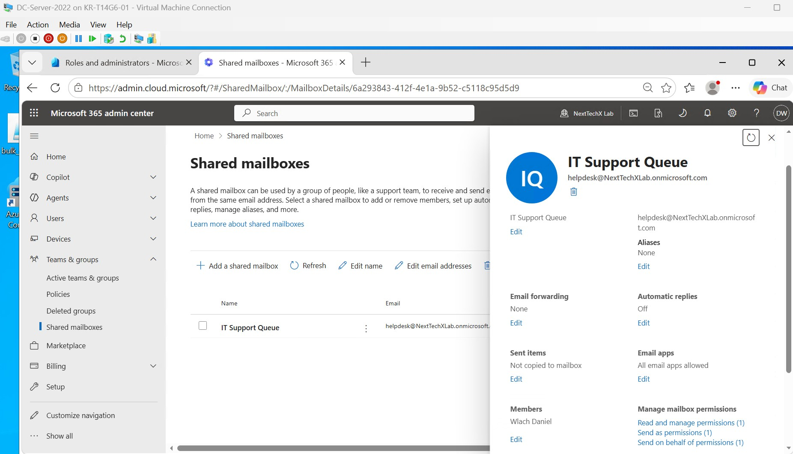

---

### 2. Escalation Tier Distribution Infrastructure
* **Technical Objective:** Construct an internal distribution boundary to broadcast escalated high-priority incident data to Tier 2 support engineering staff concurrently.
* **Execution:** Navigated to the core Teams & Groups repository and generated a new global Mail-Enabled Distribution List designated as `IT_Tier2_Escalations`. Defined configuration attributes mapping ownership and subscription boundaries to support localized administrative control.

#### Documentation Reference:
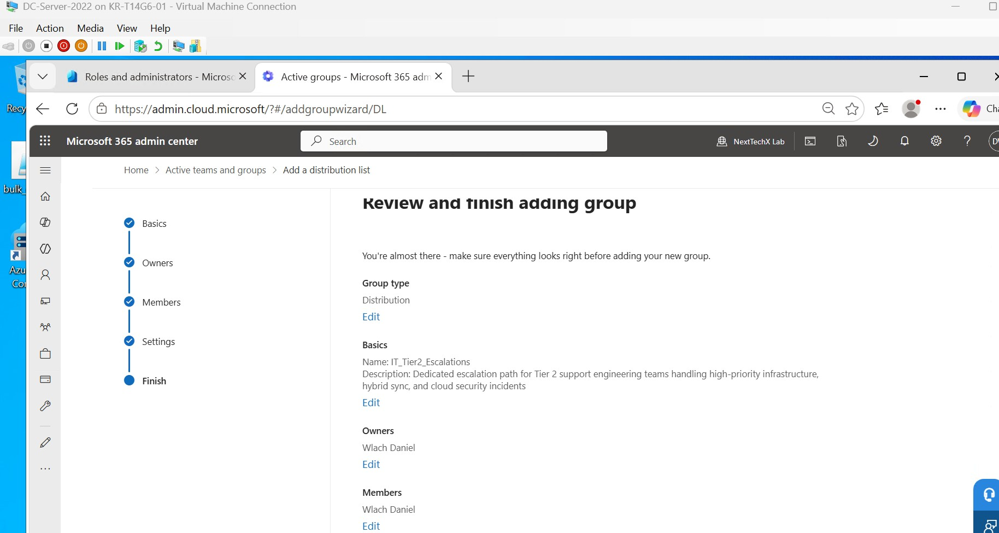

---

### 3. Integrated Operations and Workspace Verification
* **Technical Objective:** Validate that delegated administrators can seamlessly map, mount, and interface with the shared support queue workspace via standard communication protocols.
* **Execution:** Authenticated into Outlook on the Web as the designated technician and invoked the secondary mailbox mounting API targeting the shared queue UPN. 
* **Outcome Verification:** The mail interface successfully spawned a distinct, fully integrated workspace instance for the `IT Support Queue` shared inbox without requiring a secondary independent identity login. This proves the validity of the underlying delegated permission architecture, confirming that helpdesk agents can natively triage tickets from a unified console.

#### Documentation Reference:
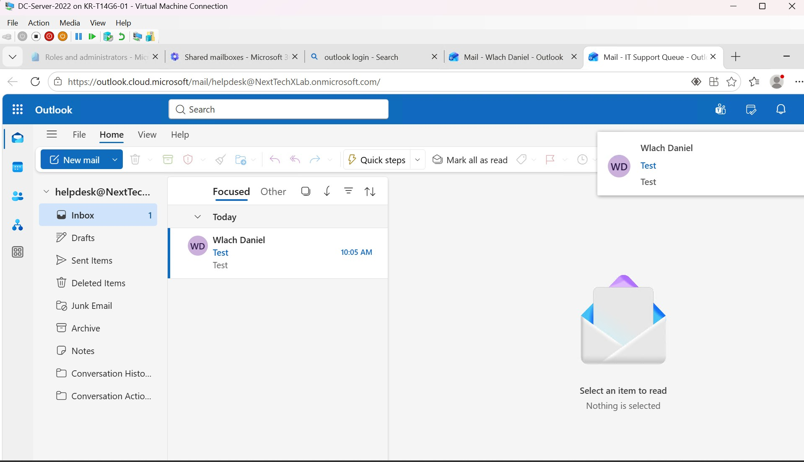

## ⚙️ Phase 14: Post-Deployment Operations — Conditional Access Enforcement & Sign-In Log Triage

To safeguard corporate identity footprints against credential harvesting and malicious brute-force attempts, operations advanced to implementing adaptive access controls. This phase provisions a targeted Microsoft Entra Conditional Access policy and establishes standard operating procedures for helpdesk log analysis, sign-in triage, and tenant security model transitions.

### 1. Conditional Access Policy Implementation & Security Defaults Deprecation
* **Technical Objective:** Deploy an identity boundary rule forcing multi-factor authentication (MFA) across all cloud ecosystem services for synchronized directory objects, transitioning from unconfigurable tenant wide baselines to custom granular policies.
* **Execution:** Navigated to Entra ID Conditional Access controls and provisioned policy `CA001: Require MFA for Synchronized Users`. Scoped enforcement directly to the synchronized global group container `M365_Licensed_Users`, while explicitly applying a safety exclusion rule for the root administrator identity `Wlach Daniel`. 
* **Tenant Level Architectural Override:** Initial log testing revealed that custom Conditional Access rules were being bypassed by the pre-configured Microsoft default security posture. To pass control to our custom engineering stack, accessed tenant properties and explicitly disabled 'Security Defaults' (citing a transition to advanced Conditional Access architecture). The custom runtime environment state was then set to 'Report-only' to validate evaluation metrics safely.

#### Documentation Reference:
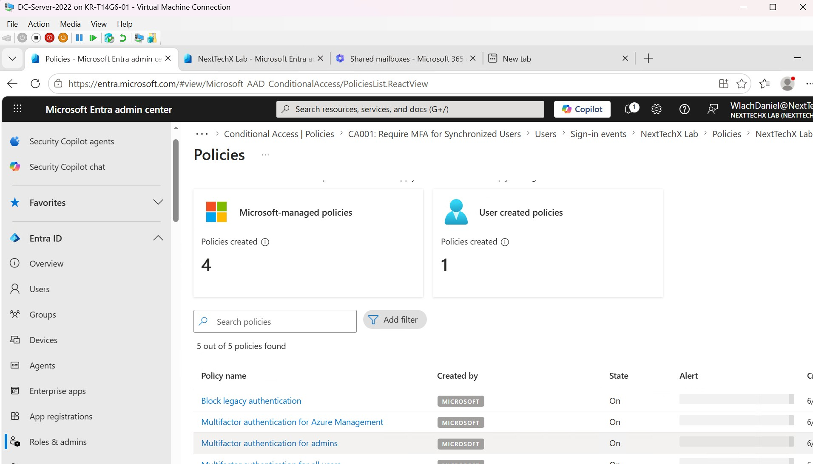
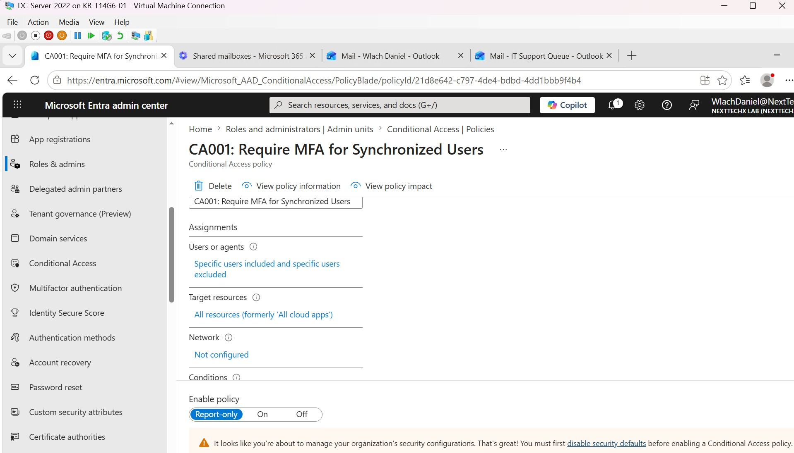

---

### 2. Helpdesk Sign-In Audit and Policy Evaluation Verification
* **Technical Objective:** Audit directory events using telemetry logs to trace identity verification workflows and confirm policy matching logic under the new custom security layout.
* **Execution:** Accessed the centralized Monitoring & Health suite to isolate interactive sign-in events corresponding to user `Tariq Malik`. Interrogated the metadata wrapper, drilling down directly into the nested Conditional Access execution tab to confirm policy triggering.
* **Outcome Verification:** The sign-in telemetry confirms that the custom policy engine successfully targeted the active authentication stream following the deprecation of tenant security defaults. The event logs document a definitive 'Success' status receipt for the custom rule wrapper, proving that the policy is correctly observing and evaluating connection attempts from the synchronized directory scope without introducing service delivery disruption.

#### Documentation Reference:
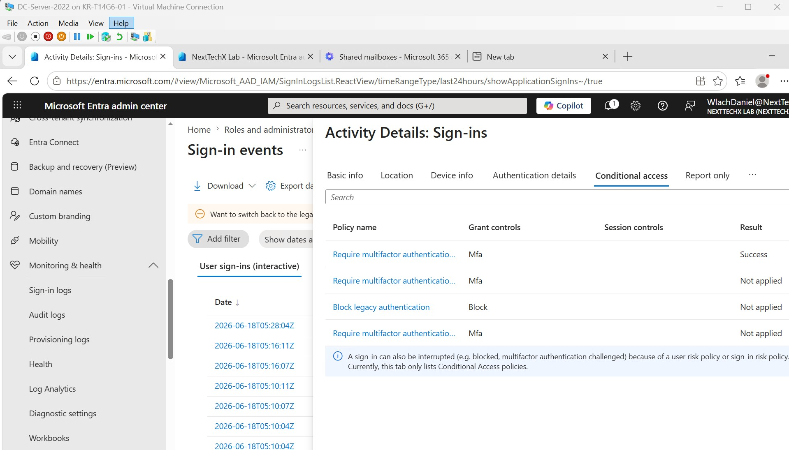


## ⚙️ Phase 15: Post-Deployment Operations — Corporate Branding Customization & Helpdesk Support Disclosures

To strengthen tenant anti-phishing defense vectors and optimize tier-structured incident ingestion, operations advanced to configuring custom tenant visualization profiles. This phase implements custom company branding parameters and publishes explicit directory-level helpdesk routing disclosures directly onto the cloud authentication runtime template.

### 1. Enterprise Branding and Support Context Provisioning
* **Technical Objective:** Embed business-specific directory headers and support instructions into the primary authentication page to validate site authenticity and decrease ticket triage latency.
* **Execution:** Navigated to the Custom Branding infrastructure within the Microsoft Entra admin center. Modified the default tenant theme configuration by injecting an explicit string disclosure detailing the authoritative remediation paths (`helpdesk@nexttechx.local`) for remote workers experiencing credential lockouts or MFA sync faults.

#### Documentation Reference:
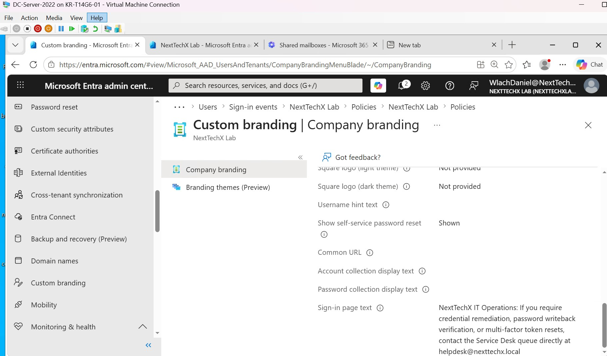

---

### 2. Phishing-Mitigation and Gateway Validation Tracking
* **Technical Objective:** Verify that custom directory properties parse and display properly during an unauthenticated external session handshake.
* **Execution:** Initialized a clear-session browser container targeting the Microsoft 365 Outlook endpoint. Inputted user profile identity strings mapping to `Tariq Malik` to force a tenant-specific gateway lookup.
* **Outcome Verification:** The Entra login portal successfully intercepted the routing path, rendering the custom structural text. This baseline implementation provides an effective psychological firewall against external phishing clones (as spoofed endpoints fail to pull tenant-specific administrative text strings) while providing end-users immediate helpdesk contact paths when blocked at the identity gateway.

#### Documentation Reference:
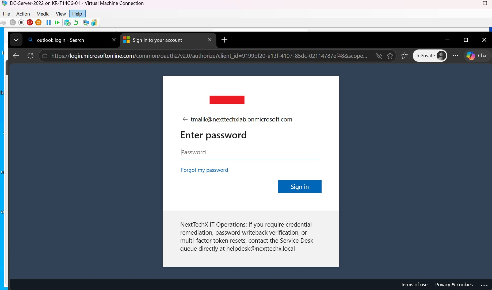


## 🏢 Lab Documentation: Enterprise Identity & Group Management

### 📋 Overview
In this lab phase, I streamlined the Microsoft Entra ID and hybrid on-premises Active Directory environments to transition from a flat, unorganized directory to a structured, enterprise-ready hierarchy. By organizing users, separating location-based scopes, and introducing group-based access controls, the lab environment now mirrors a production corporate structure.

---

### ⚙️ Phase 16 Implementation & Fixes

* **Departmental Structure**: Successfully created and populated explicit department groups (`HR_Department`, `Finance_Department`, and `Operations_Department`) to enforce proper Role-Based Access Control (RBAC).
* **Hybrid & Cloud-Only Scopes**: 
  * Isolated the **US Austin Staff** using a cloud-only architecture to accommodate bulk-imported cloud identities.
  * Resolved hybrid synchronization limitations for the **Seoul Staff** by centralizing their identity container to a cloud-managed security group, allowing it to dynamically support both local AD-synced accounts and cloud-native users seamlessly.
* **Directory Cleanup**: Audit trails were cleaned by eliminating duplicate staging accounts and onboarding fresh user profiles with designated local properties.
* **Automated Licensing Architecture**: Standardized end-user onboarding by replacing messy, manual user-by-user licensing with **Group-Based Licensing**. Implemented a dedicated `M365_Licensed_Users_Cloud` security group to automatically assign Microsoft 365 licensing across the tenant cleanly.

---

### 🔐 Phase 17: Lab Documentation: Password Policy & Authentication Security

#### 📋 Overview
In this phase, I implemented baseline identity security controls across the Microsoft 365 tenant. The objective was to move away from default, unmanaged credential lifecycles and establish an enterprise-standard password rotation and self-service framework that balances end-user autonomy with corporate security requirements.

#### ⚙️ Implementation & Technical Configurations
* **Password Expiration Governance**: Configured the global organizational security baseline via the Microsoft 365 Admin Center to enforce a **90-day password expiration lifecycle** across all cloud-managed domains, shifting the environment away from unmanaged permanent credentials.
* **SSPR Hardening (Security Questions)**: Configured and enforced a tenant-wide Self-Service Password Reset (SSPR) validation baseline using security questions within Microsoft Entra ID. Standardized the policy to require users to register **5 predefined security questions**, requiring a minimum of **3 correct answers** to successfully execute a self-service password reset.
* **Conditional Access vs. Security Defaults**: Audited tenant-wide properties and verified that basic Security Defaults are disabled. This is by design, as the tenant utilizes advanced, granular **Conditional Access Policies** to enforce Multi-Factor Authentication (MFA) and access controls, overriding the basic all-or-nothing Security Defaults tier.

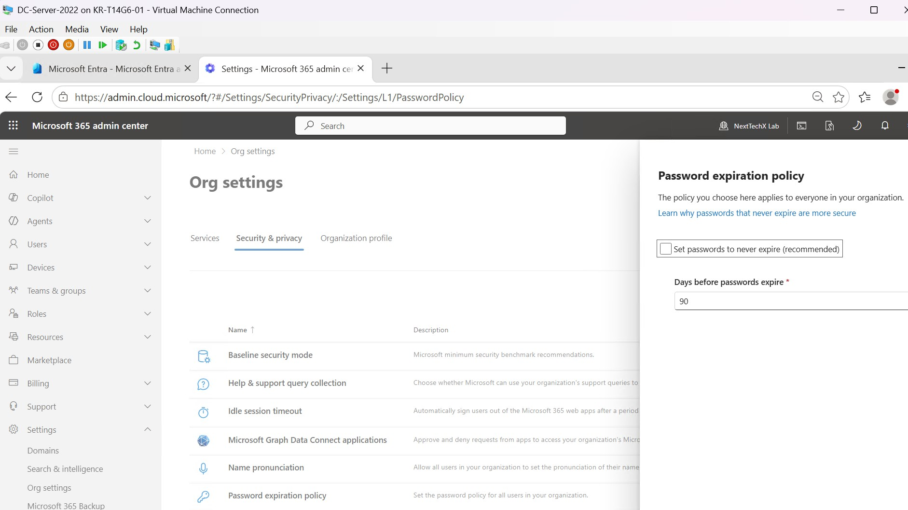


---

### 💻 Phase 18: Lab Documentation: Device Join & Automatic Enrollment Configuration

#### 📋 Overview
In this phase, I established the foundation for modern endpoint management within the corporate tenant. By configuring the integration between Microsoft Entra ID and Microsoft Intune, the environment is now structurally prepared to handle automated, out-of-the-box corporate device enrollment (MDM) without manual administrator intervention during deployment.

#### ⚙️ Implementation & Technical Configurations
* **Automated MDM Scope Provisioning**: Configured the **Microsoft Intune Mobility (MDM and MAM)** settings, upgrading the MDM user scope to **All** corporate accounts while disabling competing MAM settings. This configuration enforces immediate, automatic device enrollment into mobile device management upon cloud user registration.
  
  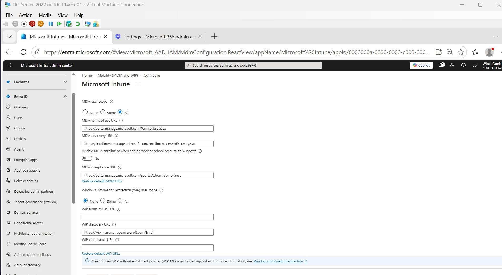

* **Tenant Device Controls**: Hardened the global cloud **Device Settings** by adjusting corporate compliance parameters. While maintaining open tenant-join permissions for onboarding verification, I throttled the **Maximum number of devices per user** from the default 50 down to **10** to mitigate unauthorized rogue endpoint footprint expansion.

  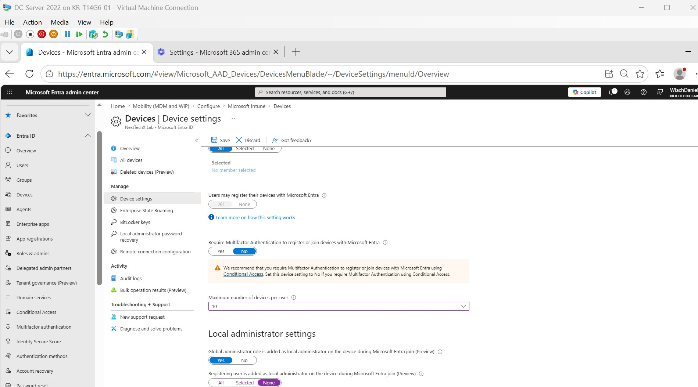


### 👥 Phase 19: Lab Documentation: Least Privilege Role Delegation & Testing

#### 📋 Overview
In this phase, I implemented Role-Based Access Control (RBAC) within the Microsoft Entra tenant to enforce the Principle of Least Privilege (PoLP). Instead of relying on insecure, tenant-wide Global Administrator permissions for day-to-day operations, I isolated administrative boundaries by provisioning scoped helpdesk privileges to a tier-1 support account and validating access controls.

#### ⚙️ Implementation & Technical Configurations
* **Administrative Role Delegation**: Leveraged the Entra ID **Roles & Administrators** engine to explicitly assign the **Helpdesk Administrator** directory role to a designated IT support user account, granting them targeted operational rights.
  
  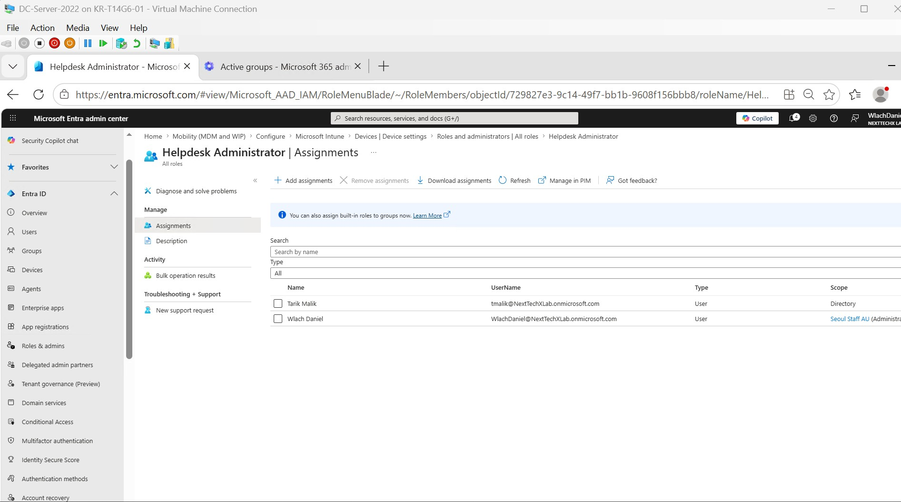

* **Boundary Validation & Least Privilege Testing**: Authenticated into the directory using the restricted tier-1 support account to map out permissions. Verified that administrative capabilities were limited exclusively to helpdesk tasks (such as password resets and user troubleshooting), while access to high-impact directories—such as billing infrastructure and Conditional Access policy nodes—was restricted by the system.

  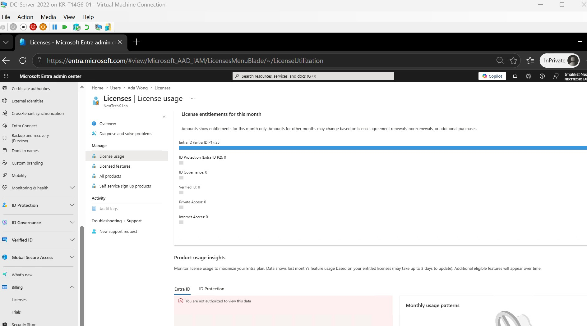


### 🌐 Phase 20: Lab Documentation: Internal Name Resolution Triage

#### 📋 Overview
In this phase, I simulated a common enterprise desktop support scenario: an endpoint losing access to local domain infrastructure due to a DNS configuration drift. The objective was to utilize advanced command-line diagnostic utilities to identify name resolution issues and execute proper cache-purging remediation workflows.

#### ⚙️ Implementation & Technical Configurations
* **Failure Simulation & Triage**: Diverted the Windows 11 client's adapter configurations to point to an external public resolver (`8.8.8.8`), dropping connection to the internal Active Directory environment. Utilized `ping` and `nslookup` patterns to isolate why internal directory resources (`nexttechx.local`) suddenly became unreachable.
  
  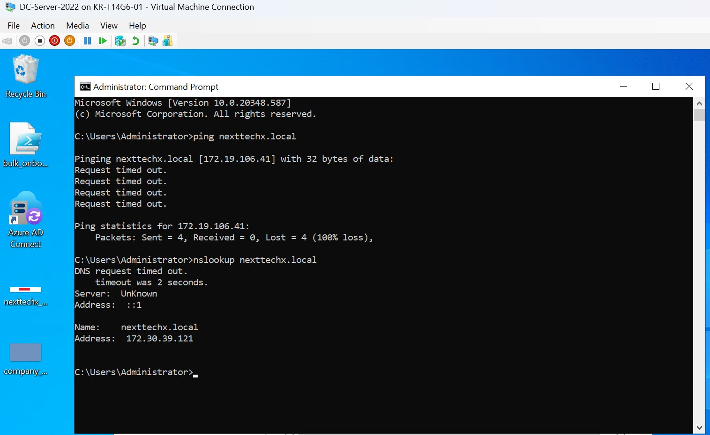

* **Adapter Remediation & Cache Clearing**: Reconfigured the network interface properties to route requests back to the local Windows Server 2022 Domain Controller IP. Executed a complete client-side flush via `ipconfig /flushdns` to wipe corrupted negative cache entries, verifying resolution health via successful `nslookup` validation checks.

  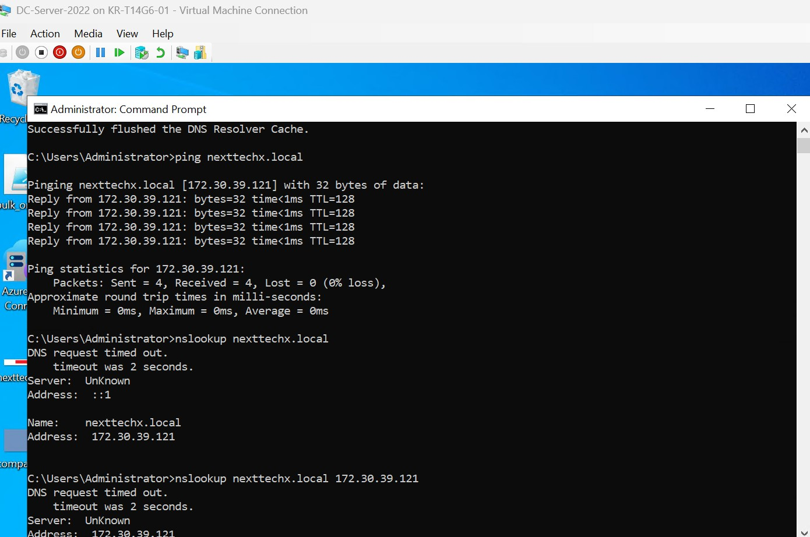


### 💻 Lab Documentation: Windows Kernel Dump Triage

#### 📋 Overview
In this phase, I stepped into advanced desktop support and forensic triage operations by initiating a manual system panic to analyze a Windows kernel memory dump (`.dmp`). Rather than relying on standard external samples, I configured the local operating system to retain full memory fault snapshots, captured a live Blue Screen of Death (BSOD), and pinpointed the exact driver module responsible for system instability.

#### ⚙️ Implementation & Technical Configurations

* **Dump Architecture & Crash Configuration**: Modified the Windows Startup and Recovery parameters to guarantee automated kernel-state preservation. De-selected the default automatic reboot option to halt the system state during an active crash kernel cycle, ensuring the integrity of physical-to-virtual storage memory commits.
  
  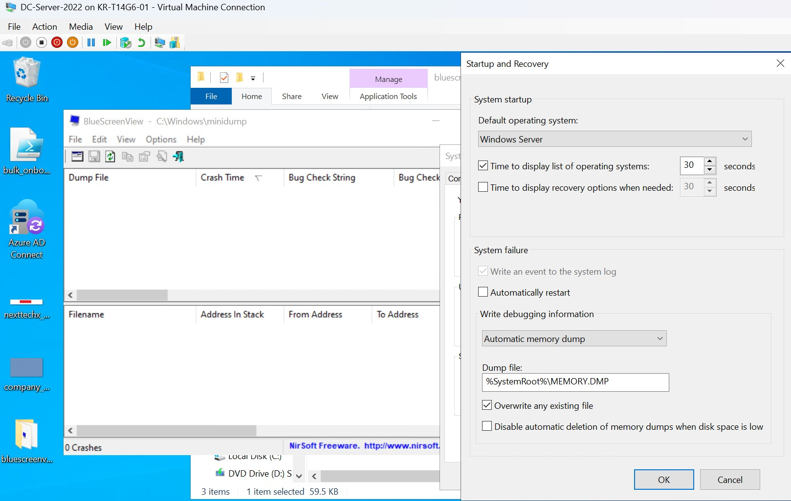

* **Live Crash Execution**: Triggered a controlled kernel exception fault within the test environment. Capturing the resulting live bugcheck execution code highlighted a localized memory fault (`DRIVER_IRQL_NOT_LESS_OR_EQUAL`) tied directly to active driver threads.

  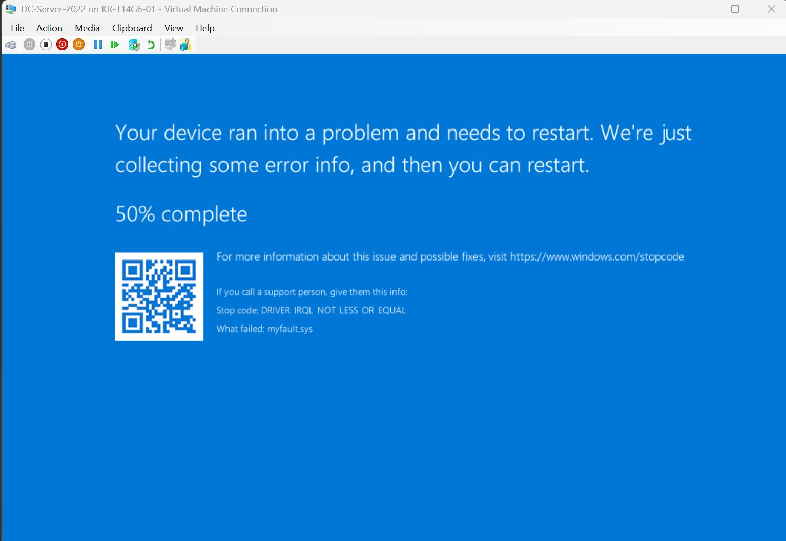

* **Forensic Stack Analysis**: Deployed the BlueScreenView log parsing utility to parse the generated memory snapshot files (`.dmp`). Inspected the memory address lines within the call stack to successfully isolate the root driver violation, targeting the precise culprit (`myfault.sys`) and its execution footprint (`ntoskrnl.exe`).

  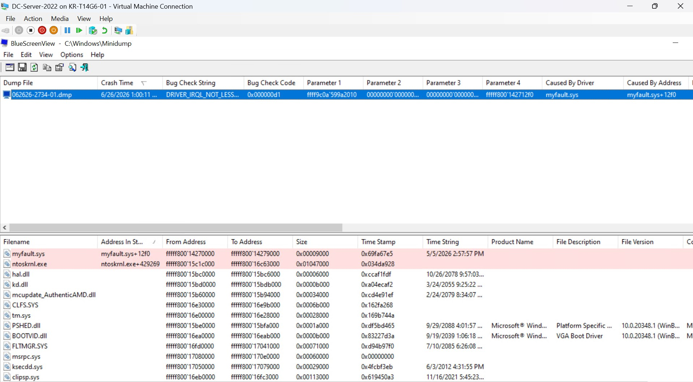

* **Post-Crash Baseline Remediation**: Initiated command-line integrity repairs to verify that system file hashes weren't compromised during the forced crash cycle. Completed a Deployment Image Servicing and Management (`DISM`) image health assessment followed by a full System File Checker (`sfc /scannow`) cycle to secure a pristine, error-free system state.

  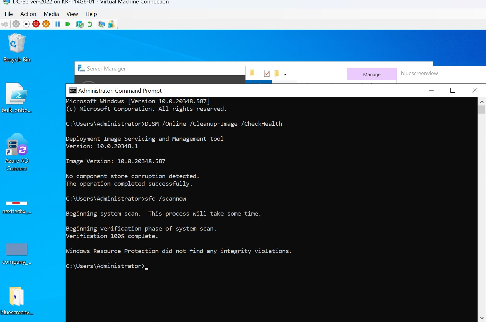

- [x] Phase 22: Enterprise Messaging Operations & User Lifecycle Triage

### 💻 Lab Documentation: Exchange Online Mail Flow Continuity

#### 📋 Overview
In this phase, I managed an emergency user lifecycle ticket involving unexpected employee absences. To ensure business continuity and zero communication gaps, I implemented emergency Out-of-Office (OOF) automatic replies and mail forwarding redirections across two target accounts using both graphical and programmatic administration methods.

#### ⚙️ Implementation & Technical Configurations
* **Administrative Mailflow Redirection (GUI)**: Utilized the Exchange Admin Center to select Ada Wong's mailbox, enabling an internal forward directly to Daniel Wlach and establishing an automated corporate hand-off reply for all inbound senders.

  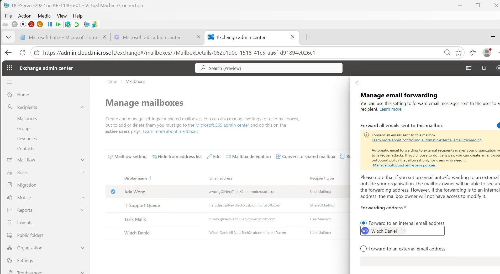
  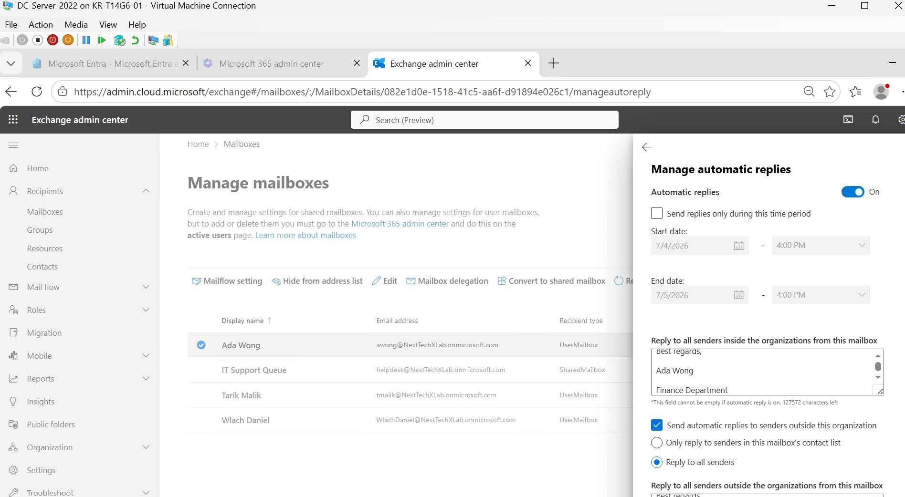

* **Automated Messaging Auditing (PowerShell)**: Leveraged the `ExchangeOnlineManagement` REST API module in an elevated console session to bypass GUI constraints for Tarik Malik's mailbox. Initialized dependencies via NuGet, authenticated against the cloud tenant, and executed administrative overrides to apply OOF configurations and map back-end forwarding rules.

  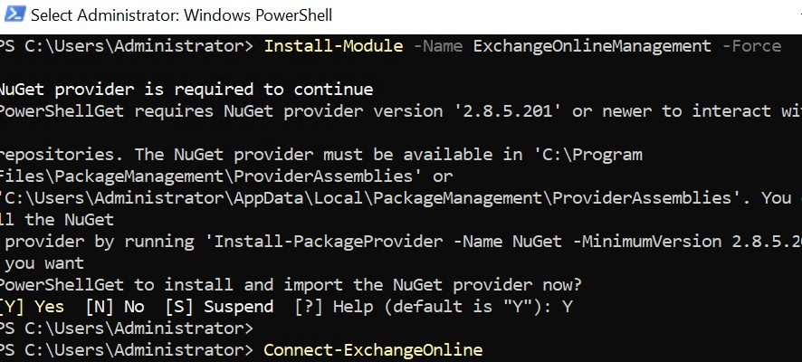
  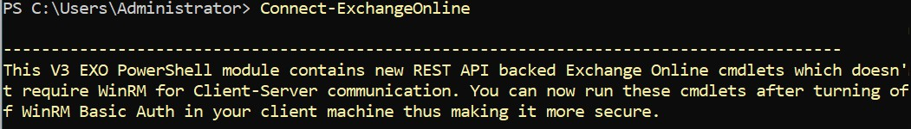

* **Validation & Compliance Logs**: Ran verification queries using `Get-MailboxAutoReplyConfiguration` and `Get-Mailbox` to audit the live server properties. Confirmed that `AutoReplyState` is live, `ForwardingSmtpAddress` routes to the active coverage account, and `DeliverToMailboxAndForward` is verified as true to preserve local compliance records.

  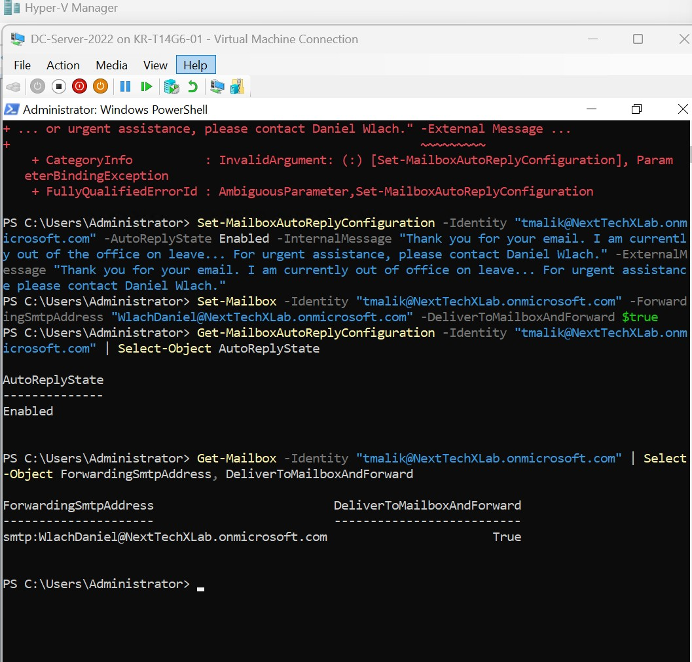


## 🔐 Phase 23: Lab Documentation: Identity Lifecycle & Account Termination Triage

#### 📋 Overview
In this phase, I executed a standard Tier 1/2 help desk offboarding protocol for a terminated employee Ada Wong). The core focus of this lab was implementing rapid access revocation to secure corporate assets, followed by tenant resource optimization to preserve data compliance while eliminating unnecessary licensing costs.

#### ⚙️ Implementation & Technical Configurations
* **Session Revocation & Password Invalidation**: Initiated an emergency access cutoff within the Microsoft 365 Admin Center by executing a global token revocation, forcing Ada Wong out of all active web, mobile, and desktop sessions. Simultaneously forced an administrative password override to eliminate unauthorized entry hooks.

  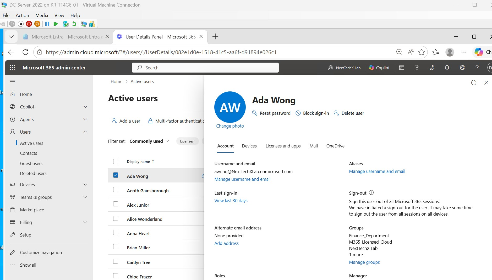

* **Account Sign-In Lockdown**: Enforced a strict administrative block on the Azure AD / Entra ID identity layer, transitioning the account status to a locked state to drop all inbound authentication attempts at the tenant perimeter.

  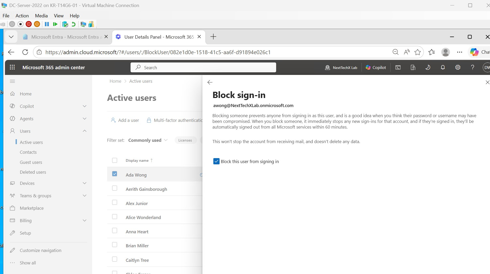

* **Mailbox Conversion & License Reclamation**: Navigated to the Exchange Admin Center to convert the traditional user mailbox into a free Shared Mailbox asset. This preservation method keeps the underlying historical mail data accessible for management compliance lookup while safely allowing the deletion of the paid M365 license.

  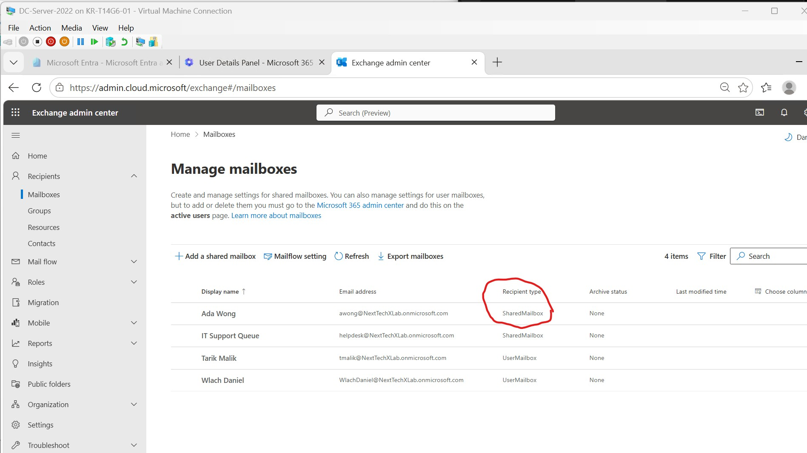

#### 🚀 Technical Outcomes
* **Tenant Security Hardening**: Immediate mitigations successfully isolated the identity without damaging historical data trails.
* **Cost Optimization**: Reclaiming the user license ensures the enterprise resource pool is optimized, dropping active subscription costs for an inactive seat.

### 📬 Phase 24: Lab Documentation: Cross-Mailbox Delegation & Post-Offboarding Access Governance

#### 📋 Overview
Following the successful termination and conversion of a legacy user account (Ada Wong), I executed the final phase of the lifecycle ticket by mapping secure mailbox delegation permissions. This phase grants an active team coverage resource (Daniel Wlach) full operational visibility over historical and inbound communication channels to prevent information gaps.

#### ⚙️ Implementation & Technical Configurations
* **Read and Manage (Full Access) Assignment**: Configured explicit backend mailbox mapping within the Exchange Admin Center delegation layers. Assigning this property allows the platform to automatically attach Ada Wong's mailbox framework into Daniel Wlach's desktop and web Outlook profiles without exposing individual credentials.

  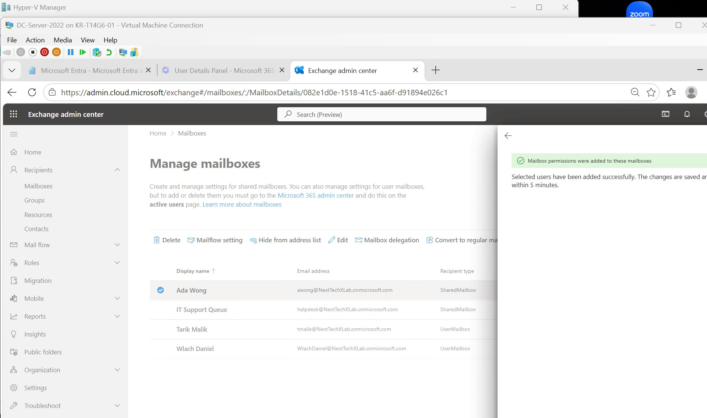

* **Send As Mail-Flow Delegation**: Provisioned administrative security rights allowing Daniel Wlach to legally impersonate the origin mailbox identity on outbound messaging queues. This configuration guarantees that any external client threads replied to by the coverage resource seamlessly maintain the original `awong@...` namespace.

  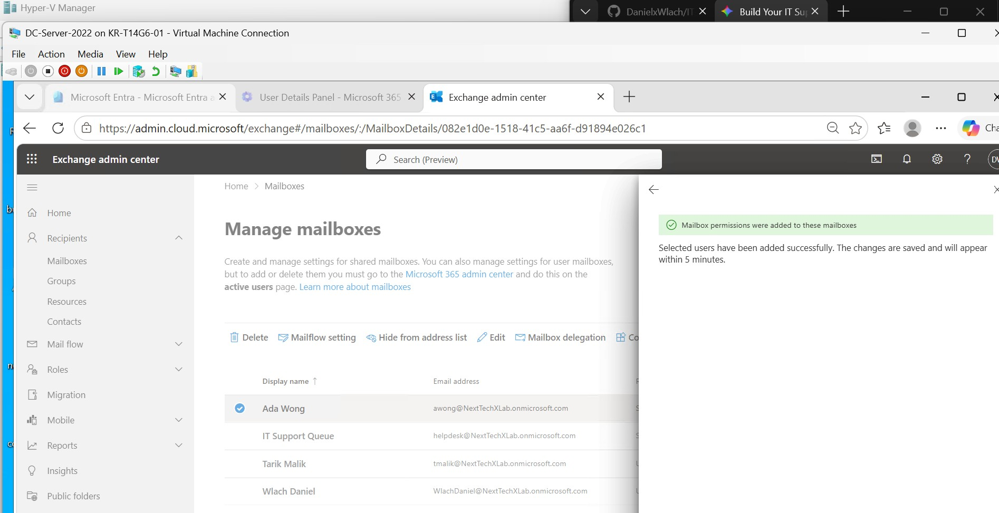

#### 🚀 Technical Outcomes
* **Business Continuity Preserved**: The active department resource can safely monitor and respond to external stakeholders, protecting corporate delivery workflows.
* **Least Privilege Access Control**: Permissions were granted strictly at the mailbox application layer rather than sharing system passwords, keeping the tenant completely compliant with identity security baselines.


### ✉️ Phase 25: Lab Documentation: Post-Separation Mail-Flow Controls & Auto-Response Routing

#### 📋 Overview
To finalize the identity lifecycle management thread for a separated user asset (Ada Wong), I configured tenant-level mail-flow auto-responders within the Exchange Admin Center. This standard help desk intervention safeguards client relations by programmatically intercepting incoming traffic and redirecting external and internal stakeholders to the designated coverage resource.

#### ⚙️ Implementation & Technical Configurations
* **Automated Boundary Messaging**: Provisioned a global out-of-office message loop across both the internal tenant directory boundary and external public-facing mx queues. 
* **Dynamic Vendor Interception**: Enforced immediate auto-reply routing rules on the origin namespace without requiring an active mailbox interactive logon session, keeping the legacy identity dead-ended while guiding live communication toward active operational queues.

  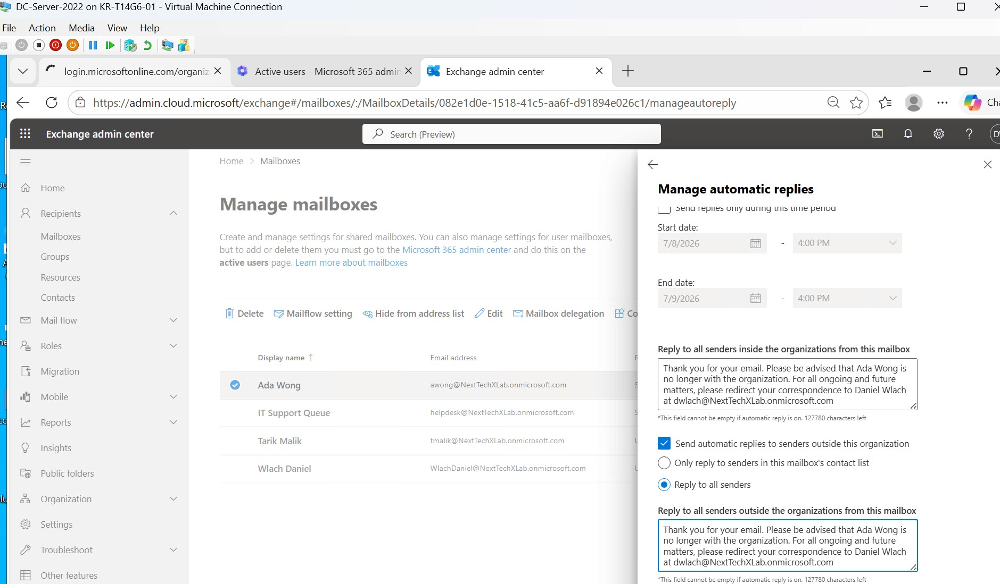

#### 🚀 Technical Outcomes
* **Zero Drop Communication**: Legacy contacts are immediately provided a validated path of escalations, preventing communication black holes.
* **Identity Boundary Isolation**: Confirms that although the mailbox data remains fully intact for historical searching, the user entry point has successfully completed its lifecycle phase down to public-facing indicators.


### ⚡Phase 26: Lab Documentation: Multi-Attribute Access Control (ABAC) via Dynamic Entra ID Groups

#### 📋 Overview
To further automate identity lifecycle management and scale cross-departmental collaboration, I deployed a multi-attribute dynamic security group in Microsoft Entra ID. This allows the system to evaluate separate business units using advanced logical operator queries, streamlining resource access for teams with shared corporate responsibilities.

#### ⚙️ Implementation & Technical Configurations
* **Logical Operator Query Compiling**: Provisioned a cloud security group using the compound logical statement filter `(user.department -eq "Legal") -or (user.department -eq "Compliance")`. This configuration instructs Microsoft Entra's identity matching framework to actively poll the directory for updates across multiple distinct business fields.

  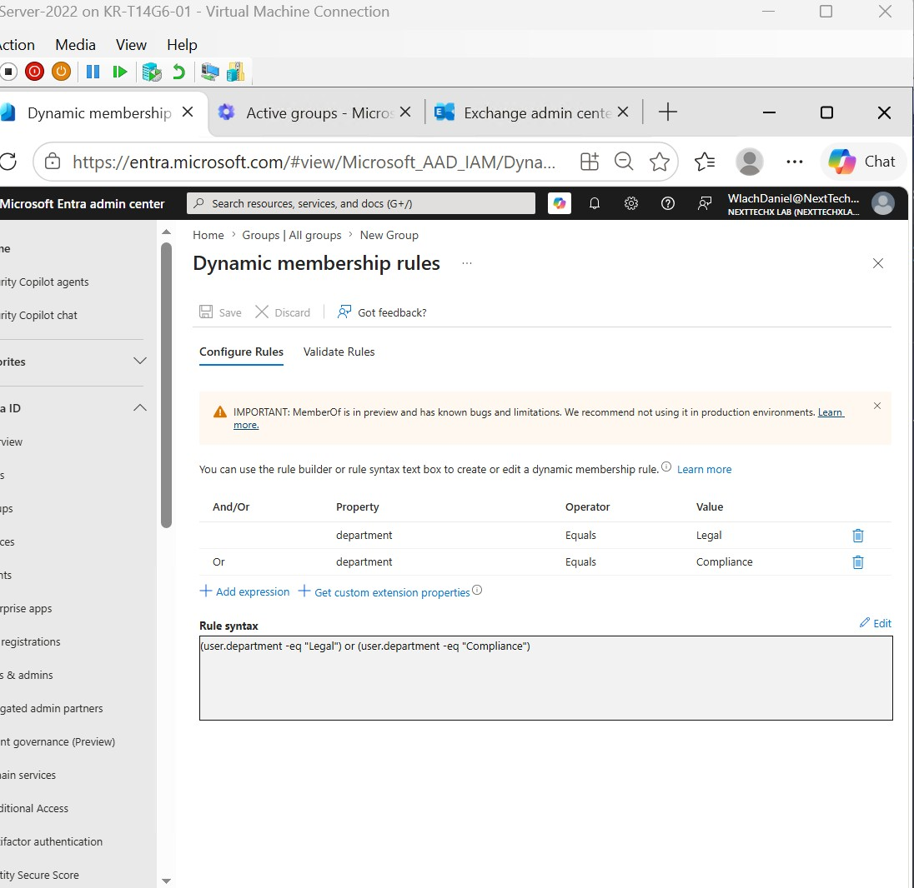

* **Automated Sync Evaluation**: Verified the processing engine. By assigning a test user's department attribute to match the query parameters, the Entra identity evaluation cycle successfully calculated the policy change and automatically populated the group roster without manual intervention.


  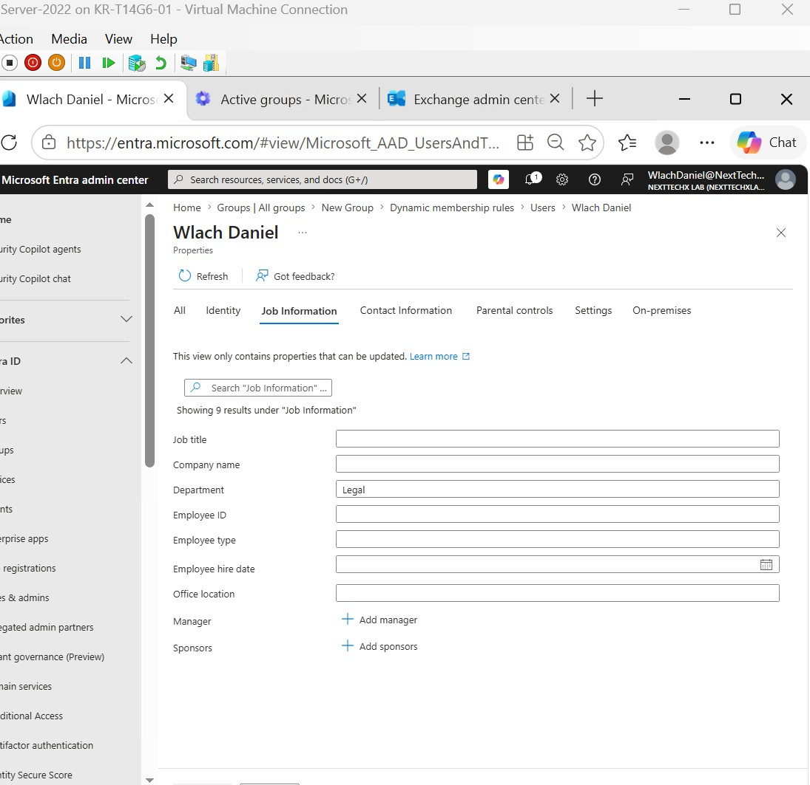
  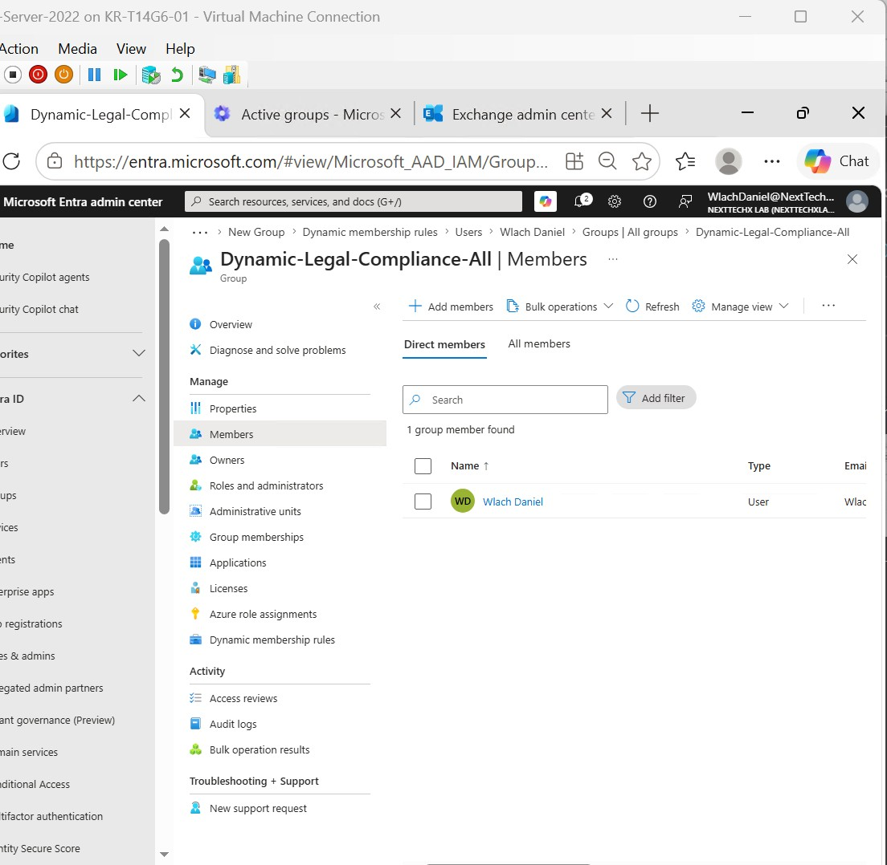

#### 🚀 Technical Outcomes
* **Advanced Multi-Department Consolidation**: Merged cross-functional legal and auditing domains into a single managed data tier, allowing immediate deployment of organization-wide compliance boundaries.
* **Automated Least Privilege Lifecycles**: Any workforce asset hired into or transferred between the Legal or Compliance spaces gains or loses permissions automatically based purely on directory metadata changes.


### 🔑 Phase 27: Lab Documentation: Enforcing Self-Service Password Reset (SSPR) Baselines

#### 📋 Overview
To mitigate high-volume Tier 1 service desk ticket queues and enhance operational scaling, I deployed a tenant-wide Self-Service Password Reset (SSPR) framework in Microsoft Entra ID. This configuration safely delegates identity verification capabilities back to the end-users, ensuring unmanaged lockouts can be resolved autonomously without technical staff intervention.

#### ⚙️ Implementation & Technical Configurations
* **SSPR Scope Allocation**: Enabled global registration enforcement across the directory infrastructure, requiring mandatory security method registration upon the next active identity logon handshake.
* **Multi-Factor Reset Gates**: Conditioned the password recovery engine to accept validated single-token challenges, establishing mobile application push notifications and out-of-band alternate email routing as approved cryptographic verification tokens.

  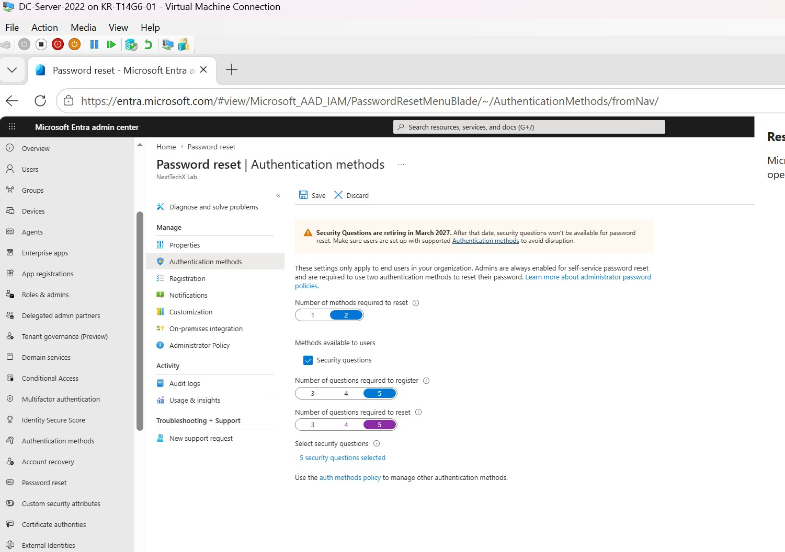

#### 🚀 Technical Outcomes
* **Ticket Queue Optimization**: Drastically drops standard password maintenance ticket overhead, allowing support personnel to focus on higher-tier infrastructure projects.
* **Hardened Identity Recovery**: Replaces insecure manual phone verification or temporary clear-text passwords with automated, multi-factor authorization checkpoints managed entirely by the Entra identity protection subsystem.

### 🔍 Phase 28: Lab Documentation: Tier 1/2 Incident Response & Sign-In Log Diagnostics

#### 📋 Overview
To establish foundational proficiency in modern identity triage and security monitoring, I simulated an authentication failure event and conducted an end-to-end log analysis within the Microsoft Entra ID monitoring architecture. Mastering log parsing allows me to diagnose real-world access issues instantly based on explicit cryptographic error codes rather than user descriptions.

#### ⚙️ Implementation & Technical Configurations
* **Authentication Event Generation**: Executed an intentional credential validation failure under a controlled test identity (Tarik Malik) to generate a hard failure footprint within the tenant's authentication boundary.
* **Telemetry Interception**: Navigated to Entra Monitoring & Health to isolate the resulting event correlation token. Investigated the raw JSON metadata and panel parameters to verify the telemetry flow.

  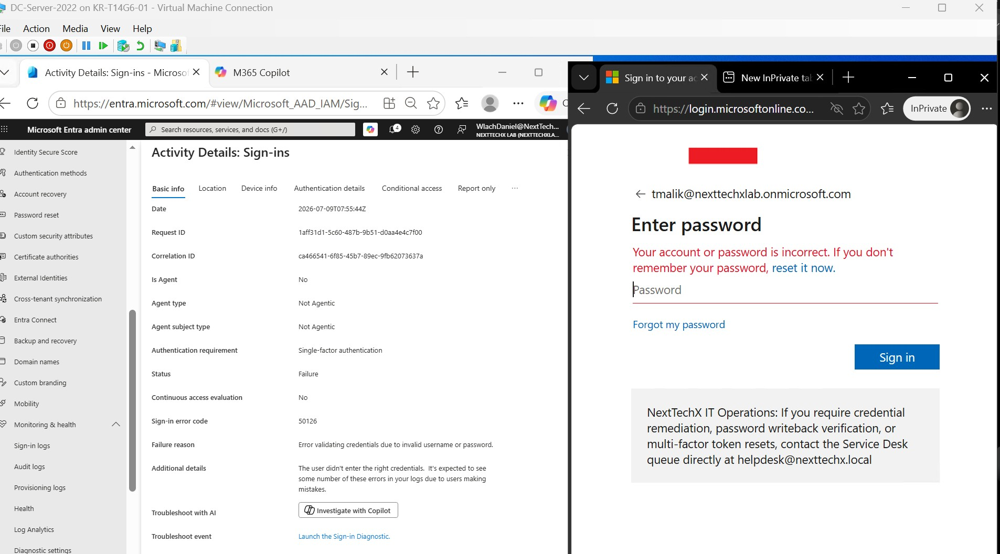

#### 🚀 Technical Outcomes
* **Error Code Deciphering**: Isolated the explicit error code (e.g., `50126`), instantly confirming an invalid credential state without relying on subjective end-user symptoms.
* **Root Cause Verification**: Audited associated sign-in metadata parameters including the client application, incoming IP mapping, and browser user-agent string—skills critical for spotting malicious brute-force attempts and identifying conditional access policy gaps.

### 📊 Phase 29: Lab Documentation: Tenant-Wide Security Auditing & Proactive Operations

#### 📋 Overview
To implement proactive security operations within the enterprise sandbox, I executed a tenant-wide "Daily Status Check" utilizing Microsoft Entra Identity Protection and Microsoft 365 Admin Center reporting engine metrics. Reviewing high-level environmental telemetry allows engineers to spot brute-force trends, anomalous access spikes, and account compromises before they manifest as critical help desk outages.

#### ⚙️ Implementation & Technical Configurations
* **Identity Protection Analysis**: Audited global risk boundaries within the Entra security center, validating active threat counters across user objects, session risk flags, and conditional policy gaps.
* **Workload Usage Assessment**: Navigated cross-platform usage analytics grids to baseline normal system traffic profiles across Exchange and SharePoint/OneDrive vectors, establishing a behavioral reference model for the sandbox.

  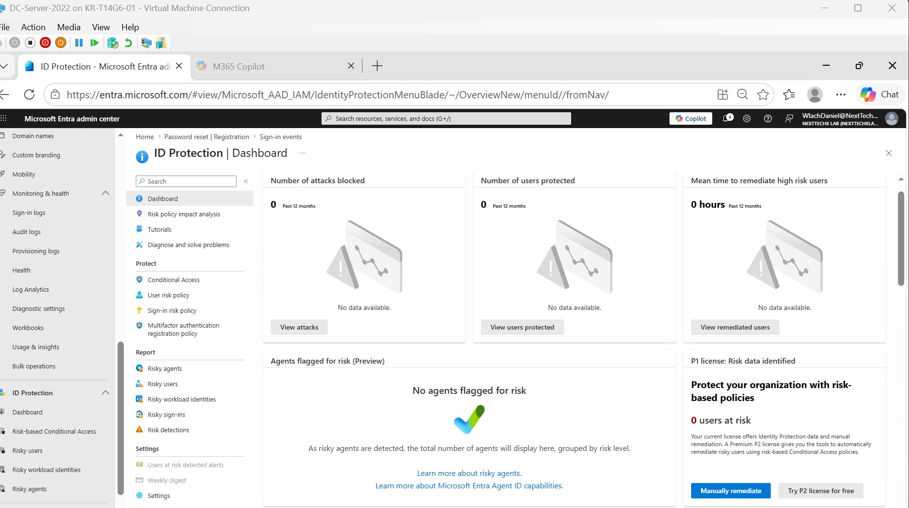
  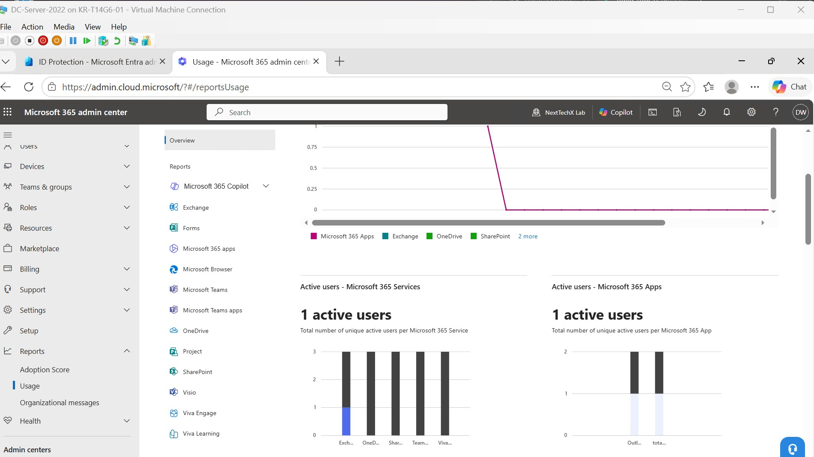

#### 🚀 Technical Outcomes
* **Proactive Security Gating**: Shifts technical workflow from a reactive, ticket-driven model to a proactive, defensive security posture.
* **Environmental Integrity Verification**: Confirms that backend infrastructure operations remain within safe baselines, providing data-driven verification of overall tenant platform stability.
* 

### 📬 Phase 30: Lab Documentation: Directory Integration of External B2B Mail Pointers

#### 📋 Overview
To streamline cross-organization communication boundaries and eliminate address-entry errors for end-users, I provisioned an external Mail Contact within the Exchange Admin Center. This integrates critical third-party vendors and external partners directly into the tenant's Global Address List (GAL), making them discoverable by name across all corporate Outlook clients.

#### ⚙️ Implementation & Technical Configurations
* **Mail Pointers Provisioning**: Generated a directory-integrated mail contact entry, mapping a public-facing external SMTP destination to an internal corporate display identity.

  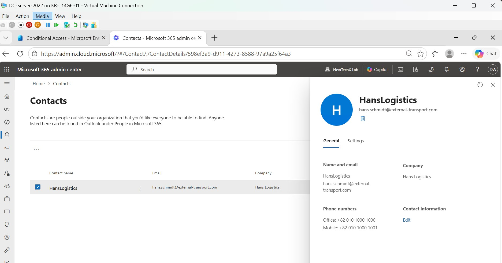

* **GAL Namespace Exposure**: Validated that the object successfully populated the recipient configuration index under the explicit 'Mail contact' object class, enabling tenant-wide lookup without consuming an internal Exchange mailbox license.

#### 🚀 Technical Outcomes
* **Directory Governance Optimization**: Allows users to find external points of contact natively within Outlook, preventing typographical delivery failures and boosting workflow efficiency.
* **Zero-License Resource Scoping**: Safely introduces external stakeholder endpoints to the organizational directory without provisioning costly interactive user licenses or allocating cloud mailbox storage slots.


### 🔐Phase 31: Lab Documentation: Privileged Access Governance via Scoped Directory Roles

#### 📋 Overview
To support an internal workforce promotion cycle for Tarik Malik, I executed an end-to-end identity modification and Role-Based Access Control (RBAC) alignment procedure in Microsoft Entra ID. Adhering strictly to the security principle of "Least Privilege," I mapped out elevated permissions to grant administrative clearance for his new technical scope without exposing the tenant to global domain compromise.

#### ⚙️ Implementation & Technical Configurations
* **Directory Profile Re-Profiling**: Modified target organizational metadata fields, transitioning the underlying user identity structure to the 'IT Operations' department with an active 'IT Support Technician' classification.
* **Granular RBAC Mapping**: Assigned the cloud-native 'Helpdesk Administrator' role profile to the updated user account object, allowing execution of password management workflows and basic service desk monitoring.

  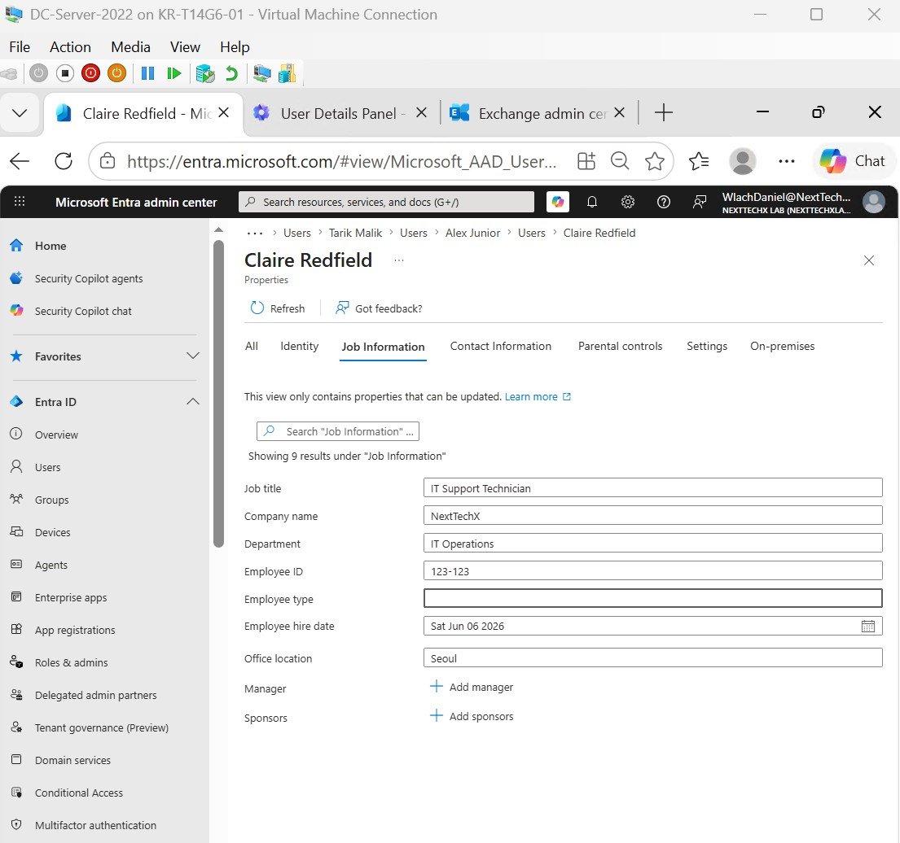
  


#### 🚀 Technical Outcomes
* **Least Privilege Enforcement**: Safely isolated privileged operational commands to standard service desk parameters, ensuring the user cannot accidentally modify tenant-wide enterprise applications or alter root infrastructure architecture.
* **Audit-Ready Asset Allocation**: Ensures all future administrative actions taken by this support profile are tied directly to an updated corporate title and tracking path within the global tenant audit stream.


### 🏢 Phase 32: Lab Documentation: Macro-Level Tenant Governance & Corporate Branding Infrastructure

#### 📋 Overview
To enforce corporate compliance frameworks and optimize user-facing technical support channels, I executed a tenant-wide optimization project modifying the global Organization Settings and Company Branding parameters. Configuring macro-level environmental boundaries ensures that all corporate entities experience a standardized, verified interface across every cloud resource access loop.

#### ⚙️ Implementation & Technical Configurations
* **Org Settings Policy Modulation**: Configured shared corporate profiles within the Microsoft 365 Admin Center workspace, hardcoding designated help desk contact pointers and uniform navigation theme parameters globally across all subscriber nodes.
* **Pre-Authentication Branding Enforcement**: Managed the entry-level authentication interface within the Entra ID user experience engine, mapping out identity verification gates to surface corporate structural markers and trust parameters before credential validation.

  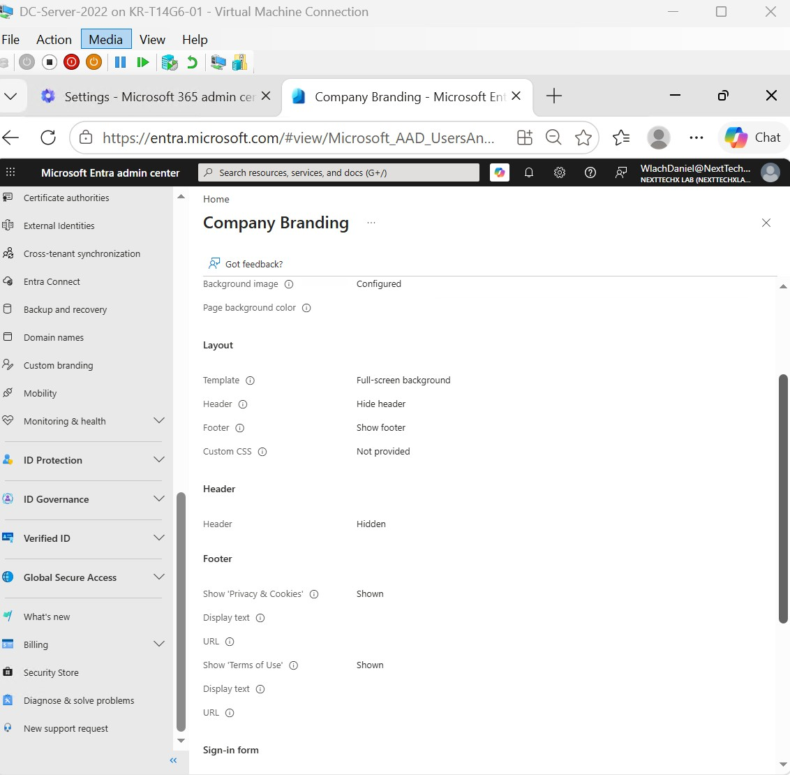

#### 🚀 Technical Outcomes
* **Phishing Mitigation Baseline**: Presenting distinct, company-approved visual profiles at the pre-login gate helps train end-users to distinguish the real corporate authentication portal from malicious external lookalikes.
* **Streamlined Support Access**: Embeds direct help desk escalations natively within the standard Microsoft 365 header architecture, lowering operational barriers for end-users seeking technical service assistance.

### 📱 Phase 33: Lab Documentation: Enabling Mobile Mail Access & Checking Device Profiles

#### 📋 Overview
In this phase, I verified how to manage mobile access for user mailboxes and how to audit the devices that connect to the tenant. This reflects a typical help desk scenario where a user needs to set up email on their phone, or a technician needs to check if a device successfully registered in the cloud.

#### ⚙️ What I Did
* **Enabled Mobile Access**: Navigated to the user mailbox properties and opened the **Manage email apps** panel. Checked the box for **Mobile (Exchange ActiveSync)** to guarantee the user has permission to sync their mail, calendar, and contacts to a mobile device.

  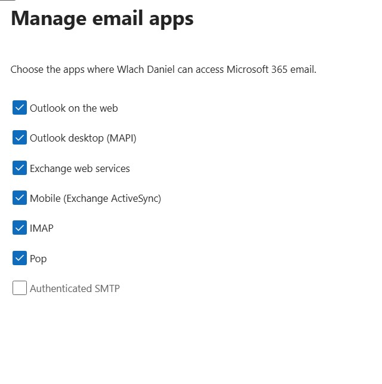

* **Audited Registered Devices**: Opened the Microsoft Entra ID device directory to search for any registered smartphones. While no physical mobile phone has logged into this test account yet, I identified a Windows machine (`WIN-S6NMGD0051Q`) that automatically created an **Entra registered** device profile during a previous login sequence.

  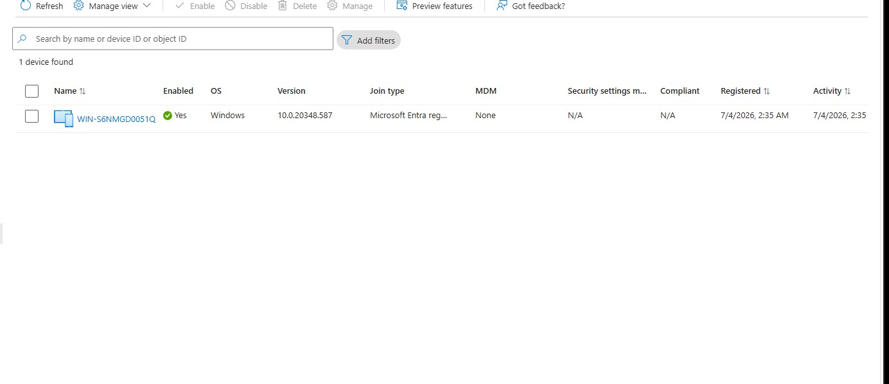

#### 🚀 Why This Matters for Help Desk Support
* **First Step for Mobile Issues**: If a user reports their phone won't sync email, the **Mobile (Exchange ActiveSync)** checkbox is the very first setting the help desk verifies. If it's unchecked, access is blocked.
* **Tracking Assets**: Checking the Entra ID device list allows a technician to confirm if a user's phone or computer successfully made a handshake with the organization's cloud network.
* **Security & Remote Wipe**: Ensuring an ActiveSync partnership exists gives administrators the power to trigger a **Remote Wipe** to delete corporate emails if an employee loses their device.


### 📂 Phase 34: Lab Documentation: Resolving File Access Blocks & Account Lockouts

#### 📋 Overview
In this phase, I resolved two common tier-1 help desk issues: troubleshooting restricted shared folder permissions via Security Groups, and managing active directory account states for locked-out or disabled users.

#### ⚙️ What I Did
* **Group-Based Access Allocation**: Added the test user `Tarik Malik` to the `SG-HR` Security Group within Active Directory Users and Computers. 
* **Configured Network Sharing & NTFS Security**: Located the `HR_Data` folder on the local disk. Set up Advanced Sharing by removing generic access and explicitly granting the `SG-HR` group **Change/Read** Share Permissions. Then, matched this on the Security tab by adding the group with **Modify** NTFS permissions.


  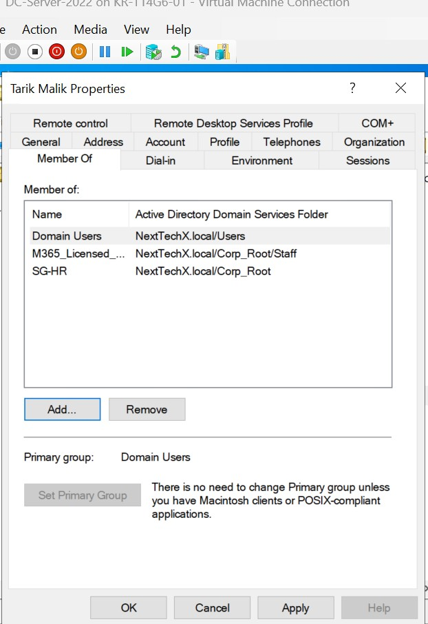
  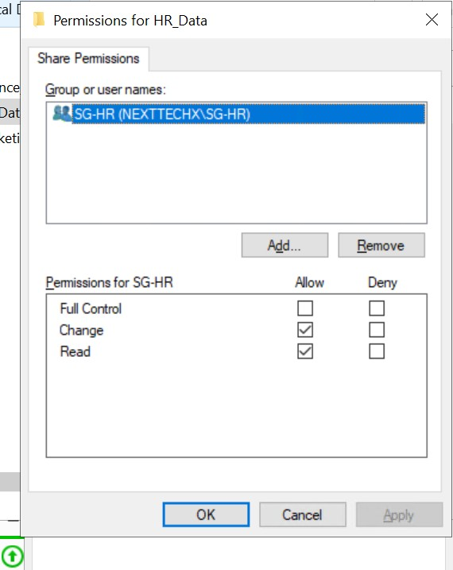
  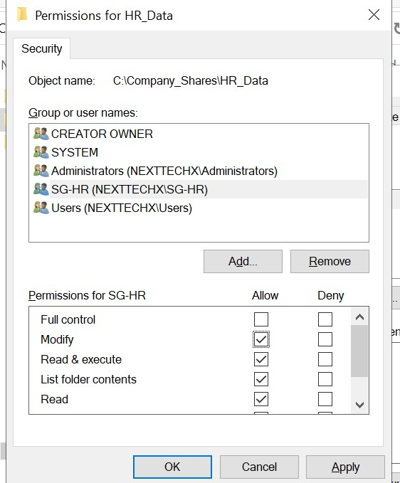

* **Account Status Audit**: Navigated to the **Account** tab within the user's Active Directory properties to verify the location of administrative override switches used to unlock accounts following credential failures or toggle the 'Account is disabled' lifecycle setting.

  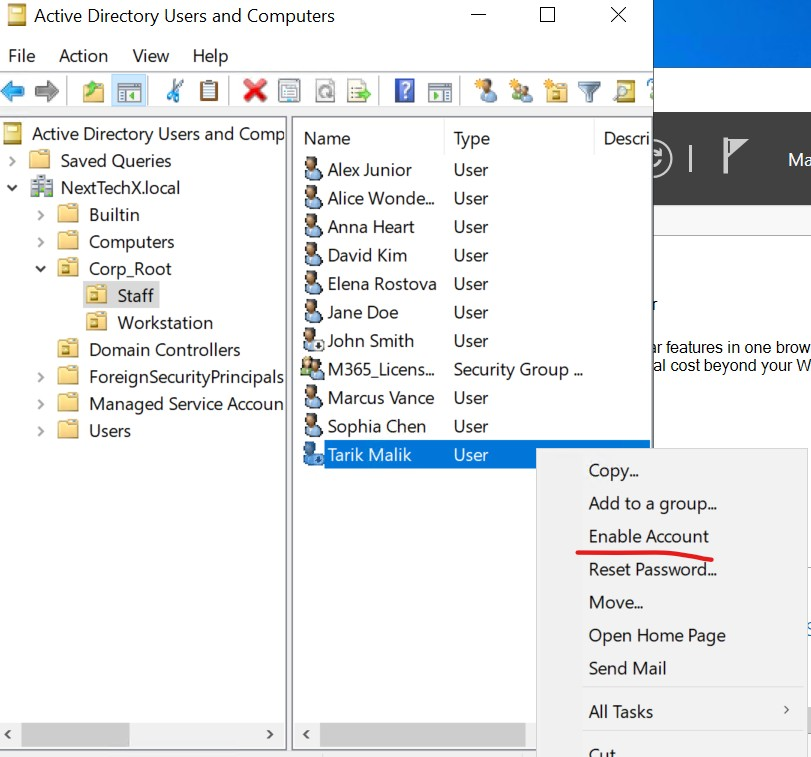
  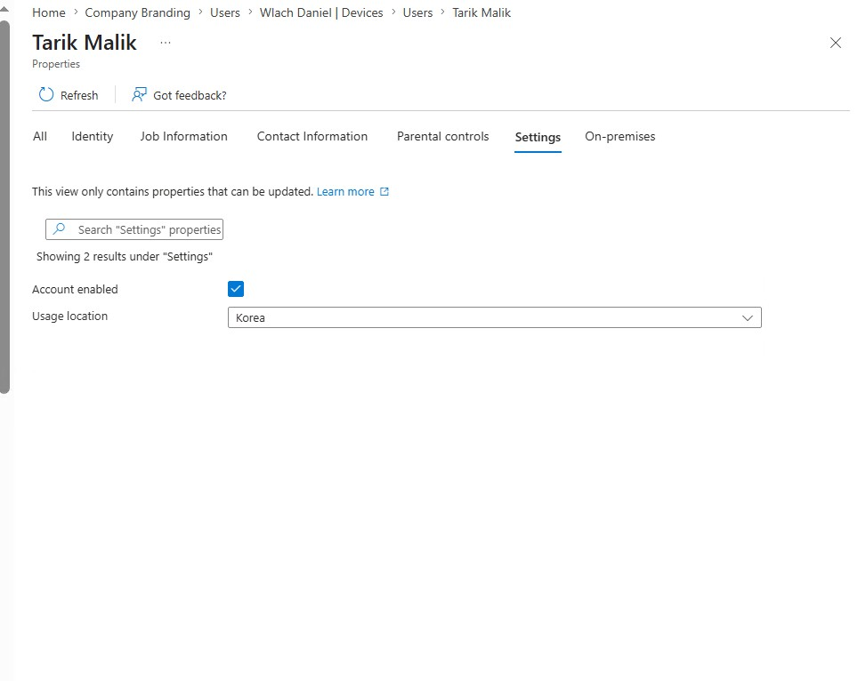
  

#### 🚀 Why This Matters for Help Desk Support
* **Security Group Efficiency**: Adding users to groups rather than assigning folder permissions individually prevents permission sprawl and makes onboarding/offboarding employees seamless.
* **Share vs. NTFS Rule**: IT technicians must configure both Share and NTFS layers correctly because Windows automatically applies the *most restrictive* combination of the two when a user connects over a network.
* **Identity Control**: Unlocking and enabling accounts is a daily help desk function required to restore user productivity safely after extended leaves or security lockout thresholds are tripped.


### 🗄️ Phase 35: Lab Documentation: Resolving Disk Space Exhaustion & Session Resource Bloat

#### 📋 Overview
In this scenario, I implemented a multi-stage administrative strategy to resolve a critical system storage exhaustion and resource bottleneck event. I demonstrated how to audit real-time system resource consumption, perform safe automated OS directory cleanup, and target stale, historical data profiles to reclaim disk space.

#### ⚙️ Step-by-Step Execution & Tooling

1. **Real-Time Active Session Triage (Task Manager)**
   * **Action**: Opened Task Manager and navigated directly to the **Users** tab to audit live human interactive sessions. 
   * **Purpose**: This allows a technician to check real-time CPU and Memory usage per profile. On shared infrastructure like corporate terminal servers or VMs, this view is essential to identify if an active or disconnected background user is causing immediate system resource starvation.
   
   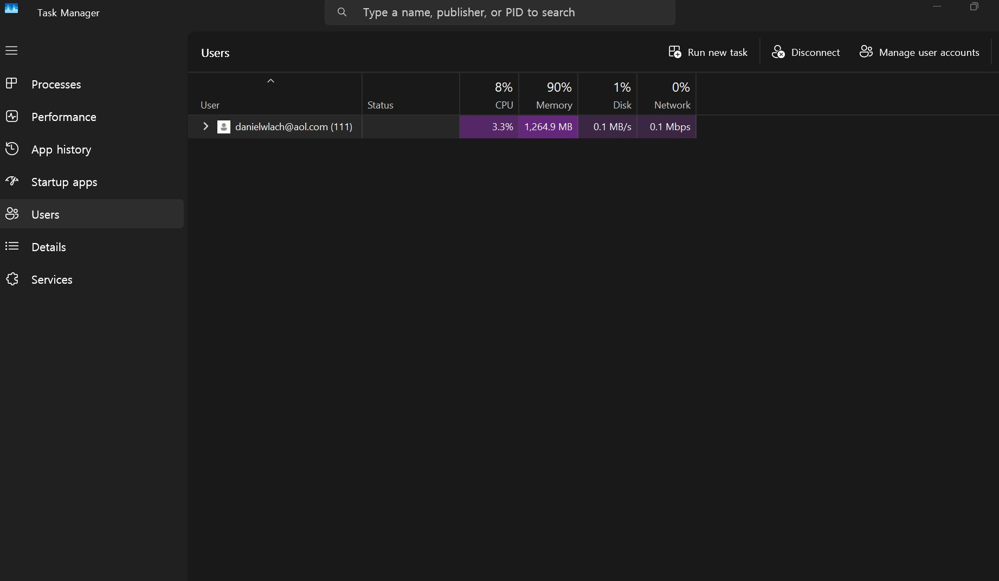

2. **System Cache Reclamation (Administrative Disk Cleanup)**
   * **Action**: Launched the native Windows **Disk Cleanup** utility with elevated administrative privileges (`Run as administrator`).
   * **Purpose**: Running the tool as an administrator unlocks hidden system directories. This safely aggregates and purges non-critical junk files—such as Microsoft Defender temporary items, system error memory dumps, Delivery Optimization caches, and old Windows Update remnants—without risking operating system stability.

   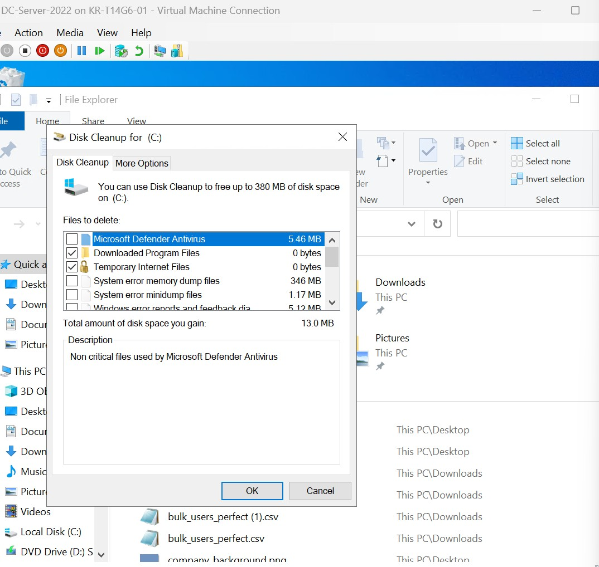

3. **Stale Historical Account Purging (Advanced User Profiles)**
   * **Action**: Executed `sysdm.cpl` via the Run dialog, navigated to the **Advanced** tab, and launched the **User Profiles** configuration sub-utility.
   * **Purpose**: Unlike Task Manager (which only shows live, running sessions), this dedicated management console lists *every* account that has ever historically logged onto the machine. This allows help desk technicians to safely view exactly how much storage space old user profiles are hoarding and cleanly delete obsolete employee profiles to reclaim gigabytes of storage space permanently.

   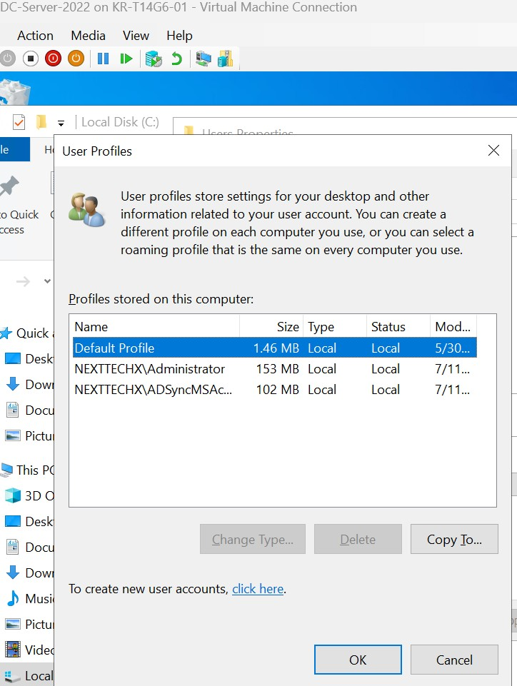

#### 🚀 Help Desk Key Takeaways
* **Task Manager vs. Profile Storage**: Task Manager is for *active memory/CPU triage*; the Advanced User Profiles menu is for *historical storage cleanup*. Understanding this distinction prevents a technician from misdiagnosing where hidden storage blockages reside.
* **Enterprise Safety Compliance**: Manually deleting folders under `C:\Users\` can leave orphaned registry keys and corrupt the local machine's security identifier (SID) table. Utilizing `sysdm.cpl` ensures Windows cleanly uninstalls the user profile folder along with its corresponding registry entry hooks.


### 🧰 Phase 36: Lab Documentation: Resolving Frozen Desktop Processes via Task Manager

#### 📋 Overview
In this scenario, an end-user experienced a complete freeze of the Microsoft Edge web browser on a Windows Server 2022 environment (`DC-Server-2022`). Standard window controls were unresponsive, preventing normal operation or standard application termination. I executed a targeted process termination via Task Manager to safely release system resources and restore browser functionality.

#### ⚙️ Step-by-Step Execution & Tooling

1. **Process Identification & Force Termination (Task Manager)**
   * **Action**: Launched Task Manager (`Ctrl + Shift + Esc`), identified the hanging `Microsoft Edge` process under the **Apps** section, right-clicked the parent process, and selected **End task**.
   * **Purpose**: Forces the operating system to immediately release locked memory addresses and terminate hung process handles (`msedge.exe`) that prevent new GUI instances from spawning.

   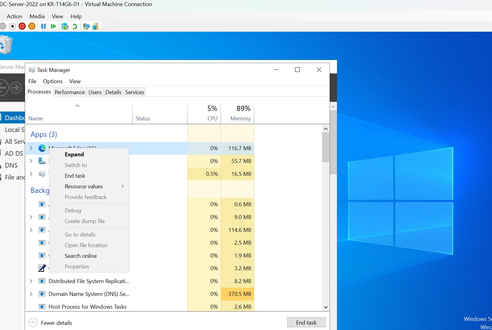

2. **Verification & Application Relaunch**
   * **Action**: Monitored the **Processes** tab to ensure all child worker threads cleared from memory, then relaunched Microsoft Edge from the desktop shortcut.
   * **Purpose**: Confirms that the application state is completely reset and that normal browser operations are restored without requiring a full system reboot.

---

#### 💡 Technical Analysis & Tier 1 Takeaways
* **Root Cause**: A worker thread encountered an unhandled exception or memory deadlock, locking the primary parent process in system memory.
* **Command Line Alternative**: If Task Manager becomes unresponsive, the same task force-kill can be executed via Command Prompt:
  ```cmd
  taskkill /F /IM msedge.exe


### 🧰 Phase 37: Lab Documentation: Suppressing Disruptive Taskbar Widgets & Hover Notifications

#### 📋 Overview
In this scenario, an end-user reported frequent visual disruptions caused by automatic popups appearing from the Taskbar during active work. The root cause was identified as the native Windows Widgets feature (e.g., news feeds, weather updates, and dynamic taskbar badges) triggering on cursor hover or system updates. I reconfigured the Taskbar behavioral settings to disable news and interest feeds, preventing accidental triggers and restoring a distraction-free desktop environment.

#### ⚙️ Step-by-Step Execution & Tooling

1. **Accessing Taskbar Settings**
   * **Action**: Right-clicked an empty area on the Windows Taskbar and selected **Taskbar settings** (or navigated to **Settings** > **Personalization** > **Taskbar**).
   * **Purpose**: Opens the central configuration control panel for system tray items and integrated desktop widgets.

2. **Disabling Widgets & Dynamic Feeds**
   * **Action**: Under the **Taskbar items** section, toggled the **Widgets** setting to **Off**. 
   * **Purpose**: Completely removes the Widget icon/weather feed from the Taskbar, preventing popups from launching when the mouse inadvertently hovers over the lower-left or center region of the screen.

   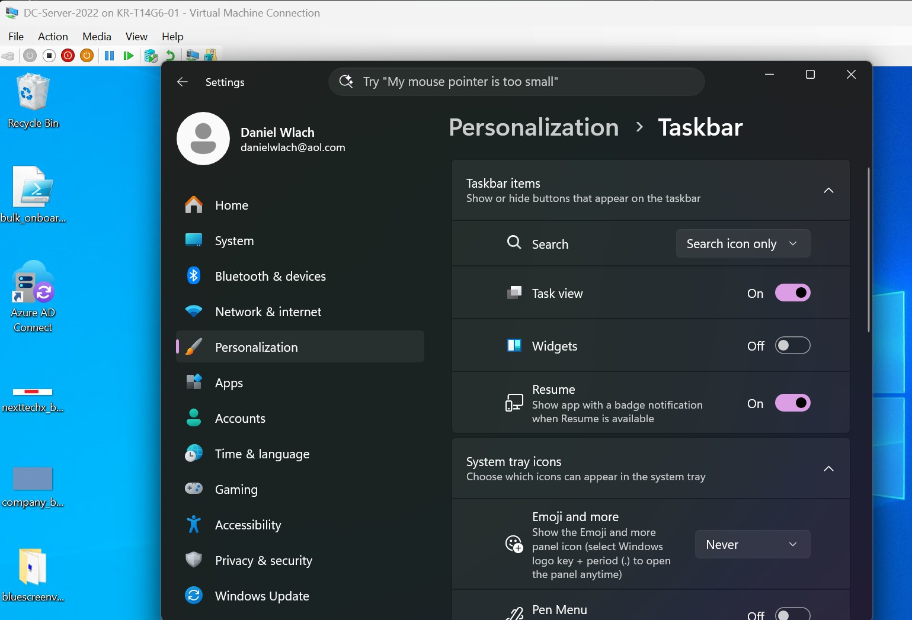

3. **Suppressing Notification Badges & Toasts (Optional Fine-Tuning)**
   * **Action**: Navigated to **Settings** > **System** > **Notifications** and disabled * "Show notifications on the lock screen" * and turned off hover-activated toast alerts for non-essential applications.
   * **Purpose**: Eliminates background popups from marketing or web feeds while preserving critical system alerts.

---

#### 💡 Technical Analysis & Tier 1 Takeaways
* **Root Cause**: Windows default settings enable interactive Taskbar widgets that automatically expand on mouse hover (`Open on hover` setting), leading to accidental popovers while working across multiple windows.
* **Enterprise / Group Policy Alternative**: In an Active Directory domain environment, Windows Widgets can be globally disabled across all endpoints using Group Policy Manager (GPO):
  ```text
  Computer Configuration > Administrative Templates > Windows Components > Widgets > Allow widgets -> Disabled


